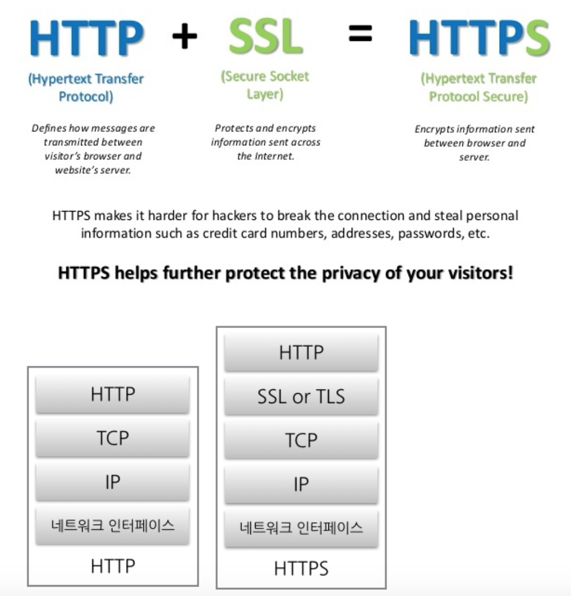
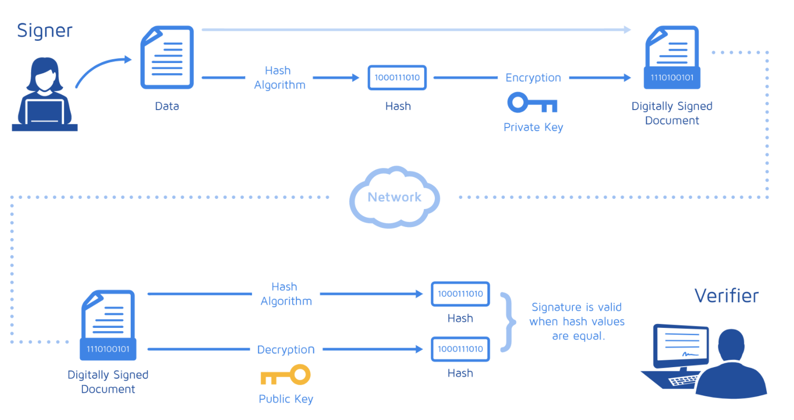

# HTTPS

### HTTPS란?

- HTTP Secure : 클라이언트와 서버가 먼저 암호화 통신 채널을 설정한 다음 평문 HTTP 메시지를 전송함으로서 정보 전송을 막음
- HTTP는 브라우저와 서버 사이에서 정보를 평문으로 전송하므로 정보가 전달되는 네트워크에서 전송되는 정보를 엿볼 수 있다.
- HTTP 하부에 SSL과 같은 보안계층을 제공함으로써 동작한다.
- 보안이 강화된 HTTPS
- HTTP 버전 1.1에서는 보안 연결이 선택이었지만(HTTP와 HTTPS는 독립적)  HTTP/2에서는 사실상 필수

### SSL 인증서

- SSL (Secure Socket Layer) == TLS
- Client와 Server간의 통신을 제 3자가 보증해 주는 전자화된 문서
- Client가 Server에 접속한 직후에 서버는 클라이언트에게 이 인증서 정보를 전달한다.
- Client는 이 인증서 정보가 신뢰할 수 있는 것인지를 검증 한 후 다음 절차를 수행하게 된다.
  - 통신 내용이 공격자에게 노출되는 것을 막을 수 있다.
  - 클라이언트가 접속하려는 서버가 신뢰할 수 있는 서버인지를 판단 할 수 있다.
  - 통신 내용의 악의적인 변경을 방지할 수 있다.

### HTTPS에서 제공하는 것

- **기밀성** : HTTPS는 인터넷과 같은 공공 매체에서 두 참여자간의 통신을 보호한다.
  - HTTPS가 없다면 와이파이 액세서 포인트를 운영하는 사람은  액세스 포인트를 사용하는 사람이 온라인에서 무언가를 구입할 때 신용카드와 같은 개인정보를 볼 수도 있다.
- **무결성** : HTTPS는 변조되지 않은 정보로 목적지에 도달하게 한다.
  - 와이파이가 웹사이트에 광곡를 추가하거나, 대역폭을 절약하고자 이미지 품질을 저하시키거나, 읽는 기사의 내용을 변조할 수 있지만, HTTPS는 변조할 수 없도록하낟.
- **인증** : HTTPS를 통해 웹사이트의 진위 여부를 확인 할 수 있다.
  - 와이파이 액세스포인트를 운영하는 사람이 가짜 웹사이트를 브라우저에 보낼수 도 있다.
  - HTTPS는 실제로 있는 페이지 인지 확인한다.

### SSL 인증서의 장점 및 역할

- 통신 내용이 노출, 변경되는 것을 방지
- 클라이언트가 접속하려는 서버가 신뢰할 수 있는 서버인지 확인 가능
- SSL 통신에 사용할 공개키를 클라이언트에게 제공

### SSL에서 사용하는 암호화의 종류

- 암호 : 텍스트를 아무나 읽지 못하도록 인코팅
- 키 : 암호의 동작을 변경하는 매개변수, 키에 따라서 암호화 결과가 달라지기 때문에 키를 모르면 복호화 불가능
- `대칭키+공개키`를 사용하여 SSL는 암호화를 한다

### 대칭키 암호화 방식

- 인코딩과 디코딩에 같은 키를 사용하는 알고리즘
- 단점 : 단점은 발송자와 수신자가 서로 대화하려면 둘 다 공유키를 가져야 한다는 것
- 장점 :  암호,복호화 할때 key를 동일하게 사용해서 속도가 빠르다
- 대칭키를 전달하는 과정에서 키가 유출되면 암호의 내용을 복호화 할 수 있기 때문에 위험
- 이를 보완하기 위해 나온 방법이 공개키 암호화 방식

### 공개키 암호화 방식

- 인코딩과 디코딩에 다른 키를 사용하는 알고리즘
- A키로 암호화를 하면 B키로 복호화를 할 수 있고, B키로 암호화를 하면 A키로 복호화 할 수 있는 방식
- public key(인코딩 키)는 `공개` 되어 있으며, 보통 디지털 인증서 안에 포함되어있다.
- secret key(디코딩 키)는 호스느만이 개인 디코딩 키를 알고 있다.
- 공개 키와 비공개키의 분리는 메시지의 인코딩은 누구나 할 수 있도록 해주는 동시에, 메시지의 디코딩은 비밀 키 소유자에게만 부여
- 클라이언트가 서버에게 안전하게 메시지를 발송하는 것을 쉽게 해준다.
- 단점 : 키 전달을 하지 않는 대신 두 개의 키가 동일하지 않기에 암호화, 복호화 속도가 느리다

공개키로 암호화를 하는 것은 데이터 보안에 중점을 둔 것이고, 개인키로 암호화 하는 것은 인증 과정에 중점을 두는 것이다.

따라서 SSL은 공개키 방식으로 대칭키를 전달하고, 대칭키로 통신해서 암호화와 속도 두 마리 토끼를 잡았다.

### 디지털 서명

- 전자 서명을 통해서 누가 메시지를 썼는지 알려주고, 메시지가 위조 되지 않았음을 증명할 수 있다. 전자 서명은 **SSL 인증서** 에서 서비스를 보증하는 방법으로 사용된다.
- 공개키와 비공개키는 안전한 데이터 전달 이외에도 **데이터 제공자의 신원을 보장**하는데 사용할 수 있다.
- 비공개키의 소유자가 비공개 키를 이용해서 정보를 암호화 => 공개키와 함께 암호화된 정보를 전송 => 수신자는 공개키로 암호화 된 정보를 복호화
- 암호화된 데이터를 공개키를 가지고 복호화 할 수 있다는 것은 그 데이터가 공개키와 쌍을 이루는 비공개키에 의해서 암호화 되었다는 것을 의미한다.
- 즉 공개키가 데이터를 제공한 사람의 신원을 보장해주게 되는 것

### SSL 동작방법

- 공개키 암호 방식은 알고리즘 계산방식이 느린 경향이 있다.
- 따라서 SSL은 암호화된 데이터를 전송하기 위해서 공개키와 대칭키 암호화 방식을 혼합하여 사용한다.
- **안전한 의사소통 채널을 수립할 때는 공개키 암호를 사용하고, 이렇게 만들어진 안전한 채널을 통해서 임시의 무작위 대칭키를 생성및 교환한다. 해당 대칭키는 나머지 데이터 암호화에 활용한다.**
  - 실제 데이터 암호화 방식 : 대칭키
  - 상기 대칭키를 서로 공유하기 위한 암호화 방식 : 공유키

### SSL 통신과정

- 컴퓨터와 컴퓨터가 네트워크를 통해서 통신을 할때 `핸드쉐이크 -> 세션(전송) -> 세션 종료`의 과정을 거친다.
- 암호화된 HTTP 메시지를 교환하기 전에 클라이언트와 서버는 `SSL 핸드쉐이크`를 진행한다.
- 핸드쉐이크의 목적
  - 프로토콜의 버전교환
  - 양쪽이 잘 알고 있는 pre master secret키 생성 및 교환
  - 양쪽 의 신원 인증
  - 채널을 암호화 하기 위한 임시 세션 키 생성

- **핸드쉐이크** : 서버의 인증서를 클라이언트에게 전송, 클라이언트와 서버가 암호화 할수있는 기법을 전송한다

좀 더 자세한 것은 https://opentutorials.org/course/228/4894,,,,,,여기로

중요한 것은 공개키 방식으로 안전한 의사소통을 할 수있는 채널을 수립한 후, 안전한 채널에서 대칭키를 주고받는 다는 것이 중요한 거같음.