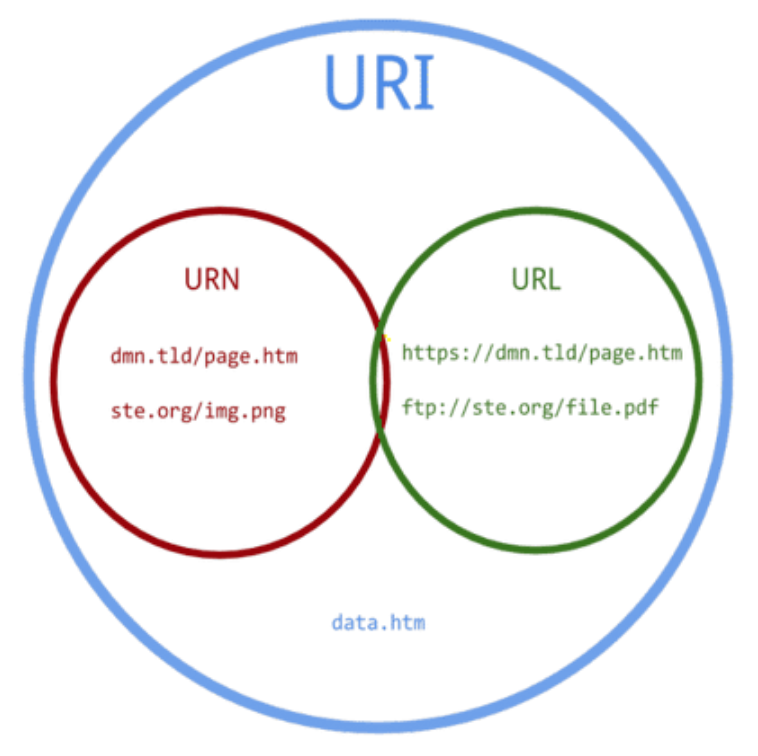

# REST API

### API 란?

- '이런 일을 하고 싶을 때는 이런 명령을 호출하시오'라고 미리 정해진 **명령의 집합**을 말한다.


### REST API 란?

- Representataional State Transfer
  - 자원을 이름(자원의 표현)으로 구분하여 해당 자원의 상태를 주고받는 모든 것
- Resurce 중심으로 설계하며 CRUD에 해당하는 HTTP 4가지 메소드를 사용(GET, POST, PUT, DELETE)
- **HTTP URI(Uniform Resource Identifier)를 통해 자원을 명시하고 HTTP Method를 통해 해당 자원에 대한 CRUD Operation을 적용하는것**
- 리소스 지향 아키텍쳐
  - 각 세부 리소스에는 id를 붙인다.


### URI vs URL vs URN



- **URI** (Uniform Resource Identifier)
  - 통합 자원 식별자로 현재 동작하고 있는 Server에서 특정 리소스에 접근하기 위해 사용하는 path
  - 정보 리소스를 고유하게 식별하고 위치를 지정할 수 있다.
  - URI에는 URL과 URN이 있다.
- **URN** (Uniform Resource Name)
  - unique함을 보장하기에 리소스를 옮기더라도 잘 동작
  - 현재 표준으로 채택되지 않아 잘 볼 수 없다.
- **URL** (Uniform Resource Locator)
  - 통합 자원 지시자로서 특정 서버 안에서 해당 리소스에 접근 할 수 있는 상대적인 위치
  - ex) www.naver.com 네이버의 URL
  - 한계 : 어느 순간에 해당 리소스에 접근할 수 있는 상대적 위치를 알려준다. 따라서 상대적 위치를 변경하면 이후에는 접근 불가능하다

- 예시
  - http://img().gmodules.com/ig/imges/korea/logo.gif
    - 위는 logo.gif라는 자원의 상대적인 위치를 뜻하는 것이기에 URI도 되고, URL도 된다.
  - http://goodgid.github.io?name=gid
    - 위는 googid.github.io까지만 URL이고 ?name=gid은 식별자이기 때문이 URI은 되지만 URL은 되지 못한다.
    - URL은 상대적인 위치를 나타내는 것이기 때문


### REST API 특징

- Uniform Interface : REST는 HTTP 표준에만 따른다면 어떠한 기술이라던지 사용가능한 인터페이스 스타일

  - 꼭 포맷을 JSON을 적용해야 할 필요는 없다. (이전에는 XML)
  - 웹 브라우저를 포함해서 HTTP 통신이 가능한 모든 클라이언트 플랫폼을 타겟으로 한다.
  - HTTP Response Body는 단순한 텍스트 포맷 사용 (JSON, XML ...)

- Stateless : 각 요청에 대한 컨택스트(세션, 로그인 정보)가 서버에 저장되어서는 안된다

  - Resource 중심이기 때문에 API 동작을 이해하고 Resource에 접근할 수 있다.
  - JWT token을 사용해 인증절차를 진행한다.
  - 사용자나 클라이언트의 컨택스트를 서버쪽에 유지하지 않는다.
  - HTTP Session과 같은 컨텍스트 저상소에 상태 정보를 저장하지 않는 형태를 의미
  - 상태 정보를 저장하지 않으면 각 API 서버는 들어오는 요청만을 들어오는 메세지로 처리하면 되며, 세션과 같은 컨텍스트 정보를 신경 쓸 필요가 없기 때문에 구현이 단순해 진다.

- Cacheable : 클라이언트는 응답을 캐싱할 수 있다.

  - 캐싱처리가 잘 되면 클라이언트-서버 간 상호작용을 부분적, 완전하게 제거하여 확장성 성능을 향상시킨다.

  - HTTP가 가진 가장 강력한 특징 중 하나인 캐싱 기능 적용가능

  - 일반적인 서비스에서 60~80% 가량의 트랜잭션이 Select와 같은 조회성 트랜잭션인 것을 감안하면 HTTP의 리소스 들을 웹캐시 서버등에 캐싱하는 것은 용량이나 성능면에 많은 장점이 있다.

  - `Last-Modified`태그나 `E-Tag`를 이용하여 캐싱 구현

    - Client가 HTTP GET을 Last-Modified값과 함께 보냈을 때, 컨텐츠에 변화가 없다면 REST 컴포넌트는 `304 Not Modified`를 리턴하며 Client는 자체 캐쉬에 저장된 값을 사용하게 된다.

    - 이렇게 캐쉬를 사용하게 되면 네트워크의 응답시간 뿐만 아니라 REST 컴포넌트가 위치한 서버에 트랜잭션을 발생시키지 않기 때문에 응답 시간과 성능 그리고 서버의 자원 사용률을 비약적으로 향상시킬 수있다.

- Self-descriptiveness : 별도의 문서가 필요없다.

  - API를 보면 다 알수 있다!
  - 리소드와 메서드를 이용해 어떤 메서드에 무슨 행위를 하는지 알 수 있으며 또한 메시지 포맷 역시 JSON을 이용해 직관적으로 이해 가능한 구조

- Clinet-Server 구조

- 계층형 구조(Layered system) : 순수 비즈니스 로직을 수행하는 API와 그 앞단에 사용자 인증, 암호화, 로드 밸런싱 등을 하는 계층을 추가해 구조상 유연성을 둘 수 있다.

  - 마이크로 서비스 아키텍쳐의 API Gateway나 간단한 기능의 경우에는 HA Proxy나 Apache와 같은 Reverse Proxy를 이용해 구현하는 경우가 많다.


### REST 안티 패턴

- GET / POST를 이용한 터널링

  - 가장 나쁜 디자인 중 하나가 GET or POST를 이용한 터널링

  - http://myweb/users?method=update&id=terry 이 경우가 전형적인 GET을 이용한 터널링

  - 메서드의 실제 동작은 리소스를 업데이트 하는 내용인데 HTTP PUT을 이용하지 않고 GET에 Query Parametsers로 method=update라고 넘겨서 이 메서드가 수정 메서드임을 명시

  - POST 터널링 : Insert성 Operation이 아님에도 JSON 바디에 Operation을 넘기는 형태

  - ```
    HTTP POST, http://myweb/users/
    {  
       "getuser":{  
          "id":"terry"
       }
    }
    ```


### REST의 문제점

- 제대로 사용하지 않은 것들이 많다.
- 표 규약이 없다. -> 그래서 관리하기가 어려움


### 인증 vs 인가

- **인증** : 인증은 누가 서비스스를 사용하는지 확인하는 절차이다.
  - ex) 아이디와 비밀번호를 넣어 사용자를 확인하는 과정
  - API도 마찬가지로 API로 호출하는 대상(단말 or 다른 서버 or 사용자)을 확인하는 절차가 필요하고 이를 `API인증`이라고 한다.
- **인가** : 해당 리소스에 대해서 사용자가 그 리소스를 사용할 권한이 있는지 체크하는 권한 체크 과정
  - */users* 라는 리소스가 있을 때 일반 사용자 권한으로는 내 사용자 정보만 볼 수 있지만, 관리자 권한으로는 다른 사용자 정보를 볼 수 있는 것과 같은 **권한의 차이**를 의미한다.


### 네트워크 레벨 암호화

- 인증과 인가 과정이 끝나서 API를 호출하게 되면 네트워크를 통해서 데이터를 주고 받는다.
- 이 떄 해커등이 중간에 이 네트워크 통신을 낚아 채서(감청) 데이터를 볼 수 없게 할 필요가 있다.
- 이를 네트워크 프로토콜 레벨에서 처리하는 것을 **네트워크 레벨의 암호화** 라고 한다.
- HTTP에서의 네트워크 레벨 암호화는 일반적으로 **HTTPS 기반의 보안 프로토콜**을 사용한다.


### 메시지 무결성 보장

- 메시지 무결성이란 메시지가 중간에 해커와 같은 외부 요인에 의해서 변조가 되지 않게 방지하는 것을 이야기한다.
- 무결성을 보장하기 위해서 많이 사용하는 방식은 메시지에 대한 *Signature*를 생성해서 메시지와 같이 보낸 후 검증하는 방식


### 메시지 본문 암호화

- 네트워크레벨 암호화를 사용할 수 없거나 신뢰할 수 없는 경우 메시지 자체를 암호화 하는 방법
- **애플리케이션 레벨**에서 구현 전체메시지 암호화와 특정 필드만 암호화 하는 두가지로 접근
- 전체 메시지 암호화는 비용이 많이들뿐만아니라 중간에 API Gateway등을 통해서 메시지를 열어보고 메시지 기반으로 라우팅 변환하는 작업등이 어렵기 때문에 특정 필드만 암호화 하는 방법을 사용한다.