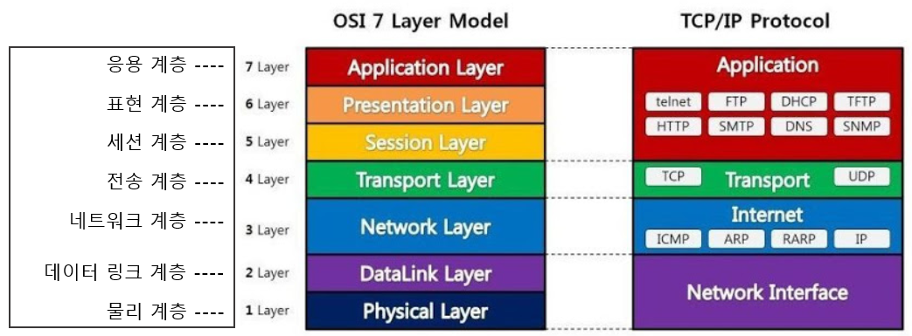

# OSI 참조모델

### ISO 란?

- 국제 표준화 기구 (International Organization for Standardization)
- ISO는 그리스어로 '동일함'이라는 뜻의 단어에서 유래 됨
- 여러 나라의 표준 제정 단체들의 대표들로 이루어진 국제적인 표준화 기구
- 다른 산업, 통상 표준의 문제점을 해결하고자 **국제적으로 통용되는 표준**을 개발하고 보급

### OSI란?

- Open Systems Interconnection
- 개방 시스템의 상호 연결 구조
- Open System : 공개(오픈)되어 있는 사양에 준거한 소프트웨어나 하드웨어를 이용함으로써 다른 벤더의 제품을 조합해 구축된 시스템
- ISO에서 이기종간의 원활한 통신을 위해 개발
- 컴퓨터 통신구조 모델과 앞으로 개발될 프로토콜의 뼈대를 제공하기위해 개발된 참조 모델

### OSI 가 필요한 이유

- 통신이 일어나는 과정을 단계별로 파악할 수 있다
- OSI 7계층 모델을 알면 네트워크 구성을 예측하고 이해 할 수 있다.
- 네트워크에서 트래픽의 흐름을 꿰뚫어 볼 수 있다.
- 각 계층이 독립되어 있어서 한 계층이 이상이 생기면 이상이 생긴 단계만 고치면 된다.
- 상호 이질적인 네트워크 간의 연결에 어려움이 많은데 호환성 결여를 막기 위해 OSI 참조 모델이 제시 되었다

### 물리계층

- 기능 : 물리적 매체를 통해 실제로 비트(bit)의 흐름을 전송한다
- 프로토콜 : 전파, 광섬유, PSTN 등
- 인터넷 케이블, 라우터 스위치 등의 전기적 신호가 물리적인 장치에 의해서 왔다갔다 하는 곳

### 데이터링크 계층

- 기능 : 오류 없이 홉(Hop)간 프레임(Frame)을 전달하는 기능 제공
- 프로토콜 : Ethernet, Token Ring, 무선랜 등
- 물리게층을 이용하여 네트워크 상의 주변 장치들 간의 데이터 전송
- 주소할당, 오류 감지

### 네트워크 계층

- 기능 : 발신지로부터 목적지까지 네트워크 간 패킷 전송을 지원
- 프로토콜 : IP, IPX, ICMP, X 25, ARP, OSPF 등
- 대표적인 장치는 라우터 (라우터 기능 대부분이 여기 네트워크 계층에 자리 잡는다)
- 가장 기본적으로 볼 때 이 계층은 다른 여러 라우터를 통한 라우팅을 비롯한 패킷 전달 담당
  - 서울 -> 부산 : 경로 수백만가지

### 전송계층

- 기능 : 종단 프로세스 간 신뢰성 있는 메시지 전송과 오류 제어 기능 제공
- 프로토콜 : TCP, UDP, SCTP 등
- 최종 시스템 및 호스트 간의 데이터 전송 조율을 담당
- 보낼 데이터의 용량과 속도, 목적지 등을 처리
- TCP/IP의 IP주소가 여기서 작동

### 세션계층

- 기능 : 통신 세션을 구성하는 계층으로, 통신장치 간의 상호작용을 설정하고 유지, 동기화 한다.
- 프로토콜 : TLS, SSH, RPC, NetBIOS 등
- 연결이 손실 되는 경우 연결 복구 시도
  - 오랜 시간 동안 연결되지 않으면 세션계층의 프로토콜이 연결을 닫고 다시 연결 재개
- 전이중 통신, 반 이중 통신, 명령 중 하나를 제공하고 교화 ㄴ메세지 스트림 내에서 **동기화** 지점 제공

### 표현계층

- 기능 : 두 시스템간 교환하는 정보의 구문(Syntax), 시맨틱과 관련된 인코딩 변환과 암호화 지원
- 프로토콜 : JPEG, MPEG, XDR 등
- 응용게층의 표현에서 독립적인 부분을 나타냄
- 응용프로그램 형식을 네트워크 형식으로 변환하거나 네트워크 형식을 응용프로그램 형식으로 변환 하는 것
- 응용프로그램이나 네트워크를 위해 데이터를 표현하는 것
  - 암호화 복호화

### 응용계층

- 기능 : 사용자 인터페이스, 전자우편, 데이터 베이스 관리 등 서비스 제공
- 프로토콜 : HTTP, SMPT, SNMP, FTP, Talent 등
- 사용자에게 보이는 부분
- 사용자와 직접 상호작용
  - Chrome, Firefox, Safari...등등