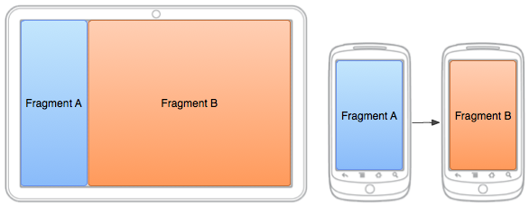

# Fragment

- ` Fragment`는 `FragementActivity`내의 어떤 동작을 또는 UI의 일부를 나타낸다.

- 여러개의 프로그먼트를 하나의 액티비티에 결합하여 창이 여러개인 UI를 빌드할 수 있다.
- 하나의 프래그먼트를 여러 액티비티에서 재사용 할 수 있다.
- `액티비티의 모듈식 섹션`이라고 생각하면 된다.
- 자체적인 수명 주기를 가지고 자체 입력 이벤트를 수신하고, 액티비티 실행중 추가 및 삭제 가능
  - 다른 액티비티에 재사용 할 수 있는 "하위 액티비티"와 같은 개념
- 프래그먼트 수명주기는 호스트 액티비티의 주기에 직접적으로 영향을 받음
  - 액티비티 소멸 -> 프래그먼트 소멸
- 액티비티가 실행 중인 동안 각 프래그먼트를 추가 또는 제거하는 등 개별적으로 조작 가능
- 액티비티가 관리하는 백 스택에 추가 가능
- 액티비티의 뷰 계층 내에서 `ViewGroup`에 들어가 자체적인 뷰 레이아웃 정의


### 디자인 철학

- Android 3.0(API 11)부터 프래그먼트 도입
- 태블릿과 같은 큰 화면에서 보다 역동적이고 유연한 UI 디자인을 지원하는 것이 목적
  - 태블릿은 화면이 크기 때문에 UI 구성 요소를 조합하고 상호교환할 공간이 많음
- 개발자가 뷰 계층에 복잡한 변경 내용을 관리하지 않아도 이러한 디자인을 사용할 수 있도록 해줌
- 액티비티 레이아웃을 여러 프래그먼트로 나누면 런타임에서 액티비티의 외관을 수정할 수 있음.
  - 변경 내용을 해당 액티비티가 관리하는 백 스택에 보존할 수 도 있음.
- 프래그먼트 지원 라이브러리를 통해 폭 넓게 제공한다.
- 각 프래그먼트는 모듈식이고 재사용 가능한 액티비티 구성 요소로 디자인 해야한다
  - 프래그먼트가 자체적인 수명 주기 콜백으로 레이아웃과 동작을 정의하기 때문에 한 프래그먼트를 여러 액티비티에 포함 할 수 있다.
  - 하나의 프래그먼트를 다른 프래그먼트에서 조작하는 것은 삼가해야한다.
    - 모듈식 프래그먼트를 사용하면 프래그먼트 조합을 여러 가지 화면 크기에 맞춰 변경할 수 있기 때문에


### 프래그먼트 생성

- Fragment의 하위 클래스를 생성해야한다.


- `onCreate()` : 프래그머트를 생성할 때 시스템에서 이것을 호출
  - 일시정지 되거나 중단 되었다가 재개 되었을 때 유지하고 자하는 것을 초기화
- `onCreateView()` : 프래그먼트에 맞는 UI를 그리면서 메서드에서 View를 반환
  - 프래그먼트 레이아웃의 루트
  - 프래그먼트가 UI를 제공하지 않는 경우 null을 반환
- `onPause()` : 사용자가 프래그먼트를 떠난 다는 첫번째 신호 (소멸을 의미하는 것은 아님)
  - 현재 사용자 세션을 넘어서 지속되어야 하는 변경 사항을 커밋함 
    - 사용자가 돌아오지 않을 수 있기 떄문에


### Fragment의 하위 클래스

- DialogFragment : 대화 상자를 표시
  - Activity 클래스의 대화상자 도우미 메서드를 사용하는 것의 좋은 대체 수단
  - 액티비티가 관리하는 프래그먼트의 백스택에 통합 시킬수 있어, 사요자가 닫힌 프래그먼트로 돌아갈 수 있다.
- ListFragment : 어댑터가 관리하는 항목의 목록(ex. SimpleCursorAdaptor)을 표시하며 ListActivity와 비슷하다
  - 목록 뷰를 관리하는데 쓰는 메서드를 제공
  - `onListItemChlick()` 콜백을 제공하여 클릭 이벤트를 처리한다.
- PreferenceFragmentCompat
  - `Preference` 객체의 계층을 목록으로 표시한다.
    - 설정화면을 만드는데 사용


### 사용자 인터페이스 추가

- 택티비티의 사용자 인터페이스의 일부로 사용되며 자체 레이아웃으로 액티비티에 기여한다.
- `onCreateView()`콜백 메서드를 구현해야 한다.
  - 프래먼트가 자신의 레이아웃을 그릴 때가 되면 Android 시스템이 이를 호출한다.
  - 이 메서드는 반드시 프래그먼트 레이아웃의 루트인 `View`를 반환해야한다.
  - 프래그먼트가 ListFramgment의 하위 클래스인 경우, 기본 구현이 onCreateView()로부터 ListView를 반환하므로 이를 구현하지 않아도 된다!
- `onCreateView()`로부터 레이아웃을 반환하려면 XML에서 정의된 `레이아웃 리소스`로 부터 팽창시키면 된다.
  - 이를 돕기위해 `onCreateView()`가 `LayoutInflator`객체를 제공한다.

```
public static class ExampleFragment extends Fragment {
    @Override
    public View onCreateView(LayoutInflater inflater, ViewGroup container,
                             Bundle savedInstanceState) {
        // Inflate the layout for this fragment
        return inflater.inflate(R.layout.example_fragment, container, false);
    }
}
```

- `onCreateView()`로 전달된 `container`매개변수가 상위 `ViewGroup`이며 (액티비티 레이아웃으로 부터), 이 안에 프래그먼트 레이아웃이 삽입된다.
- `savedInstanceState`매개변수는 일종의 `Bundle`로, 이것은 프래그먼트가 재개되는 중인 ㅕㄱㅇ우 프래그먼트의 이전 인스턴스에 대한 데이터를 제공한다.
- `inflate()`은 세개의 인수를 취한다
  - 팽창시기려는 레이아웃 리소스 ID
  - 팽창된 레아우웃의 상위가 될 ViewGroup
    - container를 전달해야 시스템 레아이아웃 매개변수를 팽창된 레이아웃의 루트 뷰에 적용할 수 있으므로 중요한 과정이다.
  - 팽창된 레이아웃이 팽창중에 ViewGroup에 첨부되어야 하는지 나타내는 부울 값
    - 항시 false : 이미 팽창된 레이아웃을 container 안에 삽입하기 때문에 
      - true로 전달하면 최종 레이아웃에 중복된 뷰 그룹을 생성하게 됨


### 액티비티에 프래그먼트 추가

- 프래그먼트는 UI의 일부분으로 호스트 액티비티에 참가하고, 호스트 액티비티는 해당 액티비티의 전체적은 뷰 계층의 일부분으로 포함되게 된다.

- 레이아웃을 추가하는데 두가지 방법이 있다.

  1. 프래그먼트를 액티비티의 레이아웃 파일 안에서 선언한다.

     - 프래그먼트에 대한 레이아웃 속성을 마치 뷰인 것처럼 나타낼 수 있다.

     - ```
       <?xml version="1.0" encoding="utf-8"?>
       <LinearLayout ...>
       		<!-- android:name 속성은 레이아웃 안에서 인스턴스화 할 Fragment 클래스 지정-->
           <fragment android:name="com.example.news.ArticleListFragment"
                   android:id="@+id/list"
                   android:layout_weight="1"
                   android:layout_width="0dp"
                   android:layout_height="match_parent" />
           <fragment android:name="com.example.news.ArticleReaderFragment"
                   android:id="@+id/viewer"
                   android:layout_weight="2"
                   android:layout_width="0dp"
                   android:layout_height="match_parent" />
       </LinearLayout>
       ```

     - 시스템은 이 액티비티 레이아웃을 생성 할 때 레이아웃에서 지정된 각 프래그먼트를 인스턴스화 하며 각각에 대해 `onCreateView()` 메서드를 호출하여 각 프래그먼트의 레이아웃을 검색한다.
       - 프래그먼트가 반환한 View를 < fragment > 요소 자리에 곧 바로 삽입한다.
     - 각 프래그먼트에는 액티비티가 다시 시작되는 경우 프래그먼트를 복구하기 위해 시스템이 사용할 수 있는 고유한 식별자가 필요하다 
       - 고유한 ID와 함께 android:id 특성을 제공
       - 고유한 문자열과 함께 android:tag특성을 제공

  2. 프그래밍 방식으로 프래그먼트를 기존의 `ViewGroup`에 추가

     - 액티비티가 실행 중인 동안에는 언제든 액티비티 레이아웃에 프래그먼트를 추가 할 수 있다.

       - 프래그먼트를 배치할 `ViewGroup`을 지정하기만 하면 됌

     - 액티비티 내에서 프래그먼트 트랜잭션(추가, 제거, 교체)를 수행하려면 `FragmentTransaction`에서 가져온 API를 사용해야한다.

     - `FragmentTrasaction`의 인스턴스를 `FragmentActivity`에서 가져오는 방법은 다음과 같다.

     - ```
       FragmentManager fragmentManager = getSupportFragmentManager();
       FragmentTransaction fragmentTransaction = fragmentManager.beginTransaction();
       ```

     - `add()`메서드를 사용하여 프래그먼트를 추가하고, 삽입할 뷰를 지정하면 된다.

     - 프그래밍 방식으로 프래그먼트를 기존의 `ViewGroup`에 추가

     - ```
       ExampleFragment fragment = new ExampleFragment();
       fragmentTransaction.add(R.id.fragment_container, fragment);
       fragmentTransaction.commit();
       ```


### 프래그먼트 관리

액티비티 내의 프래그먼트를 관리하기 위해 `FragmentManager`를 사용한다.

- `getSupportFragmentManger()`를 호출

##### FragmentManager

- 액티비티 내에 존재하는 프래그먼트를 `findFragmentById()`(UI 제공 프래그먼트)로 가져오거나 `findFragmentByTag()`(UI를 제공하지 않는 프래그먼트)로 가져온다
- `popBackStack()`을 사용하여 프래그먼트를 백스택에서 꺼낸다
  - 사용자가 back명령을 시뮬레이션
- 백 스택에 변경 내용이 있는지 알아보기 위해 `addOnBackStackChangeListenr()`로 리스너 등록을 해야함

- `FragmentManager`를 사용해도 `FragmentTransaction`을 열수 있다.


### 프래그먼트 트랜잭션 수행

- 액비티에서 프래그먼트를 사용하는 경우 사용자 상호작용에 응답하여 추가, 제거, 교체 및 다른 작업을 수행할 수 있다.
- 액비티에 커밋한 변경사항의 집합을 트랜잭션이라고 하고 `FragmentTransaction` 내의 API를 사용하면 된다.
- 액티비티가 관리하는 백 스택에 행해진 트랜잭션을 저장 하 ㄹ수도 있다.
- 프그먼트 변경사항에서 역으로 탐색 할 수 있다.

```
FragmentManager fragmentManager = getSupportFragmentManager();
FragmentTransaction fragmentTransaction = fragmentManager.beginTransaction();
```

- 트랜잭션의 변경사항을 설정하려면 `add()`, `remove()` 및 `replace()`와 같은 메서드를 사용하면 된다.
- 그 다음 `commit()`호출!
  - `commit()`을 호출하기 전에 먼저 `addToBackStack()`을 호출 해야 트랜잭션을 프래그먼트 트랜잭션의 백 스택에 추가할 수 있다.
  - 이 백스택은 액티비티가 관리
  - Back 버튼을누르면 이전 프래그먼트 상태로 되아감

```
// Create new fragment and transaction
Fragment newFragment = new ExampleFragment();
FragmentTransaction transaction = getSupportFragmentManager().beginTransaction();

// Replace whatever is in the fragment_container view with this fragment,
// and add the transaction to the back stack
transaction.replace(R.id.fragment_container, newFragment);
transaction.addToBackStack(null);

// Commit the transaction
transaction.commit();
```

- `newFragment`가 `R.id.fragment_container ID`로 교체하고 `addToBackStack()`를 호출하면 교체 트랜잭션이 백스텍에 저장되므로, 사용자가 **back**버튼을 눌러 트랜잭션을 되돌리고 이전 프래그먼트를 다시 가져올 수 있다.

- 트랜잭션에 여러개의 변경을 추가하고 (add, remove) `addToBackStack()`을 호출하면, `commit()`을 호출하기 전에 적용된 모든 변경 사항이 백스택에 하나의 트랜잭션으로 추가되며, Back 버튼을 누르면 모두 한꺼번에 되돌려짐

- `commit()`을 마지막에 호출해야한다. 
- 같은 컨테이너에 여러개의 프래그먼트를 추가하는 경우, 추가하는 순서에 따라 뷰계층에 나타나는 순서가 결정됨
- `addToBackStack()`을 호출하지 않으면, 트랜잭션이 적용되고 소멸되면 탐색할 수 없음
  - 프래그먼트를 제거하면서 `addToBackStatkc()`을 호출하면, 해당 프래그먼트는 주단되고 사요자가 뒤로 탐색할 떄 다시 시작됨
- `commit()`한 즉시 트랜잭션이 실행되지는 않음
  - 스레드가 준비되는 즉시 최대한 빨리 액티비티의 UI스레드에서 이 트랜잭션이 수행되도록 일정을 예약하는 것에 가까움
  - UI 스레드에서 `executePendingTransactions()`를 호출한다면 `commit()`이 제출한 트랜잭션을 즉시 실행 할 수 있음


### 액티비티와의 통신

- 프래그먼트의 주어진 인스턴스는 그것을 포함하고 있는 액티비티에 직접적으로 연결되어있다.
- `getActivity()`를 사용하여 `FragmentActivity`인스턴스에 액세스하고 액티비티 레이아웃에서 뷰를 찾는 등의 작업을 손쉽게 수행할 수 있다.

```
View listView = getActivity().findViewById(R.id.list);
```

- 액티비티도 프래그먼트 안의 메서드를 호출 할수 있음

```
ExampleFragment fragment = (ExampleFragment) getSupportFragmentManager().findFragmentById(R.id.example_fragment);
```

- `findFragmentById()`나 `findFragmentByTage()`를 사용!


#### 액티비티에 대한 이벤트 콜백 생성

- 데이터를 공유하려면 공유된 `ViewModel`을 생서앙한다. 
- `ViewModel`로 처리할 수 없는 이벤트를 전달해야 할 경우 프래그먼트 안에서 콜백 이터페이스를 정의하고 호스트 액티비티가 이를 구현하도록 요구 할 수 있다.
- 액티비티가 인터페이스를 통해 콜백을 수신하면, 필요에 따라 그 정보를 레이아웃 내의 다른 프래그먼트와 공유 할 수 있다.

##### 예제

- 한 액티비티안에 A(기사 목록), B(기사 표시) 두개의 프래그먼트가 존재한다. 목록 항목이 선택되면 A가 액티비티에 알려야 B에 해당 기사를 표시하라고 알릴 수 있다. 이 경우 `OnArticleSelectedListner`인터페이스는 프래그먼트 내부에 선언된다.

```
public static class FragmentA extends ListFragment {
    ...
    // Container Activity must implement this interface
    public interface OnArticleSelectedListener {
        public void onArticleSelected(Uri articleUri);
    }
    ...
}
```

- 그러면 호스팅하는 액티비티가 `OnArticleSelectedListener`인터페이스를 구현하고 `onArticleSelected()`를 재정의하여 A로부터 발생한 이벤트를 B에 알린다. 호스트 액티비티가 이 인터페이스를 구현하게 하려면 A의 `onAttach()`콜백 메서드(프래그먼트를 액티비티에 추가할 때 시스템이 호출하는 메서드)가 `onArticleSelectedListener`의 인스턴스를 생성해야한다. 이떄 Activity로 전달되는 `onAttach()`를 형변환하는 방법을 사용한다.

```
public static class FragmentA extends ListFragment {
    OnArticleSelectedListener listener;
    ...
    @Override
    public void onAttach(Context context) {
        super.onAttach(context);
        try {
            listener = (OnArticleSelectedListener) context;
        } catch (ClassCastException e) {
            throw new ClassCastException(context.toString() + " must implement OnArticleSelectedListener");
        }
    }
    ...
}
```

- 액티비티가 인터페이스를 구현하지 않았다면 프래그먼트가 `ClassCastException`를 발생시킨다. 성공시에는 `mListener`멤가 액티비티의 `OnArticleSelectedListener`구현에 대한 참조를 보유하므로, A가 액티비티와 이벤트를 공유할 수 있다.  `OnArticleSelectedListener`인터페이스가 정의한 메서드를 호출하는 방법을 사용한다
  - A가 `ListFragment`의 확장인 경우, 사용자가 목록 항목을 클릭 할 때마다 시스템이 프래그먼트 안의 `onListItemClick()`을 호출하고, `onArticleSelected()`를 호출하여 해당 이벤트를 액티비티와 공유한다.

```
public static class FragmentA extends ListFragment {
    OnArticleSelectedListener listener;
    ...
    @Override
    public void onListItemClick(ListView l, View v, int position, long id) {
        // Append the clicked item's row ID with the content provider Uri
        Uri noteUri = ContentUris.withAppendedId(ArticleColumns.CONTENT_URI, id);
        // Send the event and Uri to the host activity
        listener.onArticleSelected(noteUri);
    }
    ...
}
```

- `onListItemCllick()`에 전달된 `id` 매개변수는 클릭한 항목의 행 ID이며, 액티비티 (또다른 프래그먼트)가 이것을 사용해 애플리케이션의 `Content Provider`에 기사를 가져온다.


### 프그먼트 수명 주기 처리

액티비티와 마찬가지로 프래그먼트는 세가지 상태로 존재할 수 있음

- Resumed(재개됨) : 프래그 먼트가 실행 중인 액티비티로 표시됨
- Paused(일시정지됨) : 다른 액티비티가 포그라운드에 있고 포커스를 갖고 있지만, 이 프래그먼트가 있는 액티비티도 여전히 표시됨
  - 포라운드의 액티비티가 부분적으로 투명하거나 전체 화면을 뒤덮지 않는다.
- Stopped(정지됨) : 프래그먼트가 보이지 않음
  - 호스트 액티비티가 정지되었거나 프래그먼트가 액티비티에서 제거되었지만 백스택에 추가된상태
  - 정지된 프래그먼트도 여전히 표시는 됨 
  - 사용자에게는 더 이상 표시되지 않으며 액티비티를 종료하면 이것도 종료됨


##### 프래그먼트의 저장

- 액티비티와 마찬가지로 `onSaveInstanceState(Bundle)`, `ViewModel` 및 영구 로컬 저장소를 결합하여 구성이 변경되고 프로세스가 종료되더라도 프래그먼트의 UI상태를 보존할 수 있다.


##### 액티비티와 프래그먼트의 수명주기 차이

- 해당되는 백스택에 저장되는 방법
  - 기본적으로 액티비티는 정지되면 시스템에서 관리하는 액티비티의 백스택에 들어감
  - 프래그 먼트는 이를 제거하는 트랜잭션에서 `addToBackStack()`을 호출하여 인스턴스를 저장하고 명시적으로 요청할 경우에만 호스트 액티비티에서 관리하는 백 스택으로 들어간다
- 이 외에는 액티비티와 프래그먼트 수명주기가 비슷


##### 액티비티 수명 주기와의 조화

프래그먼트가 있는 액티비티의 수명 주기는 해당 프래그먼트의 수명 주기에 직접적인 영향을 미친다. 액티비티의 수명 주기 콜백이 각 프래그먼트에 대한 비슷한 콜백을 발생시킨다.

ex.) 액티비티가 `onPause()`를 받으면, 해당 액티비티 내의 각 프래그먼트가 `onPause()`를 받는다.

- `onAttach()` : 프래그 먼트가 액티비티와 연결되어 있었던 경우 호출
  - 액티비티가 전달됨
- `onCreateView() ` : 프래그먼트와 연결된 뷰 계층을 생성하기 위해 호출됨
- `onActivityCreated()` : 액티비티의 `onCreate()`메서드가 반환활 때 호출
- `onDestroyView()` : 프래그먼트와 연결된 뷰 계층이 제거되는 중일 때 호출
- `onDetach()` :프래그먼트가 액티비티와 연결이 끊어지는 중일때 호출됨

호트 액티비티의 영향을 받는 동안 프래그먼트 수명 주기의 흐름은 위 사진과 같다

-  액티비티의 연속된 상태에 따라 프래그먼트가 어떤 콜백 메서드를 수신할 지 결정 된다는 것을 보여줌
- 액티비티가 `onCreate()`콜백을 받은 경우, 해당 액티비티 안에 있는 프래그먼트는 `onActivityCreated()`콜백만 받을 뿐
- 액티비티가 재개된 상태에 도달하면 자유자재로 프래그먼트를 액티비티에 추가하거나 액티비티에서 제거해도 된다. 액티비티가 재개된 상태이 있는 동안만 프래그먼트 수명주기를 독립적으로 변경 할 수 있다.


// 예시 다큐먼트 확인


### 프래그먼트 만들기

- 프래그먼트 : 액티비티의 모듈식 세션
- v4 라이브러리에서 프래그먼트 지원
- v7 appcompat라이브러리를 사용하면 Android 2.1(API 7 )과 호환되고 Fragment API도 포함함.


##### 프그먼트 클래스 만들기

Fragment 클래스를 확장하고 생명주기 메서드를 재정희하여 앱 로직을 삽입힌다. 

- `onCreateView()`콜백을 사용하여 레이아웃을 정의 해야한다.


### 프래그먼트 테스트

// 다큐먼트 보고 나중에 정리하기


### 유연한 UI 빌드

다양한 화면 크기를 지원하도록 애플리케이션을 디자인 할 경우 프래그먼트를 다양한 레이아웃 구성에서 다시 사용하여 사용가능한 화면공간에 따라 사용자 환경을 최적화 할 수 있다.



- 서로 다른 화면 크기에서 같은 활동이 다른 구성으로 표시된 두 프래그먼트. 큰 화면에서는 두 프래그먼트를 모두 나란히 표시하지만 휴대폰에서는 프래그먼트가 한 번에 하나씩 표시되므로 사용자가 탐색 할 때 프래그먼트가 서로 교체되어야한다.


### 런타임에 액티비티에 프래그먼트 추가

- 액티비티 사용 기간동안 프래그먼트를 변경하려하는 경우에 필요
  - `FragmentManger`를 사용하여 `FragmentTransaction`을 만들어서 다른 프래그먼트 트랜잭션을 추가, 삭제, 교체, 실행하는 API를 제공해야 한다.
- 액티비테엇 프래그먼트를 삭제하거 교체할 수 있는 경우 액티비티의 `onCreate()`메드 중에 초기 프래그먼트를 액티비티에 추가 해야 한다.
- 런타임에 프래그먼트를 추가할 때 프래그먼트를 삽입할 수 있는 컨테이너 `View`가 액티비티 레이아웃에 포함되어 있어야한다.


### 한 프래그 먼트를 다른 프래그먼트로 교체

- 추가 절차와 비슷하지만 `add()`가 아니라 `replace()`메드가 필요한다.
- 교체와 삭제와 같은 프래그먼트 트랜잭션을 실행 할 때는 사용자가 뒤로 탐색하여 변경을 '실행 취소'하는 것이 적합한 경우가 많다.
  - 뒤로 탐색할 수 있으려면 `addToBackStack()`을 호출해야한다.


### 다른 프래그먼트와 통신

- 프래그먼트 UI구성요소를 재사용하려면 각 구성요소를 자체 레이아웃 및 동작을 정의하는 완전히 독립된 모듈식 구성요소로 빌드해야한다.
- 재사용 가능한 프래그먼트를 정의한 후에는 액티비티 및 애플리케이션 로직과 연결하여 전반적인 복합 UI를 실현할 수 있다.
- 프래그먼트 간 모든 통신은 공유된 `ViewModel`이 연결된 활동을 통해 실행된다.
- 두 프래그먼트는 직접 통신해서는 안된다.
- `ViewModel` 내에서 데이터를 업데이트 할 수 있고 `LiveData`를 사용하여 데이터가 노출되면 ViewModel에서 LiveData를 관찰하고 있는 한 새로운 상태가 프래그먼트에 전달된다.

//예제 다큐먼트보고 나중에 정리하기

