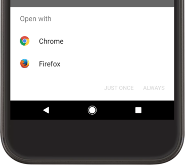

# 다른 앱과 상호작용

각 액티비티는 사용자가 특정 작업을 실행할수 있도록 사용자 인터페이스를 표시한다. 사용자를 한 액티비티에서 다른 액티비티로 안내하려면 앱은 `Intent`를 사용하여 앱이 실행하려는 작업을 정의해야한다.


### Intent

- 명시적 : 특정 구성요소를 시작 ( 특정 Activity 인스턴스 )
  - 시작하려는 구성요소의 정확한 클래스 이름을 정의
- 암시적 : 의도한 작업을 처리할 수 있는 컴포넌트를 시작하도록 할 수 있다.
  - '지도 보기'와 같이 별도의 앱에서 작업을 실행하려는 경우 


### 방법

- 다른 앱으로 사용자 보내기
  - 암시적 인텐트를 생성하여 작업을 실행할 다른 앱을 시작하는 방법을 보여줌
- 활동에서 결과 가져오기
  - 다른 활동을 시작하고 해당 활동에서 결과를 받는 방법을 보여줌
- 다른 앱이 내 활동을 시작하도록 허용
  - 앱이 허용한 암시적 인텐트를 선언하는 인텐트필러를 정의하여 다른 앱에서 내 앱의 활도을 사용할 수 있도록 공개하는 방법


### 다른 앱으로 사용자 보내기

실행하려는 '작업'에 기반하여 사용자를 다른 앱으로 보낼 수 있다.

- ex) 지도에 표시하려는 비주니스 주소가 있는 앱에서는 지도를 표시하는 활동을 빌드하지 않아도됨
- Intent를 사용하여 주소 보기 요처을 만들 수 있다.

##### 암시적 인텐트 빌드

- 시작할 구성요소의 클래스 이름을 선언하는 대신 `실행할 작업`을 선언한다.
  - action : 보기, 수정, 보내기 또는 가져오기
  - 보려는 주소 또는 보내려는 이메일 메시지와 같이 작업과 `연관된 데이터`를 포함하기도 함
    - Uri 등등,,,

```
    Uri number = Uri.parse("tel:5551234");
    Intent callIntent = new Intent(Intent.ACTION_DIAL, number);
```

- 지정된 전화번호로 통화를 시작하는 `Intent`

```
    // Map point based on address
    Uri location = Uri.parse("geo:0,0?q=1600+Amphitheatre+Parkway,+Mountain+View,+California");
    // Or map point based on latitude/longitude
    // Uri location = Uri.parse("geo:37.422219,-122.08364?z=14"); // z param is zoom level
    Intent mapIntent = new Intent(Intent.ACTION_VIEW, location);
    
```

- 지도 보기


##### 인텐트를 수신할 앱이 있는지 확인

- 특정 인텐트가 내장된 앱(ex. 전화, 이메일 캘린더 )중의 하나로 해결되도록 보장하기는 하지만 항상 인텐트를 호출하기 전에 `확인 단계`를포함해야한다.
  - 인텐트 처리 앱이 없으면 강제 종료된다.
- `queryIntentActivities()`를 호출하여 `Intent`를 처리할 수 있는 액티비티 목록을 가져와야한다.
  - 반환된 List가 비어 있지 않으면 안전하게 인텐트를 사용할 수 없다.

```
    // Build the intent
    Uri location = Uri.parse("geo:0,0?q=1600+Amphitheatre+Parkway,+Mountain+View,+California");
    Intent mapIntent = new Intent(Intent.ACTION_VIEW, location);

    // Verify it resolves
    PackageManager packageManager = getPackageManager();
    List<ResolveInfo> activities = packageManager.queryIntentActivities(mapIntent, 0);
    boolean isIntentSafe = activities.size() > 0;

    // Start an activity if it's safe
    if (isIntentSafe) {
        startActivity(mapIntent);
    }
```

- 만약 `isIntentSafe`가 `true`이면 최소 하나의 앱이 인텐트에 응답가능 한것


##### 인텐트를 이용하여 활동 시작

- `startActivity()`를 호출하여 시스템으로 보내짐
- 인텐트 처리 할 수 있는 활동이 두개 이상 식별할 경우 사용자가 선택 할 수 있도록 대화상자를 표시



- 한개일 경우는 바로 시작

```
    Intent intent = new Intent(Intent.ACTION_SEND);
    ...

    // Always use string resources for UI text.
    // This says something like "Share this photo with"
    String title = getResources().getString(R.string.chooser_title);
    // Create intent to show chooser
    Intent chooser = Intent.createChooser(intent, title);

    // Verify the intent will resolve to at least one activity
    if (intent.resolveActivity(getPackageManager()) != null) {
        startActivity(chooser);
    }
    
```

- `createChooser()`를 사용하여 `Intent`를 생성하고 `startActivity()`에 전달한다.


### 액티비티로부터 결과 가져오기

다른 액티비티를 시작하고 다시 결과를 받을 수도 있다.

- `startActiityForResult()`를 호출 한다.
- 액티비티에서 결과를 반환하도록 설계되어야 한다. `Intent`개체로 결과를 전송!
  - `onActivityResult()` 콜백에서 결과를 수신한다.

##### 액티비티 시작

- `Intent`개체에 특별한 사항은 없지만 `startActvityForResult()`메서드에 추가로 정수 인수를 전달해야한다.
- 정수 인수는 요청을 식별하는 `요청 코드`이다.
  - 이 요청 코드를 통해 탭이 결과를 식별하고 처리한다.

```
    static final int PICK_CONTACT_REQUEST = 1;  // The request code
    ...
    private void pickContact() {
        Intent pickContactIntent = new Intent(Intent.ACTION_PICK, Uri.parse("content://contacts"));
        pickContactIntent.setType(Phone.CONTENT_TYPE); // Show user only contacts w/ phone numbers
        startActivityForResult(pickContactIntent, PICK_CONTACT_REQUEST);
    }
    
```


##### 결과 수신

- 사용자가 후속 활동을 마치고 돌아오면 시그템은 활동의 `onActivityResult()`메드를 호출한다.
- 이 메서드는 다음 세 가지 인수를 포함한다.
  - `startActivityForResult()`에 전달한 요청 코드
  - 두 번 째 활동이 지정한 결과 코드, 이 값은 작업이 성공한 경우 `RESULT_OK`이며, 사용자가 취소하거나 어떤 이유로 작업이 실패한 경우 `RESULT_CANCELED`dlek.
  - 결과 데이터를 전달하는 `Intent`

```
    @Override
    protected void onActivityResult(int requestCode, int resultCode, Intent data) {
        // Check which request we're responding to
        if (requestCode == PICK_CONTACT_REQUEST) {
            // Make sure the request was successful
            if (resultCode == RESULT_OK) {
                // The user picked a contact.
                // The Intent's data Uri identifies which contact was selected.
								Uri contactUri = resultIntent.getData();
								String[] projection = {Phone.NUMBER};
								
								Cursor curosr = getContentResolver().query(contactUri, procjection, null,null,null);
								cursor.moveToFirst();
								
								int column = curosr.getColumnIndex(Phone.NUMBER);
								String number = cursor.getString(column);
								
                // Do something with the contact here (bigger example below)
            }
        }
    }
    
```

- Contacts Providerd에 쿼리를 실행하려면 Android 2.3(API 레벨 9) 이전 버전에서는 READ_CONTACTS 권한을 선언해야함
  - Android 2.3  이후에는 연락처 제공자가 결과를 반환할 떄 앱이 연락처 제공자에서 결과를 읽을 수 있도록 연락처/피플 앱이 임시 권한을 부여한다.
    - 임시 권한 요청은 요청된 특정 연락처에만 적용되므로 READ_CONTACTS 권한을 선언하지 않으면 인텐트의 Uri가 지정한 연락처 외 다른 연락처는 쿼리할 수 없다.


### 다른 앱이 내 활동을 시작하도록 허용

다른 앱에서 유용한 작업을 실행 할 수 있는 앱은 적절한 인텐트 필터를 지정하여 작업 요청에 응답을 준비해야한다.

- Ex) 사용자의 친구들과 메시지 또는 사진을 공유할 수 있는 소셜 앱을 빌드 했다면 `ACTION_SEND` 인텐트를 지원해야 다른앱애서 공유 작업을 할 수 있음

- Manifest.xml에 `<activity>` 요소의 `<intent-filter>`를 추가해야한다.
- 시스템은 인텐트 필터를 식별하고 설치된 모든 앱에서 지원하는 인텐트의 내부 카탈로그에 정보를 추가한다.
- 앱이 암시적 인텐트를 사용하여 `startAcitity()`또는 `startActivityForResult()`를 호출할 시스템은 인텐트에 응답할 수 있는 활동을 찾는다.

##### 인텐트 필터 추가

처리할 수 있는 인텐트를 제대로 정의하려면 추가하는 각 인텐트 필터의 작업 및 데이터의 유형이 최대한 구체적이어야한다.

- `action` : 실행할 작업의 이름을 지정하는 문자열
  - ACTION_SEND, ACTION_VIEW와 같이 플랫폼에서 정의한 값 중 하나
  - `<action>`요소를 사용하여 인텐트 필터에 이 값을 지정
  - API 상수 대신 작업의 전체 문자열 이름이어ㅑ한다.
- `data` : 인텐트와 관련된 데이터의 설명
  - `<data>`요소를 사용하여 인텐트 필터에 이 값을 지정
  - 하나 이상의 속성을 사용하여 MIME 유형, URI 접두사, URI 구성표 또는 이 속성과 허용된 데이터 유형을 나타내는 다른 속성들의 조합을 지정할 수 있다.
  - Uri 세부사항을 선언 할 필요가 없는 경우 (URI 대신 다른 '추가'데이터를 처리 할 때) android:mimeType속성만 지정하여 text/plain 또는 image/jpeg와 같이 활동이 처리하는 데이터 유형을 선언해야 한다.
- `category` : 인텐ㅌ트를 처리하는 특징을 추가로 지정하여 일반적으로 사용자 동작 또는 시작된 위치와 관련있음
  - 시스템이 지원하는 카테고리는 여러가지 있지만 거의 사용 되지 않음
  - 기본 암시적 인텐트 : CATEGORY_DEFAULT
  - `<category>`요소를 사용하여 인텐트 필터에 값을 지정

