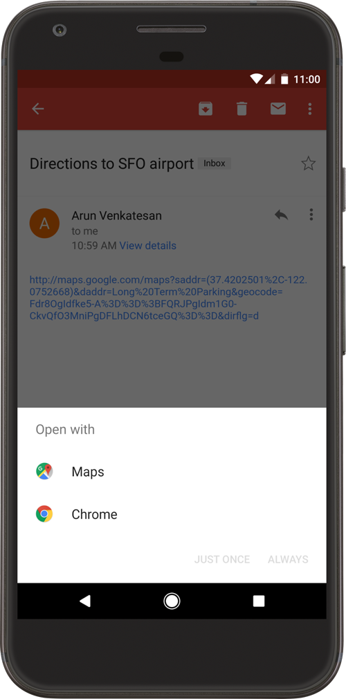

# Android 앱 링크 처리하기

앱 선택 대화상자를 건너뛰고 앱에서 링크의 특정 콘텐츠로 사용자를 바로 연결하도록 설정할 수 있다.

- HTTP URL 및 웹사이트 연결을 활용하기 떄문에 앱을 설치하지 않은 사용자는 개발자의 사이트에 있는 컨텐츠로 바로 연결 된다.


### 딥 링크 및 Android 앱 링크

- **딥 링크** : 사용자를 앱의 특정 콘텐츠로 바로 연결하는 URL
  - Andorid에서는 `인텐트 필터`를 추가하고 수신 인텐트에서 사용자를 올바른 acitivty로 연결하기 위한 데이터를 추출하여 딥 링크를 설정할 수 있다.
- 사용자 기기에 설치된 다른 앱이 이 인텐트를 처리할 수 있는 경우에는 사용자가 앱으로 바로 연결되지 않을 수 있다.
  - EX) 은행에서 온 이메일에 포함된 URL을 클릭할 때 브라우저를 사용하여 링크를 열지 아니면 은행 고유의 앱을 사용하여 링크를 열지 묻는 대화상자가 열릴 수 있다.
- **Android 앱링크** : 앱이 특정 유형의 링크에 적용되는 기본 핸들러 앱 자체를 지정 가능
  - 앱을 기본 핸들러로 사용하지 않으려는 경우 기기의 시스템 설정에서 동작을 재정의 할 수 있다.
- Android 앱링크의 장점
  - **안전성 및 구체성** : Android앱 링크는 내가 소유한 웹 사이트 도메인에 연결되는 HTTP URL을 사용하므로, 다른 앱이 내 링크를 사용할 수 없다. Andorid 앱링크의 요구사항 중 하나는 Google의 웹사이트 연결 방법 중 하나를 통해 개발자의 도메인 소유권을 확인 하는 것
  - **원활한 사용자 환경** : Android 앱 링크는 웹사이트와 앱에 있는 동일한 콘텐츠에 단일 HTTP URL을 사용하므로, 앱을 설치하지 않은 사용자는 앱이 아니라 웹사이트로 연결 된다. 404 오류가 아니다.
  - **Android 인스턴트 앱 지원** : Android 인스턴트 앱을 통해 사용자는 Android 앱을 설치하지 않고도 실행할 수 있다.
  - **Google 검색에서 사용자 참여** : 사용자는 모바일 브라우저, Google 검색 앱, Android의 화면검색에서 Google이 제공한 URL을 클릭하거나 Google 어시스턴트를 통해 앱에서 곧바로 특정 콘텐츠 열기 가능


### Android 앱 링크 추가하기

1. **앱의 특정 콘텐츠로 연결되는 딥 링크 만들기** : 앱 manifest에서 웹사이트 URI의 인텐트 필터를 만들고 인텐트에서 얻은 데이터를 사용하여 사용자를 앱의 올바른 콘텐츠에 연결하도록 앱을 구성함.
2. **딥링크의 인증 추가하기** : 앱 링크 인증을 요청하도록 앱을 구성한다. 그런 다음, Google Search Console을 통해 소유권을 확인하도록 디지털 애셋 링크 JSON 파일을 웹사이트에 게시한다.


### 앱 콘텐츠 딥 링크 만들기

- 작업 순서
  1. URI를 처리할 수 있는, 사용자가 선호하는 앱(지정되어 있는 경우)을 연다.
  2. URI를 처리할 수 있는, 사용 가능한 유일한 앱을 연다.
  3. 사용자가 대화상자에서 앱을 선택하도록한다.


##### 수신 링크의 인텐트 필터 추가하기

앱 콘텐츠 링크를 만들려면 밑의 요소와 속성 값이 포함된 인텐트 필터를 manifest에 추가해야한다.

- `<action>` : Google 검색에서 인텐트 필터에 도달 할 수 있도록 ACTION_VIEW 인텐트 작업을 지정해야한다.
- `<data>` : activity로 확인되는 URI 형식을 나타냄
  - 최소한 `<data>` 태그는 `android:scheme`속성을 포함해야한다.
  - 하나 이상 추가 가능
  - activity가 수락하는 URI유형을 더욱 세분화 할 수 있다.
    - EX) 유사한 URI를 수락 하지만 경로 이름에 따라 달라지는 여러 활동이 있을 수 있는데 이 경우 `android:path`속성이나 그 변형(pathPattern 또는 pathPrefix)을 사용하여 다양한 URI 경로별로 열리는 활동을 차별화 해야한다.
- `<category>` 
  - `BROWSABLE` 카테고리를 포함 : 웹브라우저에서 인텐트 필터에 액세스할 수 있으려면 필요한다.
    - 이 카테고리가 없는 경우 브라우저에서 링크를 클릭해도 앱으로 확인되지 않는다.
  - `DEFAULT` 카테고리를 포함 : 암시적 인텐트에 응답할 수 있다. 
    - 이 카테고리가 없으면 인텐트에서 앱 구성요소 이름을 지정한 경우에만 활동을 시작 할 수 이다.

```
    <activity
        android:name="com.example.android.GizmosActivity"
        android:label="@string/title_gizmos" >
        <intent-filter android:label="@string/filter_view_http_gizmos">
            <action android:name="android.intent.action.VIEW" />
            <category android:name="android.intent.category.DEFAULT" />
            <category android:name="android.intent.category.BROWSABLE" />
            <!-- Accepts URIs that begin with "http://www.example.com/gizmos” -->
            <data android:scheme="http"
                  android:host="www.example.com"
                  android:pathPrefix="/gizmos" />
            <!-- note that the leading "/" is required for pathPrefix-->
        </intent-filter>
        <intent-filter android:label="@string/filter_view_example_gizmos">
            <action android:name="android.intent.action.VIEW" />
            <category android:name="android.intent.category.DEFAULT" />
            <category android:name="android.intent.category.BROWSABLE" />
            <!-- Accepts URIs that begin with "example://gizmos” -->
            <data android:scheme="example"
                  android:host="gizmos" />
        </intent-filter>
    </activity>
    
```

- 두 인텐트 필터는 `<data>`요소만 다르다. 동일한 필터에 여러 `<data>`요소를 포함하는 것이 가능하지만 고유한 URL을 선언할 의도라면 별도의 필터를 만드는 것이 중요하다. 동일한 인텐트 필터의 여러 `<data>`요소가 실제로 함께 병합되어서 결합된 속성의 모든 변형을 나타내기 때문

```
    <intent-filter>
      ...
      <data android:scheme="https" android:host="www.example.com" />
      <data android:scheme="app" android:host="open.my.app" />
    </intent-filter>
    
```

- 위에 나온 두개의 URL만 지원하는 것 처럼 보일 수도 있지만 "app://www.example.com"과 "https://open.my.app"도 지원한다.
- 활동 콘텐츠의 URI가 포함된 인텐트 필터를 앱 minifest에 추가하고 나면 Android에서는 일치하는 URI가 있는 `Intent`를 런타임에 앱으로 라우팅 할 수 있다.


##### 수신되는 인텐트에서 데이터 읽기

- 인텐트 필터를 통해 활동을 시작하면 `Intent`에서 제공된 데이터를 사용하여 렌더링해야 할 항목을 확일 할 수 있다. 
- `getData()`메서드와 `getAction()`메서드를 호출하여 수신되는 `Intent`와 연관된 데이터와 작업을 검색한다.
- activity의 life cycle 동안 언제든지 호출 할 수 있지만 일반적으로 `onCreate()`또는 `onStart()`와 같은 초기 콜백에서 호출해야한다.

```
    @Override
    public void onCreate(Bundle savedInstanceState) {
        super.onCreate(savedInstanceState);
        setContentView(R.layout.main);

        Intent intent = getIntent();
        String action = intent.getAction();
        Uri data = intent.getData();
    }
```


##### 딥링크 테스트

// 다큐먼트 읽고 정리하기


### 앱 링크 인증하기

- **Android 앱 링크** : 사용자가 앱을 선택할 필요 없이, 웹사이트 URL을 클릭하면 Android 앱에서 해당 콘텐츠가 바로 열리도록 하는 특별한 유형의 딥 링크
- Android 앱 링크를 추가하려면 HTTP URL을 사용해 앱 콘텐츠를 여는 인텐트 필터를 정의하고 앱과 웹사이트 URL을 모두 소유하고 있음을 확인해야한다.
  - 시스템에서 개발자의 URL 소유권이 확인되면 URL 인텐트를 앱에 자동으로 라우팅 한다.

##### 딥링크와 앱 링크의 차이

- **딥링크** : 사용자가 Android 앱의 특정 활동으로 바로 이동할 수 있게 하는 인텐트 필터 

  - 이 링크 중 하나를 클릭하면 특정 URL을 처리할 수 있는 여러 앱(내가 개발 한 앱 포함)중 하나를 사용자에게 선택하게 하는 명확성 대화상자가 열릴 수 있다. 

  

- **Android 앱링크** : 개발자의 웹사이트에 속한다는 것이 확인된, 웹사이트 URL 기반 딥링크 이다. 
  - 하나를 클릭하면 설치되어 있는 앱이 즉시 열리며, 명확성 대화상자는 표시되지 않는다.
  - 이 링크를 처리하는 기본 설정을 나중에 변경 할 수 있음

|                           | 딥링크                                                       | 앱링크                                                       |
| ------------------------- | ------------------------------------------------------------ | ------------------------------------------------------------ |
| 인텐트 URL 스키마         | http, https, 맞춤 스키마                                     | http 또는 https 밒ㄹ요                                       |
| 인텐트 작업 (action)      | 모든 작업                                                    | 필요 : android.intent.action.VIEW                            |
| 인텐트 카테고리(category) | 모든 카테고리                                                | 필요 : android.intent.category.BROWABLE 및 android.intent.cateogry.DEFAULT |
| 링크 확인                 | 없음                                                         | HTTPS로 웹사이트에서 제공되는 디지털 애셋 링크 파일이 필요   |
| 사용자 환경               | 어느 앱에서 링크를 열 것인지 묻는 명확성 대화상자가 사용자에게 표시 될 수 있음 | 대화 상자 없음. 내 앱이 열려 웹사이트 링크를 처리            |
| 호환성                    | 모든 버전                                                    | Android 6.0 이상                                             |


##### 앱 링크 인증 요청

앱의 링크 처리 인증을 사용 설정하려면 manifest의 웹 URL 인텐트 필터 중 하나에 `android:autoVerity="true"`를 설정한다.

- android.intent.action.View 또는 android.intent.category.BROWSABLE 인텐트 카테고리가 포함 된 앱에서

```
    <activity ...>

        <intent-filter android:autoVerify="true">
            <action android:name="android.intent.action.VIEW" />
            <category android:name="android.intent.category.DEFAULT" />
            <category android:name="android.intent.category.BROWSABLE" />
            <data android:scheme="http" android:host="www.example.com" />
            <data android:scheme="https" />
        </intent-filter>

    </activity>
    
```

인텐트 필터 중 하나에 `android:autoVerify="true"`가 있는 경우 Android 6.0이상을 실행하는 기기에서 앱을 설치하면 시스템이 앱의 인텐트 필터에서 URL과 연관된 모든 호스트를 확인하려고 시도한다.

- 확인 절차
  1. 시스템에서 다음이 포함된 모든 인텐트 필터를 검사한다.
     - action : android.intent.action.VIEW
     - category : android.intent.category.BROWSABLE 및 android.intent.category.DEFAULT
     - Data schema : http 또는 https
  2. Android는 위의 인텐트 필터에 있는 고유 호스트 이름별로 디지털 애셋 링크에 사용하는 웹사이트를 `https://hostname/.well-kwonw/assetlinks.josn`에서 쿼리한다.
- manifest에 있는 모든 호스트에 일치하는 디지털 애셋 링크가 발견되는 경우에만 앱을 지정 URL 패턴의 기본 핸들러로 설정한다.


### 인스턴트 앱의 앱 링크 만들기

// 다큐먼트 확인