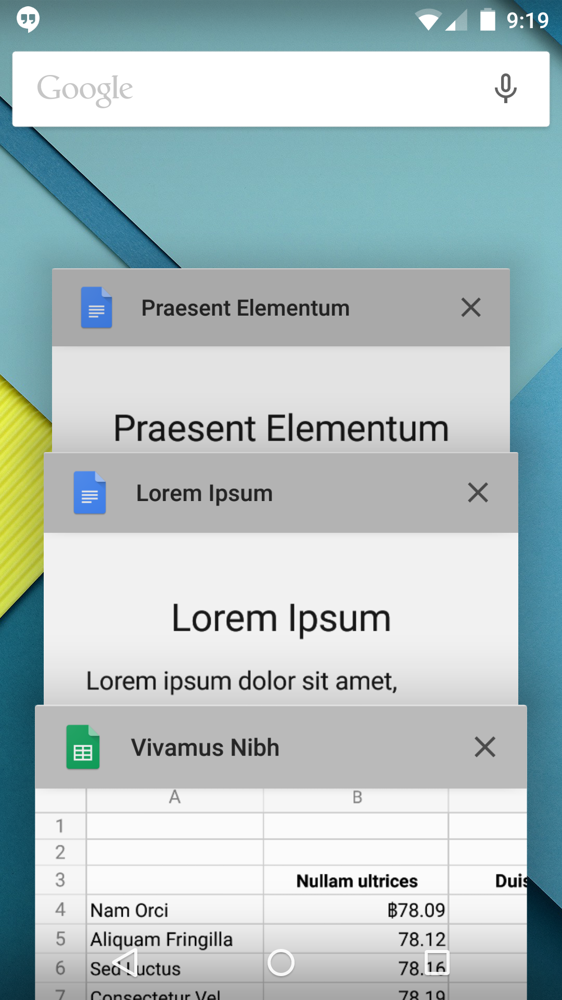

# 최근화면

최근 화면(최근 사용 화면, 최근 작업 목록 또는 최근 앱)은 최근에 액세스한 activity 및 task를 나열하는 시스템 수준의 UI

- 작업을 스와이프하여 목록에서 작업 삭제 가능
- Android 5.0(API 레벨 21)에는 `문서중심`모델(??)이 도입되었으므로 다양한 문서가 포함된 동일한 활동의 여러 인스턴스를 최근 화면에 작업으로 표시 할 수 있다.
  - Ex) Google 드라이브에는 여러 Google문서 각각에 관한 작업이 있을 수 있다.

`ActvityManget.AppTask`클래스를 사용하면 작업을 관리할 수 있으며 `Intent` 클래스의 활동 플래그를 사용하면 활동이 최근 화면에서 추가 또는 삭제 되는 시기를 정할 수 있다.

- `<activity>`속성을 통해 manifest의 동작도 설정할 수 있다.

### 최근 화면에 작업 추가

`Intent`클래스의 플래그를 사용하여 작업을 추가하면 최근 화면에서 문서를 열거나 다시 여는 시기 및 방식을 더 세부적으로 제어 가능 하다

- `<activity>`속성을 사용하면 항상 새 작업에서 문서를 열지 아니면 문서에 기존 작업을 다시 사용할지 선ㅌ택 가능

//이거 보다 중요한 내용 많은 것 같아서 다음에 정리!