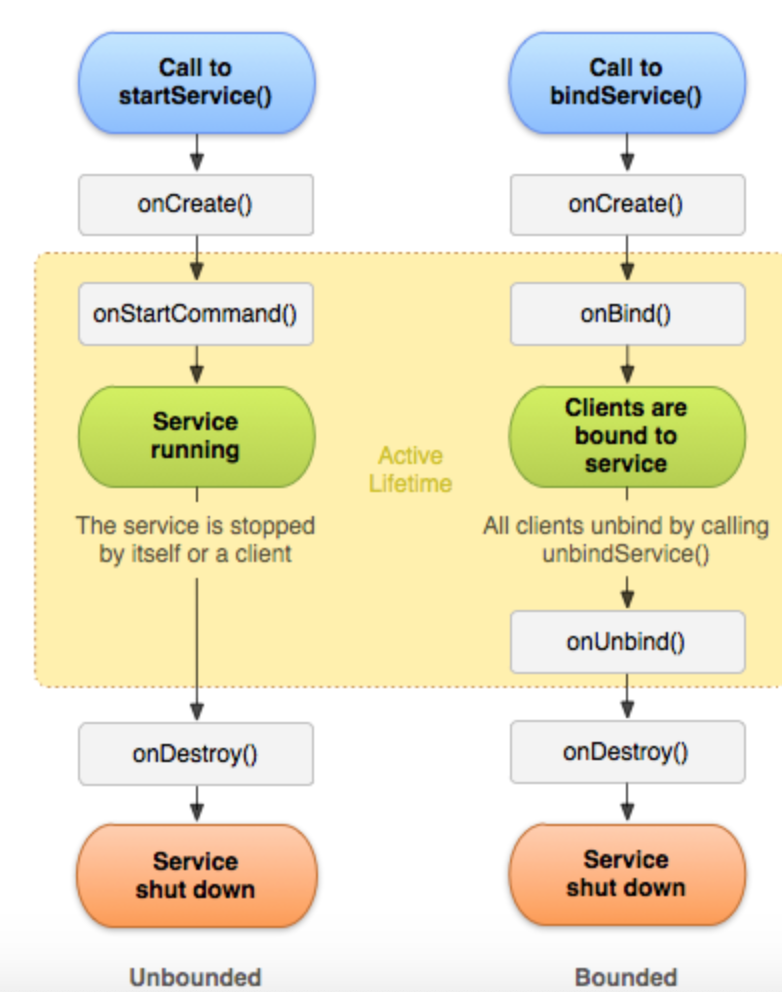

# 4대 컴포넌트

### 안드로이드 4대 컴포넌트란?

- Activity, Service, Broadcast Receiver, Content Provider
- 각 컴포넌트 들은 하나의 독립된 형태로 존재하며, 정해진 역할을 수행한다.
- `Intent`라는 일종의 메시지 객체를 사용하여 통신한다


- 안드로이드 3.0 (API level 11)부터 프래그먼트가 추가 되었다.
  - 뷰도아니고 4대 구성요소로 보기 어려움

### Activity

- UI 화면을 담당하는 컴포넌트
- 안드로이드 애플리케이션은 반드시 하나의 액티비티를 ㅏ지고 있어야한다
- 각 액티비티는 매니피스트 파일에 등록되어있어야한다.
- 하나 이상의 view를 가질 수 있다.
- VIew 또는 ViewGroup의 다양한 화면을 배치함으로써 UI 표시
- 하나의 애플리케이션은 하나 이상의 액티비티가 느슨하게 서로 묶여 있는 형태로 구성
  - 새로운 액티비티가 시작 될 때 마다 이전 액티비티는 중단 되지만 백스택에 보존
  - 백스택 푸시, 팝으로 사용자 포커스를 가지게 된다 
  - 백스택== LIFO
- 클래스
  - Activity 클래스(android.app.Activity) : 기본 라이브러리의 액티비티 클래스, 다른 모든 액티비티 클래스는 이 클래스의 서브 클래스
  - FragmentActivity (android.support.v4.app.FragmentActivity) : 과거 버전과의 호환성을 유지하면서 프래그먼트를 사용할 때 필요한 액티비티 클래스
  - AcppCompatActivity(android.app.support.v7.app.AppCompatActivity) : 과거 안드로이드 버전과 호환성을 유지하면서 새로운 버전의 기능(Material Design 관련,,)도 사용할 수 있도록 만든 액티비티 클래스
- **액티비티 생명주기**
  - 액티비티의 상태가 변경될 때 이벤트 처리기 처럼 동작
- **액티비티의 동적 상태를 저장하기 위해 만들어진 두 메서드**
  - `onRestoreInstanceState(Bundle savedInstanceState)` : onCreate()메서드 처럼 이 메서드도 이전 상태 데이터를 포함하는 `Bundle`객체를 매개변수로 받는다
    - 정상적인 상황에서는 호출되지 않는다
    - 디이스 회전, 강제 종료 후 재시작
  - `onSaveInstanceState(Bundle outState)` : 현재의 **동적 상태 데이터**가 저장될 수 있게끔 액티비티가 소멸되기 전에 호출
    - 사용자 인터페이스와 관련된 것
    - Bundle을 객체로 매개변수를 받으며 저장
      - 상태 데이터를 Bundle에 넣는다.
      - 액티비티가 다시 시작될 때 onCreate()이나 onRestoreInstanceState()메서드에 전달
    - 동적 상태 데이터가 저장될 필요가 있다는 것을 런타임이 알 경우에만 호출


### Serivce

- 백그라운으뎅서 실행되는 컴포넌트로 오랫동안 실행되는 작업이나 원격 프로세스를 위한 작업을 할 때 사용
  - ex. 노래를 켜고 웹 서핑을 하는 경우
- UI를 가지고 있지 않는다.
- 한번 시작된 서비스는 애플리케이션이 종료되고 다른 애플리케이션으로 이동해도 계속 백그라운드에서 실행된다.
- 모든 서비스는 Service 클래스를 상속받아서 작성된다.
- 네트워크를 통하여 데이터를 받을 수도 있다.
- 이것을 별도 쓰레드 생성해 작업하면 문제가 생김
  - 쓰레드로 백그라운드 작업을 하다가 앱에서 back키를 누르면 액티비티를 모두 종료할 시 앱 프로세스의 우선순위가 낮아져 LMK(low meemory killer)가 프로세스를 강제로 종료 할 수 있다.
- **프로세스 우선순위**
  1. 포그라운드 프로세스 : 사용자와 상호 작용하는 액티비티를 가지고 있거나 그런 액티비티에 바인딩된 서비스, onCreate/ onStart/ onStartCommand/ onDestory를 실행 중인 서비스, onReceive를 실행하는 브로드캐스트 리시버에 해당합니다.
  2. 가시(visible) 프로세스 : 포그라운드 컴포넌트를 가지지 않지만 사용자가 보는 화면에 아직 영향이 있는 프로세스입니다.
  3. 서비스 프로세스 : startService()로 실행 했지만 위의 카테고리에 들어가지 않는 서비스가 실행 중인 프로세스입니다.
  4. 백그라운드 프로세스 : 애기비티가 종료되지 않았지만 사용자에게 보이지 않고 (홈 키를 눌러 onStop()까지 불린 태스크) 활성화된 컴포넌트가 없는 프로세스입니다.
  5. 빈 프로세스 : 사용자가 백 키로 액티비티를 모두 종료하고 활성화된 컴포넌트가 없다면 빈 프로세스가 됩니다. 우선순위가 낮아서 리소스가 부족하면 가장 먼저 종료됩니다.
- 서비스의 생명주기
  - 서비스의 생명주기는 메인 쓰레드에서 실행.
  - 생명주기 메서드 내에서 오랜 시간동안 작업하면안된다.
  - 또한 서비스 앱에서 1개의 인스턴스밖에 생기지 않으므로 별도로 싱글톤으로 구현하지 않아도 되고 사용 되는 변수도 별도의 싱글톤 패턴으로 말들 필요 없다



- Context에는 서비스를 시작하는 방법으로 `startService()`와 `bindService()`메서드 2가지 존재
  - Bound Service : 연결을 유지해 데이터를 주고 받을 수 있는 
  - Unbound Service : 시작과 종료에만 관여
  - Unbound이면서 bound일수 있다. 
    - Ex. 음악 재생화면이 있을 때 화면을 종료해도 음악을 들 수 있으려면 unbound서비를 이용해야한다. 그런데 다시 화면에 진입할 때 재생 중인 음악정보를 화면에 보여줘야한다면 bound서비스 이기도한다.
- **Unbound Service**
  - startService()메소드로 시작
    - 바로 시작은 아님
    - 메인 Looper의 MessageQueeu에 Message가 들어가서 메인 쓰레드를 쓸 수 있는 시점에 서비스 시작
    - 맨처음 startService() -> onCreate()-> onStartCommand()실행
      - 이후 실행에서는 onCreat()을 거치지 않음
    - `onCreate()` : Service에 필요한 리소스 준비
    - `onStartCommand()` : 명령을 매번 처리
  - 서비스에서 작업 진행 상황에 따라 액티비티에 메세지를 보내려변 `BroadCast Reciver`를 사용
    - 액티비티에 브로드캐스트 리시버를 등록하고 서비스에서 `sendBradcast()`를 실행한다.
    - 서비를 시작하는 intent에 ResultReciver를 전달하고 서비스에 Result Reciver에 값을 되돌려준다. 
- 서비스 재시작
  - 디바이스 메모리가 부족하거나 포커스를 갖고있는 액티비티의 시스템 리소스가 부족할 때 서비스 강제 종료 가능
  - Unbound는 강제종료후 가능한 빨리 서비스 재시작 가능
  - onStartCommand()의 리턴값에 따라 동작 방식이 달라짐
    - START_NOT_STICKY : 강제 종료되면 재시작 하지 않는다
    - START_STICKY : 기본 리턴값, 정상 종료되지 않았을 때 재시작
      - 재시작 후 onStartCommand()를 호출하는데 이떄 Intent 파라미터가 null로 전달
      - 내부 변수를 사용하는 서비스에 적합
      - Ex. 새로운 메시지가 몇개 왔는지 정기적으로 확인
    - START_REDELIVER_INTENT : 재시작하면서 onStartCommand()에 Intent를 다시 전달하여 실행
      - Ex. 특정 상점의 상품 목룍을 가져온 후 DB에 저장하는 경우
- 서비스 종료
  - stopService
  - stopSelf : context의 stopService() 메서드와 역할이 동일, service내에서 호출한다는것이 다름, 서비스에서 할일이 끝났으면 이것을 호출해 명시적 종료
    - onDestory()까지 실행
- 멀티 쓰레드 이슈
  - 여러곳에서 startService()동시 호출 가능
    - stopSelfResult()를 실행하는 것이 좋음
- IntentService
  - 동시에 여러 요청을 처리할 필요가 없으면 IntentService를 활용
    - 1개의 백그라운드 쓰레드를 가지고 전달된 intent를 순차적으로 처리
    - Handler Thread 사용
  - `onHandlerIntetn(Intent)`메서드만 구현


### BroadCast Reciver

- 안드로이드 단말기에서 발생하는 다양한 이벤트 정보(화면이 켜지거나 꺼짐, 리부팅 등)을 받고 반응하는 컴포넌트
- UI를 가지고 있지 않다.
- 단말기에서 발생하는 일 중에서 애플리케이션이 알아야하는 상황이 발생하면 방송을 해준다.
- 수신기(Broadcast Reciver)를 통해 상황을 감지하고 적절한 작업을 수행 한다.
- 구현 방법 (정적 / 동적) -> 오레오 이후에는 manifest에 등록이 불가하다고 한다
  - 정적 Reciver : Manifest.xml에 등록
    - 원하는 action을 intentfilter를 통해 지정 가능
    - < reciver > 태그 사용
    - BroadCastReciver 클래스를 상속받는 클래스를 만들어 intent의 액션값을 토스트로 뛰음
  - 동적 Reciver : activity에서 작업이 이루어짐
    1. 인텐트 필터 생성및 액션등록
    2. 브로드 캐스트 익명 클래스로 생성 및 구현
    3. 브로드캐스트와 인텐트를 둥록
    4. 등록한 브로드캐스트 종료
  - **차이** :
    - 정적리시버는 한번 등록하면 쉽게 해체하기 어렵기 때문에 계속 적으로 유지
    - 동적 리시버는 유연하기 때문에 등록 / 해체가 빈버히 일어나는 경우 유리
    - 동적 리시버는 자신을 등록한 해당 컴포넌트의 생명주기에 영향을 받는다
      - 컴포넌트 안에 있는 변수와 메서드 접근이 유연
      - 중복 리시버 등록을 하면 안된다
    - 여러개의 브로드캐스트를 등록한경우 순차적으로 한개씩 브로드 캐스트가 작업을 하기 때문에 마지막 일처리를 하는 브로드 캐스트는 작업 지연이 심할 수도 있다
      - ANR을 발생 시킬 여지를 주기 때문에 다중 브로드캐스트 작업시 ANR에 대한 가능성을 염두 하고 코딩해야함
    - 리시버에서 너무 많은 작업, 시작이 오래 걸리는 작업을 하게되면 메인 스레드(UI Thread)의 딜레이 때문에 ANR발생


### Content Provider

- 앱과 앱 저장소 사이에서 데이터 접근을 쉽게 하도록 관리해 주는클래스

- 컨텐트 제공자는 데이터를 관리하고 다른 애플리케이션 데이터를 제공하는 컴포넌트

- 데이터는 파일 시스템이나 SQLite 데이터베이스, 웹상에 저장될 수 있다.

- 컨텐트 제공자를 통해서 다른 애플리케이션의 데이터를 쿼리하거나 변경가능 

- 어플리케이션 계층과 데이터 계층 분리

- 왜 쓰는가?

  - 앱의 직접적인 코드 변경 없이 데이터 접근/변경 할 수 있도록 해줌
  - Loader나 CursorAdpater 같은 클래스들도 사용
  - 다른 사용자들이 앱에 접근, 사용, 수정 할 권할을 줌(안전하게)

- Manifest에서 권한 부여를 해야한다.

  - ```
    <uses-permission android:name="android.permission.READ_CONTACTS"/>
    <uses-permission android:name="android.permission.WRITE_CONTACTS"/>
    ```

    