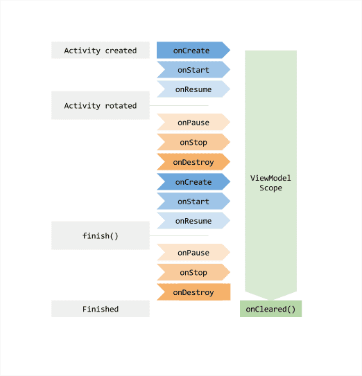
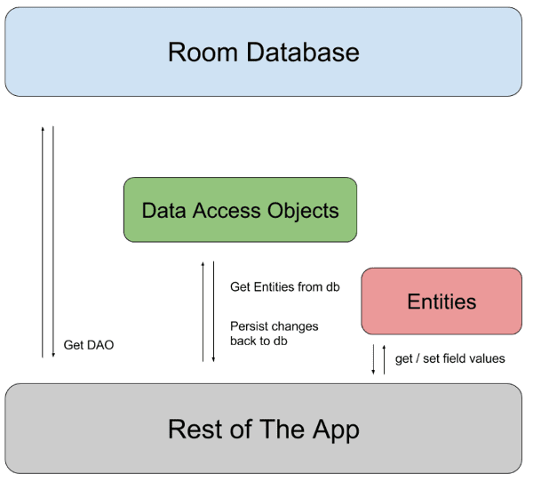
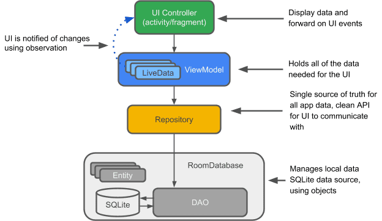

# JetPack & Androidx

2018 구글 I/O에서 새로운 안드로이드 P와 더불어 새로운 라이브러리 패키지인 Jetpack가 소개됨

- 안드로이드는 여러 OS 버전으로 파편화 되어 있기 때문에 개발자들은 하위 호환을 위해 서포트 라이브러리(support library)를 이용.

- 서포트 라이브러리 마저 v4, v7, v8, v17등등으로 여러 버전으로 파편화
- 낡고 번잡한 패키지 구조의 서포트 라이브러리를 정리하고자 익스텐션 라이브러리(Android extension library) 등장
  - Androidx 기반 구조
- 기본 Android 플랫폼에 속하지 않는 `별도의`라이브러리 제공
  - 원하는 속도와 원하는 때에 각 컴포넌트 채택 가능
- androidx.* 네임스페이스로 이동


### Jetpack 이란?

앱 개발을 쉽고 편하면서 빠르게 할 수 있도록 도와 주는 컴포넌트 라이브러리

- 안드로이드 아키텍쳐 컴포넌트를 비롯하여 서포트 라이브러리와 코틀린 지원 도구 등 다양한 기능들이 포함

- 모던 아키텍쳐를 쉬복 빠르게 적용할 수 있도록 지원

- 복잡한 백그라운드 작업이나 데이터 및 라이프 사이클 관리에 시간을 쏟지 않고, 오로지 앱 고유의 기능만 집중해서 개발 가능


### Jetpack 의 장점

- 하위 호환성 보장 (이전 버전과 호환성 제공)

```
//Jetpack 이전
if(Build.VERSION.SDK_INT >=Build.VERSION.LOLLIPOP){
	scheduleWithJobScheduler()
}else{
	scheduleWithAlarmManager()
}

//Jetpack
WorkManager.getInstacne()?.enqueue(req)
```

- 개발자의 생산성을 위한 간결한 API
- IDE 통합


### Jetpack Component

크게 4가지 컴포넌트로 구분 가능

1. Architecture : 구글에서 제안하는 안드로이드 아키텍쳐를 구현 할수 있는 기능
   - View를 포함한 UI 요소의 Lifecycle management를 비롯해 LiveData와 ViewModel, Room등의 기능 포함
2. Foundation : 안드로이드 시스템의 핵심 기능 담당 컴포넌트
   - AppCompat를 비롯하여 코틀린 익스텐션과 Multidex 등이 포함
3. Behavior : 앱의 동작과 관련된 것들로 알림(notification)을 비롯하여 다운로드 매니저나 권한(permission)관리 기능
4. UI : UI개발과 사용의 일관성을 보장해주는 컴포넌트 들이 여기에 해장
   - Animation, Fragment, Layout등의 일관된 처리가 대표적


### 새로운 Jetpack요소?

- Navigation : 화면간의 손쉬운 이동 설정 가능
- Paging : RecyclerView에서 페이징 처리 담당
- WorkManager : 백그라운드 테스크를 한층 수월하게 해주는
- KTX : 코틀린 사용을 한층 더 간결하게 사용하게 해줌
- Slices : 앱 내 기능을 바깥으로 확장 시킬 수 있는 기능


### Jetpack Architecture뜯어보기

1. `Lifecycle` : 액티비티의 상태에 따라 처리 되는 코드를 쉽게 관리할 수 있게 도와주는 라이브러리
   - 액티비티가 실행 중일 때 register하고 멈췄을 때 unregister하도록 구현 
     - `Acitivty.onResume`에 register를 하고 `Activity.onPause`에 unregister코드를 작성
     - 이 코드를 옵저버 객체로 옮길 수 있게 도와줌 
   - 코드가 복잡하지 않고 간결하게 유지하는데 도와줌
   - 주요 클래스
     - **Lifecycle** : Lifecycle을 나타내는 객체
     - **LifecycleOwner**: Activity객체를 말하며 Lifecycle 객체에 액티비티 상태를 제공
     - **LifecycleObserver** : Lifecycle로부터 액티비티 상태 변화에 대한 이벤트를 받는다 
   - **LivecycleOwner**는 Activity를 의미하고, 내부에 **Lifecycle**을 가지고 있다. **Lifecycle**은 액티비티의 상태를 저장하고 옵저버들에게 상태 변화를 알려준다
   - **LifecycleObserver**를 생성하고 **Lifecycle**에 등록하며 된다
   - **정리** : Jetapck의 Lifecycle은 LifecycleOwner와 Lifecycle 객체로 설명할 수 있다. 
     - Owner는 액티비티를 말하고 Lifecycle객체를 소유하고 있다. 
     - Lifecycle객체는 약한 참조(Weak Reference)로 Owner(액티비티)를 참조한다
     - 액티비티 상태에 대한 알림을 받는 옵저버는 Lifecycle객체에 등록할 수 있다.
       - Activity 상태가 변경되면 Lifecycle의 상태가 변경되고, Lifecycle은 옵저버 함수를 호출한다.
       - Lifecycle객체는 액티비티의 상태를 저장하기 때문에 현재 어떤 상태인지 알 수 있다.
   - **기존과 다른점** : 기존 액티비티에서는 Lifecycle에 따라 관리되는 코드들이 많았다. 그리고 실수로 빼먹으면 메모릭 또는 작은 버그가 발생 했는데 Jetpack의 Lifecycle객체로 액티비티 내부에 있는 코드들을 옵저버 객체로 분리할 수 있어서 읽기 쉬운 코드가 되고, 유지보수 하기 쉬운 코드가 될 수 있다.

2. `ViewModel` : 액티비티의 생명주기에 분리를 시켜, 액티비티가 재실행되도 데이터가 소멸되지 않도록 한다.

   - 액티비티가 파괴 되면 ViewModel의 자원도 장녀히 소멸된다.
   - ex.) 화면이 로테이션 되면, 액티비티가 재실행 된다.
     - 이런 경우 액티비티에서 사용하는 자원을 버리고 다시 불러오게 된다.
     - 데이 크기가 작으면 어렵지 않지만 코드를 더 작성하는 것은 귀찮은 일이고, 리소스를 소모하게 됨
   - 액티비티의 `Lifecycle`상태가 종료될 때 까지 소멸 되지 않는다. 
     - Rotation이 되고, 재실행 된다 해도 ViewModel이 갖는 데이터는 소멸 되지 않아 다시 로딩 할 필요가 없다.

   

   - chronometer를 사용하는 앱에서 시작을 하면 1초씩 증가한다. 하지만 화면 회전을 하면 0초부터 다시 시작됨

     - Configuration Chagne가 발생 했을때 액티비티가 재실행 되지 않도록 설정하거나, onPause에 시간을 잠시 저장했다가 재실행 후 onResume에 다시 읽어서 chronmeter에 전달해 주는 방법
     - ViewModel ?
       - ViewModel을 상속받는 chronometer객체 정의 

   - Singleton 클래스와 유사하게 생성

     - ```kotlin
       ViewModelProviders.of(this).get(ChronometerViewModel::class.java)
       ```

     - `ViewModelProviders.of`의 코드를 보면 내부적으로 AndroidViewModelFactory를 사용한다고 하고 ViewModelProvider를 리턴

   - `ViewModel` 객체에 Context를 인자로 전달하거나, Activity, Fragment, View나 객체나 Context를 ViewModel에 저장 하면 안된다.

     - 액티비티가 종료되어 자원이 소멸 될 때 , ViewModel의 자원도 자연스레 소멸되어야 하는데, 만약 내부에 Context를 참조하고 있다면 GC로 데이터를 정리 할 수 없게 된다.
     - `AndroidViewModel`를 사용해야한다.

   - **정리** : MVVM의 ViewModel과 다르고 액티비티의 Lifecycle과 데이터 유지라는 부분에 초점이 맞춰져 있음

3. `LiveData` : 데이터를 저장하고 변화를 관찰 할 수 있는 객체

   - UI 객체는 LiveData에 옵저버를 등록할 수 있고 데이터가 변경될 때 UI를 변경 할 수 있다.
   - RxJava의 Observable과 유사

   ```kotlin
   val elapsedTime = LiveData<Long>
   elapsedTime.observe(this, androidx.lifecycle.Observer<Long> { time ->
           timer_textview.text = time.toString()
   })
   ```

   - Observeable과의 차이점 : LifecycleOwner의 상태가 `STARTED`와 `RESUMED`상태로 활성화 상태일 때만 옵저버에게 데이터 변화를 알려줌 
     - `DESTORYED`로 변경되면 LiveData도 자동 소멸
     - **Memory leak** 문제 신경 X 
   - ViewModel에서 사용되도록 설계
     - 액티비티나 프래그먼트가 재실행 되어도 ViewModel은 소멸되지 않기 때문에 LiveData도 소멸 되지 않는다.
     - Lifecycle이 활성화되었을 때만 데이터 변화를 알려주기 때문에, register, unregister 등의 쓸데없는 boilerplate(형식적인) 코드들이 많이 줄어든다
     - 항상 ViewModel과 사용할 필요는 없다
   - Lifecycle이 활성화 될 때 `onActivity`를 콜백해주고, 비활성화 일 때 `onIncative`를 콜백해준다.
     - `setValue` : 데이터 즉시 변경
     - `postValue` : Runnable로 데이터를 변경 요청
       - Main thread에서 Runnable이 실행 될 때 데이터가 변경 된다.
       - 자신의 데이터 갱신 
   - **정리** : LiveData는 Lifecycle이 활성화 되었을 때만 옵저버로 데이터 변화를 알려주기 때문에 Lifecycle을 신경쓰지 않아도 된다. 또한 Lifecycle 상태가 DESTORYED될 때 LifeData와 Observer객체는 함께 소멸되어 Memory Leak에 대해서 신경쓰지 않아도 된다.

4. Room : SQLite를 추상화한 객체, ORM(Object Relational Mapping)이다. 객체를 사용하듯 DB를 사용할 수 있다.

   - 3개의 주요 Component
     - **Entity** : 데이터 베이스 안에 있는 테이블
       - 테이블 정보를 표현
       - annotation으로 이름, pk키, NonNull, column이름 설정가능
     - **Databse** : 데이터 베이스를 의미
       - DAO 객체를 제공, Access Point
       - `Room.databaseBuilder`를 이용하여 추상 클래스 객체로 만들 수 있음
       - 싱글톤 패턴으로 1개의 객체만 만들어지게 해야함
     - **DAO (Data Acess Obecjt)** : 데이터베이스에 접근하는 메소드
       -  메소드에대한 SQLite 쿼리는 직접 작성 해야함
       - @Query 어노테이션 으로 쿼리 설정
   - 다이어그램

   

   - Room 또한 ViewModel과 LiveData와 함께 쓰이도록 설계

   

   - **정리** : 안드로이드의 ORM이며 LiveData와 ViewModel과 함께 사용할 수 있다.

###  

### Jetpack Workmanager

- Backougnd task 구현, 스케쥴 등을 쉽게 처리할 수 있도록 만든 기능

- 기존 `JobSchduler`가 이와 비슷한 역할

  - WorkManger는 내부적으로 JobSeduler를 사용(API 23 이상) JobSchdeuler를 지원하지 않는 난말 (API 14~22)은 Alarm Manager 또는 Broadcast Receiver를 사용하도록 구현

- 기능

  - **Job 스케줄링** : Job을 스케줄링 할 수 있다.
  - **Job의 상태 모니터링**: 실시간으로 처리되는지 상태를 알 수 있습니다.
  - **Constraint(제약)**: 원하는 조건에 Job이 동작하도록 제약을 줄 수 있습니다.
  - **Chaining Task**: 여러 Job을 우리가 정한 순서대로 실행되도록 할 수 있습니다.

  