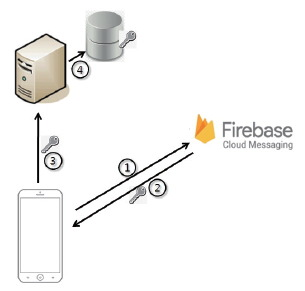
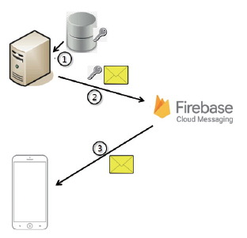

# FCM (Firebase Cloud Message)

실시간 서버 푸시방법

- 소켓 프로그램을 통한 서버와 연결을 지속한 상태에서 데이터를 송수신하는 방법
- FCM(Firebase Cloud Message)을 이용하는 방법

Firebase : 구글의 모바일 앱 개발 통합 

- 앱에서 서버와 지속적으로 연결하고 있지 않더라도 서버의 데이터를 수신 가능

### Firebase 이용하여 key 얻는 방법

1. 스마트폰에 앱이 설치되는 순간 시스템에서 앱을 위해 Firebase 서버에 키 획득을 위한 요정을 보냄
   - Firebase 서버에 키를 위한 요청은 안드로이드 시스템에 의해 자동화되므로 개발자가 구현할 로직은 없다.
   - FCM 방식을 위한 라이브러리와 플러그인이 설치되어야 하므로 시스템이 이를 인지하여 키 요청 을 보낼 수 있게 되는 구조
2. Firebase 서버에서 키를 만들어 스마트폰에 전달
   - 키가 전달되면 시스템은 인텐트를 발생해 앱의 서비스를 구동
   - 개발자가 작성한 서비스가 실행되고 서비스 내에서 키값을 획득
   - 미리 앱을 여러 절차에 맞게 Firebase 서버에 등록
3. 앱에 전달된 키를 서버에 전송
   - 실시간 데이터 푸시 기능이 필요한 곳은 서버이며, 서버에서 전달된 키를 이용하여 데이터를 전송
4. 서버에서는 전달된 키값을 영속화
   - 보통 DB에 저장
   - 서버 DB에는 앱이 깔린 모든 클라이언트 스마트폰의 키가 저장

### 서버에서 데이터를 스마트폰에 전달하는 방법

- 실시간 서버 데이터 푸시가 필요한 순간
- 앱과 서버가 소켓으로 연결되어 있다면 직접 네트워크 프로그램을 통해 데이터를 앱에 전달
- FCM 같은 푸시 서비스는 소켓 연결 프로그램을 이용하는 방식이 아니고, Firebase 서버를 이용하여 데이터가 앱에 전달되게 하는 방식
  - 앱과 서버가 소켓으로 연결되지 않아도 서버의 데이터를 앱에 보낼 수 있게 됩니다.

1. 서버에서 데이터를 스마트폰에 전달하기 위해 DB에서 키를 획득
   - 키는 스마트폰에 설치된 앱을 식별할 수 있는 유일성이 확보된 값
2. DB의 키와 실제 앱에 전송하고자 하는 데이터를 Firebase 서버에 전달
   - Firebase 서버와는 HTTP 통신이 이용되며 Firebase 서버에서 원하는 방식대로 데이터를 구성하여 요청이 이루어짐
3. Firebase 서버에서는 전달받은 키값을 식별해 어떤 스마트폰의 어떤 앱인지를 식별
   - 키값에 의해 특정 스마트폰에 데이터를 전달할 수 있다.
4. 클라이언트 디바이스를 사용할 수 없는 경우, FCM 서버는 이후 전송을 위해 메시지를 큐에 저장한다.
   - 메시지는 최대 4주간 FCM 스토리지에 보관되며 기간은 설정 가능하다.
5. 클라이언트 디바이스를 사용할 수 있는 경우, FCM 서버는 해당 디바이스의 클라이언트 앱에 메시지를 보낸다.

### Token이 변경 되는 경우

- 앱에서 인스턴스 ID 삭제

- 새 기기에서 앱 복원

- 사용자가 앱 삭제/재설치

- 사용자가 앱 데이터 소거

### Subscribe

1. The client app subscribes to a topic by sending a subscribe message to FCM.

2. 앱 서버는 메시지 전송을 위해 FCM으로 topic 메시지를 보낸다.

3. FCM은 해당 topic에 등록된 클라이언트에 topic 메시지를 전달한다.

- 요일 + 판매처를 구독하여 splash에서 리스트 구독

### 구현

- FirebaseMessagingService를 상속받아서 클래스 구현
- firebase 홈페이지에서 pakage명 입력
  - Google-service.json 다운받아서 프로젝트에 삽입
- build.gradle에 dependency추가
- onNewToken()으로 토큰을 발급 받고 sendRegistrationToServer()로 FCM서버로 보내기
- sendNotification()으로 보낼 화면 정의
- onMessageReceived()에 메세지 받았을 때 동작하는 것을 정의 하고 sendNotification()안에 사용하여 동작하게 만들기

### 예상질문

##### 이 라이브러리는 무엇인가?

- 사용자에게 푸시 알림을 보내기 위한 라이브럴

##### 왜 이 라이브러리를 사용하였는가?

- 서버와 소켓통신을 계속하거나 FCM을 이용하는 방법이 있는데 소켓통신을 이용할 경우
  - 클라이언트와 서버가 계속적으로 데이터를 주고 받는 것도 아닌데 연동을 계속해야하니까 리소스 낭비라고 생각

##### 이 오픈 소스의 장점은?

- 무료로 쉽고 빠르게 구현이 가능하다.
- Firebase에서 제공하는 여러 기능들도 함께 사용 가능하다.
- 단점
  - 자체 서버 구축보다 보안성이 떨어진다.

##### 이 오픈소스 사용 방법은?

- 위에 나옴

##### 오픈소스 내부 구조와 로직을 명확히 알고있나?

- 위에나옴

##### 오픈소스 쓰지 않고 구현이 가능 한가

- 소켓 가능 근데 리소스 낭비 심할듯