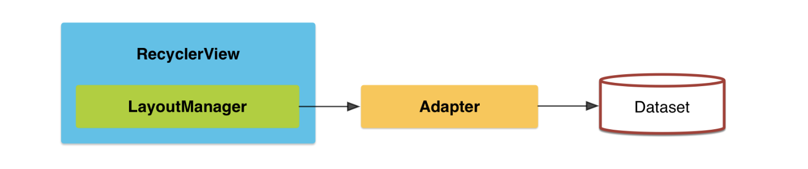
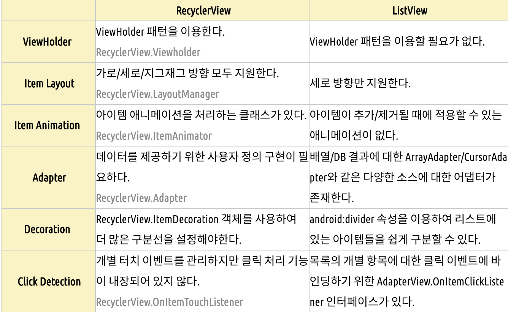

# Recycler View


### 정의

- 리사이클러뷰는 사용자가 관리하는 많은 수의 `데이터 집합(Data Set)`을 개별 `아이템`단위로 구성하여 화면에 출력하는 `뷰그룹(ViewGroup)`이며, 한 화면에 표시되기 힘든 많은 수의 데이터를 스크롤 가능한 리스트로 표시해주는 위젯


### 리스트뷰의 문제점

1. *ViewHolder Pattern* 을 강요하지 않는다.
2. *Vertical* 모드만 지원한다.
3. *Animation* 을 따로 지원하지 않기에 뷰에 대해 직접 구현해야 한다.
4. 데이터가 변경될때 `notifyDataSetChanged()` 를 통해 뷰를 갱신하는데 모든 뷰를 갱신하기에 비용이 매우 크다.


### 리스트뷰와 차이점 (더 자세히)

- `ListView` : 목록을 구현하는데 사용
  - 안드로이드에 임베디드 되어있는 코드로 동작하며 API level 1부터 존재

```
@Override
public View getView(final int position, View convertView, ViewGroup parent) {
    Holder holder = new Holder();
    View rowView = inflater.inflate(R.layout.item_list, null);
    holder.tv = (TextView) rowView.findViewById(R.id.text);
    holder.img = (ImageView) rowView.findViewById(R.id.image);
    holder.tv.setText(result[position]);
    holder.img.setImageResource(imageId[position]);
    rowView.setOnClickListener(new OnClickListener() {
        @Override
        public void onClick(View v) {
            // TODO Auto-generated method stub
            Toast.makeText(context, "You Clicked " + result[position], Toast.LENGTH_LONG).show();
        }
    });
    return rowView;
}
```

- 가장 일반적인 ListView의 `getView()` 접근 방법
  - **재사용성이 떨어짐**
  - 화면상 아이템이 보일 때 호출되는 함수인데 아이템에 20개가 있고 이를 스크롤 한다고 가정하면 스크롤 시에도 getView()함수가 계속해서 호출된다.

~~~
Holder holder = new Holder();
View rootview = inflater.inflate(R.layout.item_list, null);
~~~

- null 처리가 없으므로 스크롤 할 때마다 inflator를 통해서 View의 create가 발생하고 findViewById도 함께 호출된다
- 이래서 `ViewHolder`의 개념이 등장한다
  - 강제적이지 않지만 <u>위와 같이 inflate와 findViewById를 리스트 뷰에서 연속적으로 발생시키면 메모리와 성능에 악영향을 미칠 수 있다</u> 
- ListView에서 ViewHolder 패턴을 적용시키면?
  - `converView==null`일 경우에만 `inflate`와 `findViewById`가 호출되어 `view`가 생성된다. 그리고 `rootView`의`setTag`를 호출하여 생성된 `ViewHolder`를 임시 저장 해 둔다.
- 메리에 문제가 없다면 최초 1회만 생성되고 이후 els문을 통해 `getTage()`를 호출하여 `ViewHolder`를 꺼내와 `ViewHolder`에 접근이 가능한 형태가 만들어 지게 된다.

```
@Override
public View getView(final int position, View convertView, ViewGroup parent) {
    // 최초에 convertView가 null이므로, inflate를 처리한다
    if (convertView == null) {
        // 전역으로 생성한 rootView에 inflate
        rootView = inflater.inflate(R.layout.item_list, null);

        // ViewHolder을 생성
        Holder holder = new Holder();
        holder.tv = (TextView) rowView.findViewById(R.id.text);
        holder.img = (ImageView) rowView.findViewById(R.id.image);

        // setTag : holder 임시 저장
        rootView.setTag(holder);
    } else {
        // rootView에 convertView를 셋팅
        rootView = convertView;
        // rootView에서 holder을 꺼내온다
        holder = (Holder) rootView.getTag();
    }

    holder.tv.setText(result[position]);
    holder.img.setImageResource(imageId[position]);
    rowView.setOnClickListener(new OnClickListener() {
        @Override
        public void onClick(View v) {
            // TODO Auto-generated method stub
            Toast.makeText(context, "You Clicked " + result[position], Toast.LENGTH_LONG).show();
        }
    });
    return rootView;
}
```

- `ListView`에 `ViewHolder`패턴 적용 한 것 (위 코드)
- **ListView** 장점
  - ListView는 간단하게 리스트를 만드는 부분에 있어서는 장점을 가지고 있다. (ex. 텍스트만 있을 때)
  - 간단한 아이템 형태를 만드는 경우에 빠르게 적용이 가능한 `ArrayAdapter`를 제공한다.
- **ListView** 단점
  - 아이템의 애니메이션 처리가 쉽지 않다.
  - 리스트에는 한 개 이상의 View가 필요한 경우가 있지만 커스텀으로 작업하기 쉽지않다.
  - `ViewHolder`패턴을 강제적으로 사용하지 않으므로 고비용의 `findVIewById`가 매번 호출 된다.


### ViewHolder 패턴

- 각 뷰들을 보관하는 Holder 객체를 의미하여 이는 RecyclerView그리고 ListView에서 사용된다.

  - 각 adapter 내에서 사용

-  `findViewById()`와 같은 반복적으로 호출되는 메서드를 효과적으로 줄여 속도 향상에 많은 기여를 하는 패턴

- **ViewHolder 객체**는 레이아웃의 태그 필드 안에 각 구성요소 부를 저장하므로 반복적으로 조회하지 않고도 `즉시 액세스`할 수 있다.

- Ex) 10개의 데이터를 가진 리스트가 있을 때 이는 리스트뷰로 표현할 때 어떻게 나타내도 빠른 속도로 나타내게 되있다.

  - 하지만 100000개의 데이터를 가진 리스트를 생각 할 떄 이를 리스트 뷰로 표현하고자 한다면 `findViewById()`를 호출 할 때 매우 큰 비용이 들기 시작한다. 
  - 스크롤을 내릴 떄 더 많은 cost를 요구하게 되고 결국 속도 저하를 초래한다.

- getView를 정의하는 세가지 방법

  - 느린방법 :

    ```
    public View getView(int position, View convertView, ViewGroup parent) {
        View item = mInflater.inflate(R.layout.list_item, null);
        ((TextView) item.findViewById(R.id.text)).setText(DATA[position]);
        ((ImageView) item.findViewById(R.id.icon)).setImageBitmap(
                    (position & 1 ) == 1 ? mIcon1 : mIcon2);
        return item;
    }
    ```

    - `getView()`가 호출 될 때 마다 새로운 `View`를 생성한다. XML을 inflate하는 작업은 안드로이드에서 무거운 작업이다. 아이템의 개수가 많아질 수록 inflating작업꽈 view 생성 작업을 해야한다는 단점이 있다. (하나의 view는 RAM에서 1KB, 2KB를 차지한다) 동작이 매우 느려지거나 끊기기 때문에 convertView를 사용하면 된다.

  - 올바른 방법:

    ```
    public View getView(int position, View convertView, ViewGroup parent) {
        if (convertView == null) {
            convertView = mInflater.inflate(R.layout.list_item, parent, false);
        }
     
        ((TextView) convertView.findViewById(R.id.text)).setText(DATA[position]);
        ((ImageView) convertView.findViewById(R.id.icon)).setImageBitmap(
                    (position & 1 ) == 1 ? mIcon1 : mIcon2);
     
        return convertView;
    }
    ```

    - `convertView`는 재사용이 가능하도록 설계되어있다. 그래서 inflating작업을 했던 아이템들에 대해서는 null체크를 통해 해당 작업을 생략하는 방법을 사용한다. 이 방법을 사용하면 아이템의 총 갯수에 상관없이 화면에 맞는 갯수 아이템(view)을 ListView가 할당한다.

  - 빠른 방법(View Holder 사용):

    ```
    public View getView(int position, View convertView, ViewGroup parent) {
        ViewHolder holder;
     
        if (convertView == null) {
            convertView = mInflater.inflate(R.layout.list_item, parent, false);
            holder = new ViewHolder();
            holder.text = (TextView) convertView.findViewById(R.id.text);
            holder.icon = (ImageView) convertView.findViewById(R.id.icon);
     
            convertView.setTag(holder);
        } else {
            holder = (ViewHolder) convertView.getTag();
        }
     
        holder.text.setText(DATA[position]);
        holder.icon.setImageBitmap(
                    (position & 1 ) == 1 ? mIcon1 : mIcon2);
     
        return convertView;
    }
    ```

    - `ViewHolder`패턴은 작은 data저장소를 만들어 각각 리스트 아이템들을 static으로 연결하는 것. 올바른 방법 예제를 보면 두번 째 방법을 통해 inflating하는 작업은 줄였지만 TextView와 ImageView를 가져오기 위해 매번 `findViewById`작업을 반복하고 있다. ViewHolder을 사용하면 한번 연결한 데이터는 저장소에 저장하여 다시 `findByViewId`를 통해 view를 찾아 올 필요가 없다. 

- **findViewById()**가 cost가 많은 이유?

  - 액티미티는 메인이 되는 데코레이션 뷰에게 `findViewById()`를 호출하고 그 후로 뷰의 계층에 따라 반복적으로 `findViewById()`가 호출된다
    - `View`인 경우 자기와 id가 같은지 확인한다.
    - `ViewGroup`의 경우 자기와 id가 같은지 비교하고 같지 않은 경우 자기들에 대해 하나씩 `findViewById`를 호출하는 형태로 된다.
    - 개별 뷰는 자신만 확인하고 레이아웃을 담당하는 뷰는 자신과 자식을 확인하는 것
      - `트리의 깊이 우선탐색`과 같다.
  - 달빅에 JIT가 없던 시절 큰 차이가 있었음
    - 목록을 스크롤 할 때 GC의 일시 중지를 피하고 계층이 복잡한 뷰에서는 여전히 중요하다
  - 대체 라이브러리
    - Annotation, ButterKnife

- **inflate**이 무거운이유?

- RecyclerView에서의 ViewHodler

  - RecyclerVIew.Adapter 클래스를 상속하여 adapter클래스를 만듭니다.
  - 필수 오버라이딩 함수
    - **onCreateViewHolder** : ViewHolder 객체를 생성
      - 각 아이템을 위한 XML레이아웃을 이용해 뷰 객체를 만든 후 뷰 홀더에 담아 리턴
      - XML 레이아웃을 인플레이션 하여 설정할 VIewGroup 객체는 onCreateViewHolder 메소드 파라미더로 전달된다.
    - **onBindViewHolder** : ViewHolder에 data를 넣는 작업 수행
      - 뷰 홀더에 각 아이템의 데이터를 설정
      - `setItem`메서드는 myItem 객체를 전달받아 뷰 홀더 안에 있는 뷰에 데이터를 설정하는 역할 
    - **getItemCount** : data의 갯수 반환
  - Cf) inflate 이란?
    - xml에 쓰여진 view의 정의를 실제 view 객체로 만드는 역할을 수행
    - 성능상 문제로 컴파일 타임에 존재하는 xml에 대해서만 적용 가능


### Recycler View

- RecyclverView는 ListView의 문제를 해결하기 위해 개발자에게 더 다양한 형태로 커스터마이징 할 수 있도록 제공된다.
- ListView와 가장 큰 차이점
  - **LayoutManager**와 **ViewHolder** 패턴의 의무적인 사용, Item에 대한 뷰의 변형, 애니메이션 개념

##### Create Lists



- Widget인 RecyclerView는 LayoutManager를 통해 View를 그리는 방법을 정의
- RecyclerView.Adapter에서는 Data의 ViewHolder정의에 따라 UI가 선택되고 이를 표현


##### 특징

- 강제적 ViewHolder사용으로 View의 **재사용**을 가능하게 해준다.
- 많은 데이터를 리스트 형태로 제공
- RecyclerView.ItemAnimator을 이용하여 Item의 Animator를 이용할 수있다.
- LayoutManager를 통해서 아이템의 배치 방법을 다양하게 적용할 수 있다.


##### 주요 클래스

- Adapter : 기존의 ListView에서 사용하는 Adapter와 같은 개념으로 데이터와 아이템에 대한 View 생성
- ViewHolder : 재활용 View에 대한 모든 서브 뷰를 보유
- LayoutManager : 아이템 항목을 어떻게 배치하는가를 결정
- ItemDecoration : 아이템 항목에서 서브뷰에 대한 처리
- ItemAnimation : 아이템 항목이 추가, 삭제되거나 정렬될 때 애니메이션 처리를 할 수 있다.


##### Adpater

- 리스트 뷰의 어댑터 종류
  - ArrayAdpater(배열에서 데이터 가져올 때), CursorAdapter(DB에서 데이터 가져올 때), SimpleAdapter(XML 등으로부터 가져 올 때 사용)를 구분하여 사용
- RecyclerView는 Univeral한 Adapter를 사용하여 데이터 소스를 처리(**유연성**)
- 오버라이딩 메소드
  - **onCreateViewHolder(VeiwGroup parent, int viewType)** : 뷰홀더를 생성하고 뷰를 붙여줌
    - 새롭게 생성될 때만 호출됨
  - **onBindViewHolder(CustomViewHolder holder, int position)** : 재활용 되는 뷰가 호출하여 실행되는 메소드, 뷰 홀더를 전달하고 position데이터 결합
  - **getItemCount()** : data의 갯수 반환
- getItemCount() -> onCreateViewHoler() -> onBindViewHolder()순으로 호출


##### ViewHolder

- 리스트 뷰에서는 뷰 홀더 패턴을 권장
  - UI를 수정할 떄마다 부르는 findViewById()를 뷰 홀더 패턴을 이용해 한번만 호출 함으로 써 뷰 지연을 초래하는 무거운 연산을 줄임
- RecyclerView는 뷰홀더 패턴을 `강제함`으로써 해결
  - 앱 퍼포먼스는 향상시켜주지만 디바이스는 뷰 홀더 패턴을 사용하지 않은 리스트뷰나 리싸이클러뷰의 성능차이가 미세
- 뷰 홀더 패턴을 사용한 리스트뷰와 리싸이클러뷰 성능은 같다.


##### LayoutMangner

- 리스트뷰는 수직 스크롤만 가능
  - 어찌어찌 가능하지만 그렇게 사용하도록 설계 된 것이 아니라고 한다.
- 종류
  - LinearLayoutManager : 가로 / 세로
  - GridLayoutManager : 한 줄에 1개 이상의 이미지 표시 
    - 아이템 크기는 줄의 첫번째 아이템의 크기에 따라 달라질 수 있다. (모두 동일하게 가능)
  - StaggeredGridLayoutManager : 그리드 형태의 아이템에 크기를 다양하게 적용가능
  - CustomLayoutManger
    - 3개의 레이아웃 매니저를 상속받아 구현가능


##### Item Decoration

- 리스트 뷰에서는 XML에 파라미터를 추가함으로써 쉽게 divide할수 있었다.
- RecyclerView에서는 RecyclerView.ItemDecoration클래스(상속)를 통해 divider를 원하는 아이템에 추가 할 수 있도록 되었다.
  - 조금 복잡


##### Item Animator

- Matrial Design에 대해 조명된 이후로 리스트에서 애니메이션을 무궁무진한 가능성을 가지게 되었다.
  - 리스트뷰에서는 삽입이나 삭제에 특별한 애니메이션이 없다.
- RecyclerView에서는 RecyclerView.ItemAnimatior클래스를 통해 애니메이션 핸들링이 가능하다.
  - 아이템 삽입, 삭제, 이동에 대한 커스터마이징이 가능하고, DefaultItemAnimator가 제공되므로 커스터 마이징이 필요 없다.
- notifyItemChanged(int position), notifyItemInsetred(int position), notifyItemRemoved(int position)을 ItemAnimator을 통해 특정 아이템에 대한 애니메이션을 발생시킬 수 있다.


##### 클릭 이벤트 처리

- 터이벤트를 통해 사용자가 아이템을 클릭했는지 롱 클릭했는지를 직접 처리
- *GestureDetector* 를 이용하여 클릭뿐만 아니라 롱클릭이나 탭 등의 다양한 제스쳐 이벤트를 구현할 수 있다
- RecyclerView.OnItemTouchListener은 RecyclerView의 터치 이벤트를 감지
  - 개발자에게 터치 이벤트를 인터셉트 하는 제어 권한을 줌
- ListView에서 아이템을 클릭시 콜백받을 수 있는 리스너가 RecyclerView에는 존재하지 않음
- RecyclerView에서는 OnClickLisetner를 달아줘야하는 문제 발생

```
public class StoreItemAdapter extends RecyclerView.Adapter {

   
    @Getter
    private List<DetailStore> storeList = null;
    private OnStoreClickListner storeItemListener = null;
		
		 public interface OnStoreClickListner{
        void onStoreItemClick(View v, int pos);
    }


    public void setOnStoreClickListner(OnStoreClickListner onStoreClickListner){
        this.storeItemListener = onStoreClickListner;
    }
...
}
```

- 이렇게 인터페이스를 정의한후 클릭 리스너를 정의하여 뷰홀더에 넘겨서 아이템 클릭이벤트를 정의


##### DiffUtil

- 데이터 변화를 감지하여 뷰를 갱신 하는 클래스
- areItemsTheSame, areContentsTheSame, getChangedPayload등을 오버라이딩하여 데이터간 변화를 감지한다.
- RecyclerView.Adapter에서 `notifyItemMoved`, `notifyItemRangeChanged` , ` notifyItemRangeInserted`, `notifyItemRangeRemoved` 등이 호출되면 해당 범위의 데이터의 변화를 감지하고 뷰를 선택적으로 갱신가능
  - notifyDataSetCahgned대신 효율적으로 사용가능


##### 비교



- ListView
  - 리스트뷰에서는 BaseAdapter를 상속받은 ArrayAdapter나 CursorAdapter 등을 사용한다.
  - ViewHolder 패턴을 선택적으로 구현하기 때문에 구현하지 않는 경우 각각의 View를 그릴 때마다 findViewById()를 호출하기 때문에 성능 저하 문제가 발생한다.
  - getView() 메소드에서 뷰를 그릴 때마다 findViewById()를 매번 호출하여 성능이 저하된다.
- ListView+ViewHolder
  - 리스트뷰에서 ViewHolder 패턴을 구현한다면 성능에 관해서는 RecyclerView와 비슷하지만 기존의 ListView는 뷰 커스텀 작업에 대한 유연성이 떨어진다.
- RecyclerView
  - 리싸이클러뷰는 ViewHolder 패턴의 사용을 강제하고 Adapter 클래스를 직접 구현하기 때문에 뷰 커스텀 작업에 대한 유연성이 ListView보다 더욱 쉽고 편하다.


### 예상질문

##### 이 라이브러리는 무엇인가?

- RecyclerView는 사용자가 관리하는 많은 수의 `데이터 집합(Data Set)`을 개별 `아이템`단위로 구성하여 화면에 출력하는 `뷰그룹(ViewGroup)`이며, 한 화면에 표시되기 힘든 많은 수의 데이터를 스크롤 가능한 리스트로 표시해주는 위젯

##### 왜 이 라이브러리를 사용하였는가?

- 데이터 집합을 효율적으로 표현할 수 있는 ListView라는 라이브러리가 존재하지만 이것은 각 데이터 셋을 커스터마이징하거나 애니메이션을 넣거나, 속도적인 측면에서 더 빠르기 때문에 RecyclerView를 사용하였다.

##### 이 라이브러리의 장점은?

- View의 재사용을 하게 해주어서 많은 데이터가 주어질때 효율 적이고 뷰 커스텀 작업이 유연하다.

##### 이 라이브러리 사용 방법은?

- 

- 사용하고자하는 액티비티에 리사이클러뷰를 추가합니다.(v7 Support Library)
- 그 후 RecyclerView.Adpater를 상속받는 어댑터 클래스를 정의합니다.
- 이 때 오버라이딩 되어야 하는 메소드가 있는데 `onCreateViewHolder`, `onBindViewHolder`, `getItemCount`입니다.
- 또한 어댑터 클래스 안에 ViewHolder 클래스를 상속받아 아이템뷰를 지정하는 ViewHolder 클래스를 정의해줍니다.
- `onCreateViewHolder`, `onBindViewHolder`를 통해 데이터가 ViewHolder에 연결되게 됩니다.
- 그 후 다시 사용하고자 하는 액티비티로 돌아와 어댑터와 레아이웃 매니저를 지정하고 어댑터에 데이터를 삽입한 뒤  RecyclerView에 어댑터를 연결해 줍니다.

##### 라이브러리 내부 구조와 로직을 명확히 알고있나?

- 위 내용과 동일

##### 라이브러리 쓰지 않고 구현이 가능 한가

- 하드코딩....?