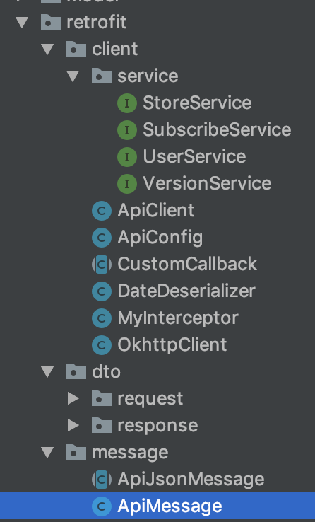

# Retorfit2

서버와 통신을 하려면 기본적으로 `http`통신을 해야한다. Retrofit은 어노테이션을 사용하여 코드를 거의쓰지않고 초보자도 알기 쉽게 쓸 수 있으며, 커스터마이즈 가능성도 높다.


**네트워크 권한 필수!!!!!!!**


### 네트워크 통신 라이브러리 (시간순)

- HttpClient
  - DefaultHttpClient라고 불리는 Apache HTTP Client와 AndroidHttpClient 라는 Http Client 변종 등이 사용됨
- HttpURLConnection
  - Java 표준 라이브러리에 포함되어 있지만 버그가 있어 Apache Http라이브러리인 HttpClient에 뭍혀 졌고 버그가 수정되었지만 다른 좋은 라이브러리가 나와 뭍혀버린 클래스
  - 버그 들이 해결되었을 텐데 왜 어째서 이 라이브러리는 사용하지 않는가?
    - Android API 28부터 네트워크 보안 정책이 바뀜
      - `https`는 문제없는데 `http`인경우 별도 설정 필요
  - URL을 정하고 열고! 스트림 받고! 데이터받고! 스트림 닫고! 커넥션 닫고!
    - 데이터 받는데 코드가 엄청 길고 불편함
- OkHttp
  - Android에서 `HttpUrlConnection`을 이용한 네트워크 통신이 존재하지만 매번 connection 설정, input, output stream 생성 및 할당 등 반복적인 작업이 생기게 된다.
  - 이것을 도와주는 라이브러리 `OKhttp`
  - `Okhttp` 사용시 대개 `Asynctask`를 통해 비동기로 실행하게 되는데 `Asynctask`가 성능상 느리다는 이슈가 존재
    - `Retrofit`에서는 `Asynctask`를 사용하지 않고 자체적인 비동기 실행과 스레드 관리를 통해 속도를 훨씬 빠르게 끌어올림 (약 3-10배 차이)
  - `Okhttp`에서도 쿼리 스트링, request, response설정 등 반복적인 작업이 필요한데, Retrofit에서 이런 과정을 모두 라이브러리에 넘겨서 처리하고 있음
    - 함수 호출시 파라미터만 머기면 되기 때문에 훨씬 작업량이 줄어들고 사용하기 편함
- Retroit (1.0.0)
  - 200~399 에러에 대해서는 정상적 Body를 반환하지만 400 이상의 경우에는 Typed Exceoption형태로 로직을 진행
  - Response Status나 Header정보를 알기에는 추가적인 로직이 필요
- Velly
  - HttpClinet에 의존
  - Android 5.1에서 HttpClient가 Deprecated(제거)됨
  - 이미지 캐시, 요청에 우선순위를 부여하는 등 추가적인 기능이 존재
  - 하지만 직렬화를 직접 세팅해 줘야하고 멀티파트 업로드시에도 리퀘스트의 재정의가 필요
  - `StringRequest`생성시 파라미터 값을 encoding해주어야 하는 불편함과 통신 실패시 `ErrorResponse`안에 `ResponseBdoy`가 담기지 않는 문제를 알게 되어 사용하지 않게 되었다.
- Rerofit2
  - REST api에  적합한 라이브러리?
  - `interface`에 `annotation`을 사용하여 호출할 함수를 파라미터와 함께 정의해놓고, 네트워크 통신이 필요한 순간에 구현 없이 해당 함수를 호출하기만 하면 통신이 이루어지기에 코드가 읽기 매우 편하다
    - `Asynctask`를 쓰지 않기에 불필요하게 코드 길이가 길어질 필요도 없고, 콜백함수를 통해 결과가 넘어오도록 되어 있어 매우 직관적인 설계가 장점
  - `Okhttp`의 상위 구현체
  - `enqeue`와 `excute`를 사용하여 동기, 비동기 처리 지원
  - 클라이언트와 직렬화를 위한 convert를 선택할 수 있어 유지보수에 편함
  - Retrofit(1.0.0)과 다른점
    - Call 객체를 통해 Request와 Response에 적용된 Header, StatusCode, Body등을 직접 접근 할 수 있도록 인터페이스 추가


### Gradle 세팅

```
 implementation 'com.squareup.retrofit2:retrofit:2.5.0'
 implementation 'com.squareup.retrofit2:converter-gson:2.5.0'
 implementation 'com.google.code.gson:gson:2.8.5'
 implementation 'com.squareup.okhttp3:logging-interceptor:3.8.0'
 implementation 'com.squareup.okhttp3:okhttp:3.8.0'
```


### 알아야하는 개념

- GSON
  - json 구조를 띄는 직렬화된 데이터를 JAVA 객체로 역질렬화, 질렬화 해주는 자바 라이브러리
- POJO == Java Benas
  - 순수하게 setter와 getter메소드로 이루어진 Value Object성의 Bean
- DTO, DAO, EntityClass
  - DAO (Data Access Object)란?
    - Repository package
    - 실제로 DB에 접근하는 객체
      - Persistence Layer(DB에 data를 CRUD하는 계층)이다.
    - Service와 DB를 연결하는 고리 역할
    - SQL를 사용(개발자가 직접 코딩)하여 DB에 접근한 후 적절한 CRUD API를 제공
  - DTO (Data Transfer Obejct)란?
    - dto package
    - 계층간 데이터 교환을위한 객체(Java Beans)이다.
      - DB에서 데이터를 얻어 Service나 Controller 등으로 보낼 때 사용하는 객체 모습
      - 로직을 가지고 있지 않은 순수한 데이터
      - getter, setter만 가짐
    - Request와 Response용 DTO는 Vie를 위한 클래스
    - VO (Value Object)
      - VO는 DTO와 동일 한 개념이지만 read only의 속성을 가진다
      - VO는 특정한 비즈니스 값을 담는 객체이고, DTO는 Layer간의 통신 용도로 오고가는 객체를 말함
  - Entity Class
    - domain pakage
      - 실제 DB테이블과 매칭될 클래스
        - 최대한 외부에서 Entity 클래스의 getter method를 사용하지 않도록 해당 클래스 안에서 필요한 로직 method를 구현
    - Entity와 DTO 분리 이유?
      - View Layor와 DB Layer의 역할을 분리하기 위해
      - 테이블과 매핑되는 Entity 클래스가 변경되면 여러 클래스에 영향을 끼치게 되는 반면 View와 통신하는 DTO zmffotmsms wkwn qusrudehlamfh qnsflgodigksek.
- CallBack
  - 응답 값이 없으면 사용 안해도됨
  - 정상적 성공 `onResponse()`, 실패한 경우 `onFailure()`

### 로직

- 구성
  - 인터페이스 (레트로핏 api 인터페이스)
  - 네트킹 처리
    - 레트로핏 팩토리
    - 레트로핏 빌더
  - 자바 오프젝트
    - POJO

- 구현 순서

  1. POJO 구성

     - 내부에 네트워킹이 정상적으로 처리되지 않았을 시 오류가 난것을 알리는 오브젝트를 반환되는 스태틱 메소드를 구현해야함

       ```
       public static List<ComulApiModel> failed() {
         List<ComulApiModel> data = new ArrayList<>();
         data.add(new ComulApiModel("error!", "", "", "", "", ""));
         return data;
       }
       ```

  2. 레트로핏 API 인터페이스 구현

     - 어노테이션을 활용한 통신 함수 정의

  3. 레트로핏 객체 생성

     - 레트로핏 객체는 생성 할 때마다 자원을 엄청 소모하기 때문에 단일 객체를 생성해 싱글톤으로 접근해 불필요한 생성을 막아줘야함

  4. 인터페이스에 있는 메소드 구현

- 우리 프로젝트 구현 (Okhttp3 + retrofit2)
  - Interceptor : Okhttp에 있는 강력한 메커니즘으로 호출을 모니터, 재 작성 및 재 시도 할 수 있다.
    - NetworkIntercpetors 사용
  - ApiClient


### 예상 질문 정리

##### 이 라이브러리는 무엇인가?

- `Okhttp`의 상위 구현체로서 쉽게 Reqeust와 Response를 구현하는 것

##### 왜 이 라이브러리를 사용하였는가?

- AsyncTask, HttpUrlConnection을 직접 사용하여 네트워크 통신을 구현하려면 직접 네트워크 통신을 연결/해제 해야하고 가져온 Json data를 class로 바꾸어야 하고 각종 에러처리를 직접 해야하기 때문에


##### 이 오픈 소스의 장점은?

- 편의성, 속도, 가독성
  - 편의성 : 반복적인 작업을 라이브러리에 넘겨서 처리
  - 속도 : 비동기로 실행이 가능하여 `Okhttp`보다 약 3-10배 빠름
  - 가독성 : 어노테이션을 사용하여 호출 할 파라미터를 정해놓고 함수 호출만 하면됨


##### 이 오픈소스 사용 방법은?



- Controller(내 파일에서는 ApiClient)를 싱글톤으로 구현하여 각종 서비스나 인터셉터 등을 컴파일 시키고 데이터가 필요한 액티비티의 onCreate()내부에 레트로핏 빌더를 이용해사용

##### 오픈소스 내부 구조와 로직을 명확히 알고있나?

- 로직은 위에
- `AsyncTask`없이 background Thread에서 실행되며 callBack을 통해 main thread에서의 UI 업데이트를 간단하게 할 수 있도록 제공


##### 오픈소스 쓰지 않고 구현이 가능 한가

- 할수 있지만 너무 복잡할 것같다. 통신이라는게 신경써야할꼐 너무 많기 때문에....!