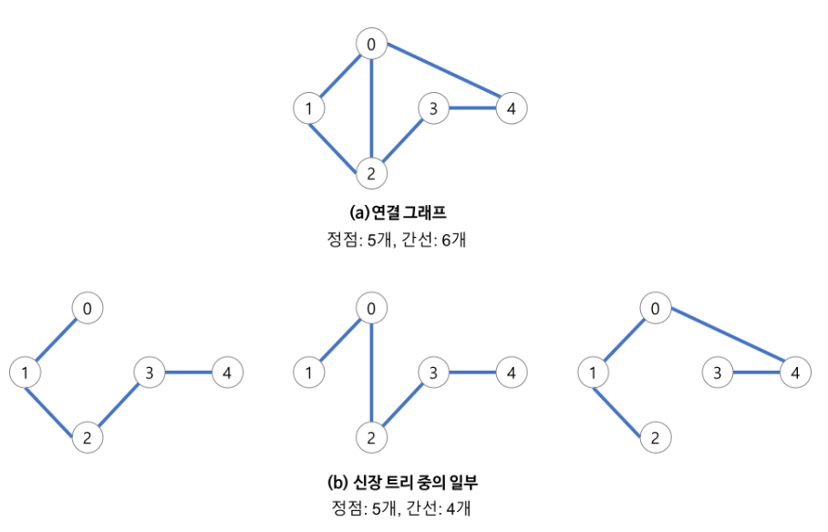

# 최소 신장 트리(MST, Minimum Spanning Tree)

## 먼저 알아 둘 것
- 그래프

## Spanning Tree 란?
- 그래프 내의 모든 정점을 포함하는 트리
    - Spanning Tree = 신장 트리 = 스패닝 트리
- Spanning Tree는 그래프의 최소 연결 부분 그래프 이다.
    - 최소 연결 = 간선의 수가 가장 적다.
    - n개의 정점을 가지는 그래프의 최소 간선의 수는 (n-1)개이고, (n-1)개의 간선으로 연결되어 있으면 필연적으로 트리 형태가 되고 이것이 바로 Spanning Tree가 된다.
- 즉, 그래프에서 일부 간선을 선택해서 만든 트리

## Spanning Tree 특징

- DFS, BFS을 이용하여 그래프에서 신장 트리를 찾을 수 있다.
    - 탐색 도중에 사용된 간선만 모으면 만들 수 있다.
- 하나의 그래프에는 많은 신장 트리가 존재할 수 있다.
- Spanning Tree는 트리의 특수한 형태이므로 모든 정점들이 연결 되어 있어야 하고 사이클을 포함해서는 안된다.
- 따라서 Spanning Tree는 그래프에 있는 n개의 정점을 정확히 (n-1)개의 간선으로 연결 한다.
