# Graph 기본 용어 정리

## Graph
- 그래프란 일련의 노드(node, vertex, 정점, 꼭지점) 집합
-  V와 엣지(edge, 간선, 변) 집합 E로 구성된 자료구조의 - 일반적으로 노드엔 데이터, 엣지엔 노드와 노드 사이의 관계 정보가 포함

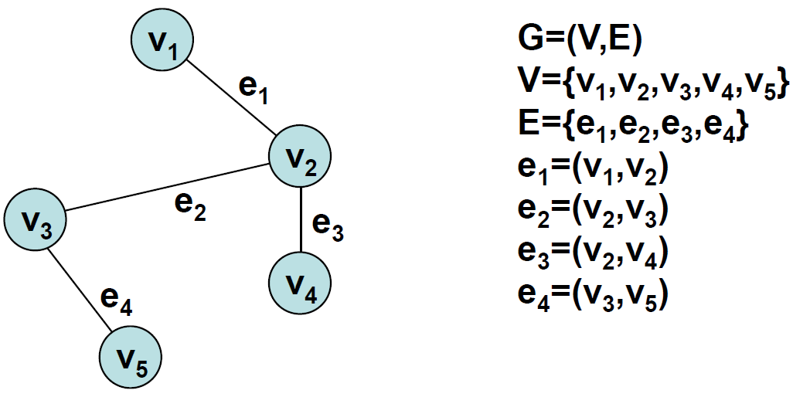

## sparse/dense graph
- sparse : 노드의 수보다 엣지 수가 적은 그래프를 가리킵니다. - dense graph : 노드 수보다 엣지 수가 큰 그래프입니다.

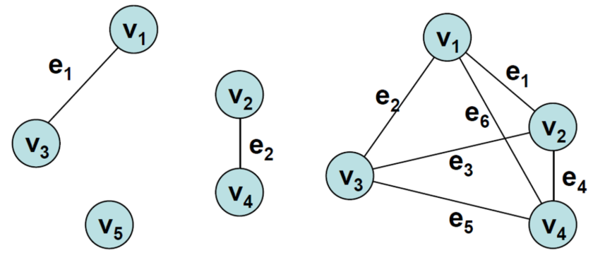

## incident/adjacent
- 인접(adjacent,) :임의의 두 노드가 하나의 엣지로 연결돼 있을 경우
    - 인접 == 부속(incident)

## degree
- 노드에 연결된 엣지의 수(혹은 엣지 가중치의 합)

## loop/isolated
- loop : 한 엣지가 같은 노드에 부속해 있을 때
- isolated vertex : 한 노드에 부속해 있는 엣지가 전혀 없을 때
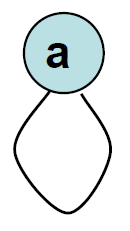

## isomorphic
- 한 그래프의 두 노드를 연결하는 엣지가 하나이고, 다른 그래프에서 그에 대응하는 노드를 연결하는 엣지가 하나뿐일 때
- 두 그래프는 생김새만 다르게 생길 뿐 본질적으로는 구조가 같다

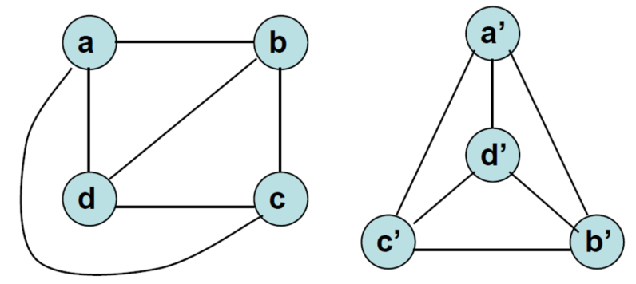

## subgraph
- 원 그래프와 노드는 같고 일부 엣지만 포함된 부분그래프
-  이 부분그래프가 트리을 만족할 경우 spanning tree라고 함

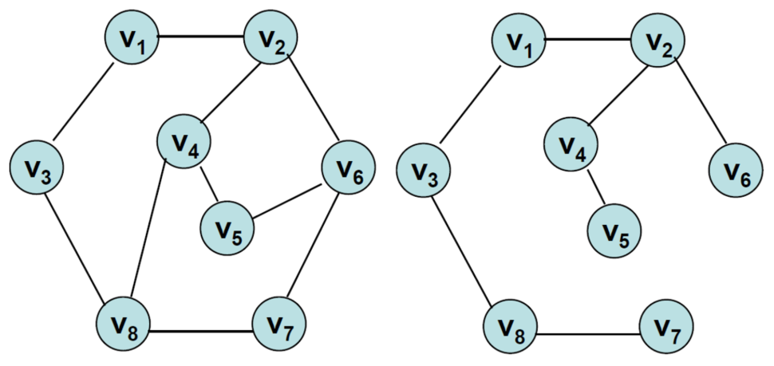

## complete graph/multigraph
- 완전 그래프 (complete graph) : 모든 노드들이 엣지로 연결돼 있어, 엣지의 수가 최대인 그래프
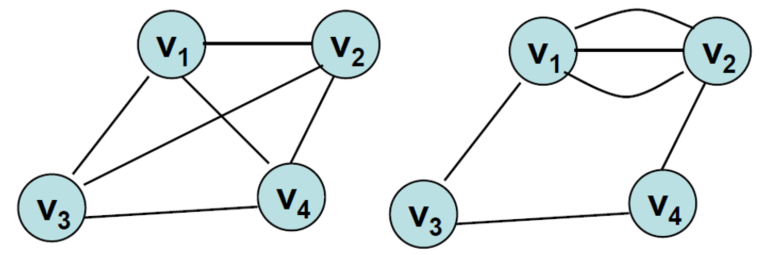
- 클리크(clique) : 모든 노드들이 엣지로 연결된 부분그래프
    - 엣지 수가 n(n-1)/2개
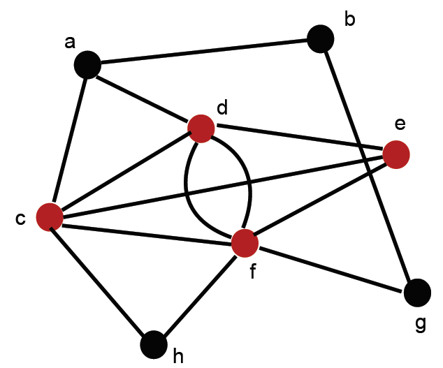
    - 노드의 수가 가장 많은 클리크(c,d,e,f)를 maximum clique라고고 함

## directed graph
- 엣지가 순서가 있는 쌍으로 표현된 그래프의 일종
- 엣지가 방향성을 가짐
- 차수가 `incoming degree`와 `outgoing degree`로 나뉨
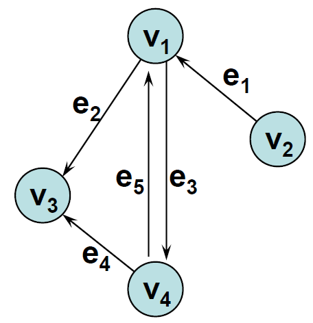
    - incoming degree는 e1, outgoing degree는 e2, e3가 됨

## weighted graph
- 엣지에 가중치 내지 우선순위 정보가 추가된 형태의 그래프입
- 함수 g는 엣지를 가중치로 매핑하는 역할
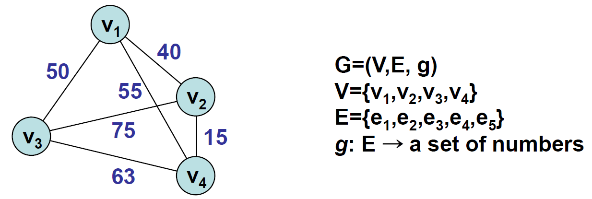

## path
- 인접한 노드들로 구성된 시퀀스(1개 이상)
- simple : 엣지가 겹치지 않는 경로
- elementary : 노드가 겹치지 않은 경로
- 길이 : 경로 내 존재하는 엣지의 수
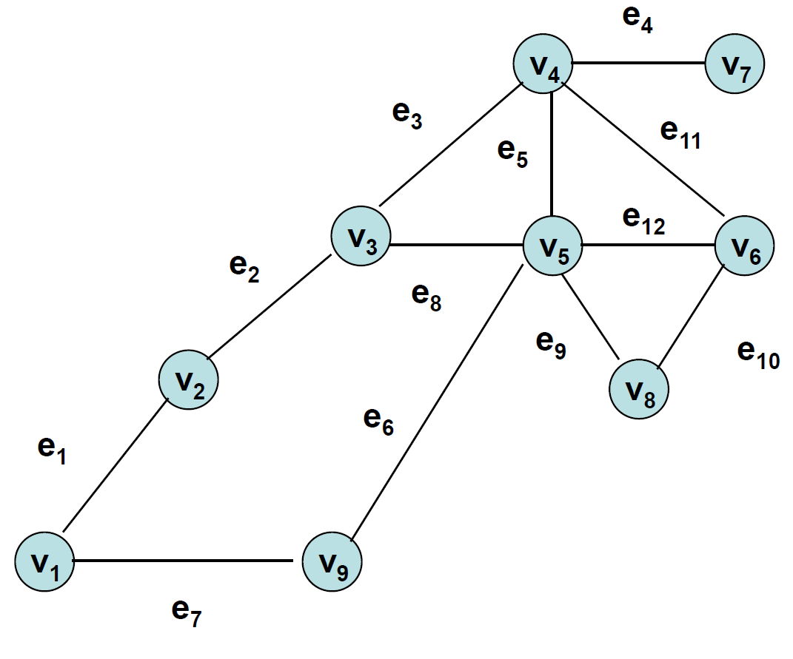
    - 두번째 노드 시퀀스는 인접한 노드들로 구성돼 있기 때문에 경로라고 할 수 있다. 엣지가 겹치지 않기 때문에 simple하다고 말할 수 있다. 하지만 노드가 겹치기 때문에 elementary하지는 않다.

## cycle/acycle
- 한 노드에서 시작해 해당 노드에서 끝나는 경로
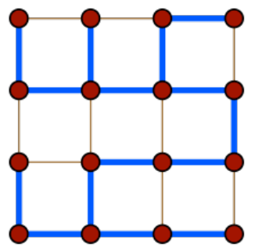
- acyclic : 사이클이 없는 그래프

## connected
- 두 노드 사이에 경로가 존재한다
    - 모든 노드쌍 사이에 경로가 존재하는 무방향그래프는 연결되었다고 말한다. 
    - 임의의 방향그래프에서 방향을 무시하고 보면 연결되어 있을 경우, 해당 방향 그래프는 연결되었다고 말한다.
    - 방향그래프의 임의의 노드쌍 a, b에 대해 a에서 b로 가는 경로, b에서 a로 가는 경로가 존재한다면, 해당 방향그래프는 강연결(strongly connected)되었다고 말한다.

