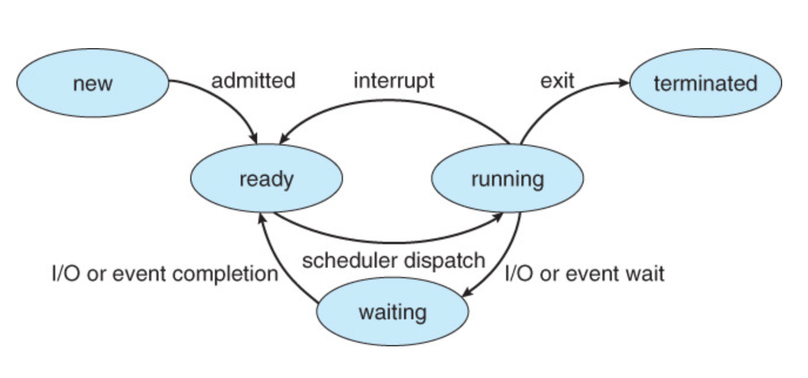

# CPU Schedling (CPU 스케줄링)

## 먼저 알아두기
- CPU 스케줄링은 다중 프로그램 운영체제의 기본
- 프로세스 스케줄링 == 스레드 스케줄링
    - 운영체제는 실제로 커널 수준 스레드를 스케줄함
    - 매커니즘은 같은데 단위가 다르다

## CPU 스케줄링 이란?
- CPU 입장에서 또는 프로세스 입장에서 최고의 효율성을 보이며, 공평하게 CPU를 프로세스에게 분배하는 알고리즘, 방법을 말함
- 시스템이 실행하고자 할 때 프로세서(CPU)를 프로그램들에게 할당하는 과정
- 싱글 CPU에 여러 프로세스가 있을 때를 기준으로 한다.

## CPU 스케줄링을 하는 이유
- CPU 이용률을 최대화 하기 위해
- 프로세스 대기 -> 다른 프로세스 할당

## CPU I/O Burst Cycle
- 프로세스의 실행 = CPU 실행 + I/O 대기

- CPU burst == CPU를 사용할 떄
- I/O burst == I/O를 기다릴 때

- running과 I/O wait을 반복

## CPU Scheduler / Dispatcher
- 하드웨어 x, 소프트웨어 x, 운영체제에서 이 역할을 하는 코드의 일부분 일 뿐
- CPU Scheduler : Ready 상태의 프로세스 중 `어떤 프로세스에게 CPU를 할당할지` 결정
- CPU Dispatcher : 스케줄러에 의해 선택된 프로세스에게 `CPU 제어권을 넘겨주는` 역할
    - 제어권
        - context switching
        - switching to user mode
        - 프로그램 재시작을 위해 사용자 프로그램을 적절한 위치로 이동
    - `Dispatch latency` : dispatcher가 한 프로세스를 멈추고 다른 프로세스를 시작하기까지 걸리는 시간
        - 가능한 한 빨라야 한다.
        - 일종의 오버헤드로서 줄이기 쉽지 않다.
        - 그래서 dispachter보다는 CPU 스케줄링의 효율적인 알고리즘에 더 주목하고자 한다.
- Ready Queue가 꼭 큐 방식이 아니라, 트리, 리스트 등 여러 자료구조로 구현 할 수 있다.

## CPU 스케줄링이 발생할 때
- Preemptive : CPU가 어느 프로세스를 실행하고 있는데(아직 끝나지도 않았고 IO를 만난 것도 아닌데) 강제로 쫓아내고 새로운 것이 들어갈 수 있는 스케쥴링(응급실)
    - running state에서 waiting state로 이동 (device controller의 I/O 완료 interrupt)
        - I/O 작업이 만료로 해당 프로세스 ready queue 대기
    - terminates (time interrupt)
        - 할당 시간 만료로 CPU를 강제로 빼앗고 다른 프로세스에게 넘기기
    - 한 프로스가 자료를 갱신하고 있는 동안 선점되어 두 번째 프로세스가 실행 가능한 상태가 될 수 있다. 이때 두 번째 프로세스가 데이터를 읽으려 할 때 데이터 일관성이 깨질 수 있다.
    - 커널 설계에 영향을 줌
        - 시스템콜을 처리하고 있는 상황에 프로세스가 선점된다면....?
        - UNIX 버전을 포함하여 몇몇 운영체제들은 context swichting이 일어나기 전에 `시스템 콜을 완료하게 하거나 입출력 요구에 따른 봉쇄가 일어니가를 기다리는 방법`을 사용함
- Non-preemptive : 프로세스가 끝나거나 IO를 만나기 전엔 안됨(은행)
    - running state에서 ready state로 이동
    - waiting state에서 ready state로 이동
        

## 스케줄링 기준
- CPU Utilization (CPU 이용률) : CPU가 얼마나 놀지않고 부지런히 일하는가
- Throughput (처리율) : 시간당 몇 개의 작업을 처리하는가
- Turnaround time (반환시간) : 작업이 레디큐에 들어가서 나오는 시간의 차이(병원에서 진료 받을 때..대기하고 CT 찍고, … 나오는 시간 차) 짧아야 좋음
    - 총처리 시간 = 메모리에 들어가기 위해 기다린 시간 + 준비 완료 큐에서 대기한 시간 + CPU 실행 시간 + 입출력 시간을 합한 시간
- Waiting time (대기시간) : CPU가 서비스를 받기 위해 Ready Queue에서 얼마나 기다렸는가
- Response time (응답시간) : Interactive system에서 중요. 클릭-답, 타이핑-답. 첫 응답이 나올 때 까지 걸리는 시간
    - 피드백을 받을때 ( 대화형 시스템 )
- 이상 적인 스케줄링, CPU 이용률과 Throughput을 올리고 Waigint time 과 Response time을 줄인다
    - 넘나 이상적 불가능

## 스케줄링 알고리즘
- 선입선출 (FCFS, First-Come, Frist-Servced Scheduling)
- 최단 작업 우선 스케줄링 (SJF, Shrtest Job First)
- 우선순위 스케줄링 (Priority Scheduling)
- 라운드 로빈 스케줄링 (Round Robin Scheduling)
- 다단계 큐 스케줄링 (Multilevel Queue Scheduling)
- 다단계 피드백 큐 스케줄링 (Multilevel FeedBack Queue Scheduling)

*간트 차트 : 참여한 프로세스의 시작 시간과 종료 시간을 포함하여 특정 스케줄 기법을 도시하는 막대형 차트

## FCFS 
- 먼저 요청 -> 먼저 서비스
- 큐로 관리, 리스트도 가능
    - 프로세스 PCB를 큐에 연결

프로세스 | 버스트 시간
:------:|:------:
p1 | 24
p2 | 3
p3 |3
- 평균 대기 시간이 김
    - 17 = (0+24+27)/3
- Convoy effect (호위 효과) : 모든 다른 프로세스들이 하나의 긴 프로세스가 CPU를 양도하기 를 기다리는 것
    - CPU와 장치 이용률 저하
- Nonpreemptive scheduling (비선점)
- 시분할 시스템에서 문제가 됨
    - 시분할 시스템 -> 각 사용자가 규칙적인 간격으로 CPU를 얻는 것이 매우 중요
- 모든게 동일 할때 마지막 조건을 사용!
    - 해울쓰 예 ) 나머지가 다 똑같으면 나이 많은 사람이! 의 느낌

## SJT
- 실행시간이 짧은 프로세스에게 우선순위 부여
    - 프로세스 전체 길이가 아닌 CPU 버스트 타임에 의해 스케줄링 된다.
- `최소 평균 대기시간` 관점에서는  SJF가 제일 좋음

프로세스 | 버스트 시간
:------:|:------:
p1 | 6
p2 | 8
p3 | 7
p4 | 3
- 간트 차트
    - p4(0-3) | p2(3-9)| p3(9-16) | p2(16-24)
- 평균 대기 시간
    - 7 = (3+16+9+0)/4
- 단기 스케줄링(더 알아보기 참조) 에서는 SJF를 사용할 수 없다
    - 단기 스케줄링은 다음 CPU 버스트 길이를 알 수 있는 방법이 없음!
- CPU가 다음 요청의 길이를 파악하는 것에 어려움을 느낌
- 다음 CPU 버스트 길이의 근사값을 계산함
    - 지수평균
    - 
    - guessn+1  = aTn + (1-a)geussn , ( 0< a <1 )
    - t : 최근 정보 , guess: 과거 역사를 저장
- `starvation` 존재 : CPU burst가 큰 process가 무한 대기하는 현상이 발생할 수 있다.
- 선점형 / 비선점형 둘다 가능

## SRTF (선점형 , SJF, shortest remaining time first)

프로세스 | 버스트 시간 | 도착시간
:------:|:------:|:------:
p1 | 6 | 0
p2 | 8 | 1
p3 | 7 | 2
p4 | 3 | 3

- 평균 응답 시간은 ((17 - 0) + (5 - 1) + (26 - 2) + (10 - 3)) / 4 = 13ms
- 평균 대기 시간은 ((10 - 1) + (1 - 1) + (17 - 2) + (5 - 3)) / 4 = 6.5ms
- 비선점형 SJF의 경우 7.75ms
- ready queue에 CPU burst가 짧은 process가 자주 도착할 경우 선점이 자주이루어져(schedule이 잦아서) context switching의 부담이 있다.
- starvation 현상 발생

## Priority Scheduling
- 가장 높은 우선순위를 가진 프로세스에게 CPU 할당
- SJF는 우선순위 스케줄링의 특별한 경우
    - SJF는 우선순위가 다음 CPU 버스트
- 우선순위가 같으면 FCFS
- Priority
    - Internal(내부적 요소): time limit, memory requirement, i/o to CPU burst, …
    - External: amount of funds being paid(유료 컴퓨터일 경우), political factors, …
- 선점 / 비선점 가능
    - 선점 : 실행중인 프로세스와 우선순위 비교, 우선순위가 높으면 CPU 선점
    - 비선점 : 준비완료 큐의 머리 부분에 새로운 프로세스를 넣는다
- indefinite blocking (무한 봉쇄) / starvation (기아 현상)
    - 우선 순위가 낮은 프로세스들을 잃어버릴 수 있다.
- aging : 오랫동안 시스템에서 대기하는 프로세스들의 우선순위를 점진적으로 증가시킴
    - ex. 127-0 사이의 우선순위라면, 매 15분 마다 1씩 우선순위 증가

## RR (Round-Robin Scheduling)
- 시분할 시스템을 위해 설계
- 시간을 쪼개서 프로세스 진행
- 쪼갠 동일한 시간을 Time Quantum, Time Slice라 부름
    - Time quantum 시간양자 = time slice (10 ~ 100msec)
- `원형 큐` 사용, FCFS로 동작
- 첫번 째 프로세스를 선택해 한번의 시간 할당량 이후에 인터럽트를 걸도록 타이머를 설정 한 후 프로세스를 디스패치한다.
- time slice 보다 CPU 버스트가 적을 경우 자발적으로 방출
- time slice 가 CPU 버스트 보다 작을 경우 context switching이 일어나고 다시 큐의 꼬리에 넣어진다.
- 평균 대기 시간이 길다.
// 표 첨부하기
- 준비 완료 큐에 n개의 프로세스가 있고 시간 할당량이 q이면, 각프로세스는 최대 1/n 시간을 얻는다.
    - `(n-1)*q` 이상을 대기 하지 않는다.
- 극단적인 time slice를 가질경우 FCFS와 같다.
- time slice > context switching time : 스위칭이 빈번하게 돌아서 같이 도는 것처럼 보임(* context switching overhead가 빈번하게 발생)

## Multilevel Queue Scheduling
- 준비 완료 큐를 다수의 별도 큐로 분류
- 메모리 크기, 프로세스의 우선순위, 프로세스 유형에 따라 한개의 큐에 영구적으로 할당
    - 프로세스를 그룹화 함!
- 큐는 각각 스케줄링 알고리즘을 가짐 (독립된 스케줄링)
    - 1번큐는 RR, 2번 큐는 SJF ...
- 큐와 큐 사이의 스케줄링이 존재해야함 (CPU 가 싱글이기 때문)
    - 일반적으론 선점형 SJF
- CPU time을 각 Queue 에 차등배분

## Multilevel Feedback Queue Scheduling
- 프로세스가 큐들 사이에 이동 가능
- CPU 버스트 성격에 따라서 구분
    - ex. 어떤 프로세스가 CPU 시간을 너무 오래 사용하면, 낮은 우선순위 큐로 이동
- 모든 프로세스는 하나의 입구로 진입
- 너무 많은 CPU time 사용 시 다른 Queue로
- 기아 상태 우려 시 우선순위 높은 Queue로
- 한 Queue에만 있지 않고 옮겨가는 방식

# 더 알아보기

## 단기 vs 중기 vs 장기 스케줄링

- 장기 스케줄링(Long-term scheduler) : 실행할 작업을 준비 큐(입력 큐)에서 꺼내 메인 메모리에 적재함.
디스크에서 메모리로 적재될 프로그램을 선정한다. 쉽게 말하면 메모리 문지기 역할이다. (작업 스케줄러 라고도 불린다)
단순히 문을 열고 닫는 문지기 역할에서 그치는게 아니라 메인 메모리에 있는 프로세스의 양을 판단하고 결정하는 역할도 한다. 
만약 메인 메모리에 적재된 프로세스들이 너무 많아 실행이 빈번하게 발생되고 메인 메모리에 프로세스들이 넘쳐나면 더 이상
프로세스들을 메인 메모리에 적재 시키지 않는다. - 멀티프로그래밍의 정도를 결정

- 중기 스케줄링(Mid-term scheduler) : cpu를 할당받고 프로그램이 실행중 일 때 멀티 프로그래밍 정도에 따라 프로그램들을
관리해 주는 역할을 한다. (= swapper)
프로세스들이 CPU를 서로 차지하려고 할 때 프로세스를 기억장소(메인 메모리)에서 잠시 빼내고 다시 메인 메모리에 들여보내
실행시킬 수 있는 교체(Swapping)기법을 사용한다.
- 메모리에서 디스크로 잠시 나가는 상태 - 스왑 아웃
- 디스크에서 메모리로 다시 들여오는 상태 - 스왑 인
- 메인 메모리에 프로그램(프로세스)들이 너무 많아 멀티 프로그래밍의 정도를 조절 하기 위해 스왑 아웃, 스왑 인 기법을 사용하는데 스왑 아웃을 할 때에는 디스크로 내보낸 작업을 다시 메모리로 들여보내겠다는 약속을 한다.
- 이 스왑 아웃, 스왑 인을 관리하는것이 스와퍼 = 중기 스케줄러이다.

- 메인 메모리의 준비 상태에 있는 작업 중 실행할 작업을 선택하여 CPU를 할당. (프로세서 스케줄러 라고도 불린다)
- 하지만 CPU는 프로그램을 실행 시키기 전에 먼저 실행 시키기 위한 데이터 확보가 필요하다.
- CPU에게 그 필요한 데이터를 확보 시켜주고 CPU를 할당하는 역할을 이 단기 스케줄링이 한다.
- 그리고 준비 큐에 있는 프로그램들(프로세스)중 먼저 도착한 프로세스에게 CPU를 할당 시켜준다. = 디스패쳐

## 장기 스케줄링과 중기 스케줄링, 단기 스케줄링의 차이?
- 먼저 장기 스케줄링과 단기 스케줄링의 차이는 실행 빈도이다. 단기 스케줄링은 실행할 프로세스를 수시로 선택해야 해서 실행시간이 100만 분의 수초 정도이다. 반대로 장기 스케줄링은 시스템에 새로운 작업이 들어오는 것은 분 단위이므로 단기 스케줄링에 비해 상대적으로 덜 수행하는 것이다. 그 때문인지 작업이 시스템에 들어오는 정도가 일정하다면 작업의 도착 정도와 작업의 끝냄 정도가 비슷하다. 
장기 스케줄러의 실행은 작업이 시스템을 나갈 때만 실행되기 때문에 실행 간격이 상대적으로 길다 그래서 실행시간이 좀 길어도 영향을
적게 받는다. 중기 스케줄링은 장기 스케줄러의 비중이 적거나 아예 없는 시스템에서 중기 스케줄러를 추가하여 사용하는데 가상 메모리체제나 시분할 기법을 사용하는 시스템이 그 (예)이다. 중기 스케줄러는 프로세스들이 CPU를 서로 차지하려고 할 때, 프로세스를 기억장소(메인 메모리)에서 빼고 다시 넣을 수 있어서 다중 프로그래밍의 정도를 줄일 수 있다.
