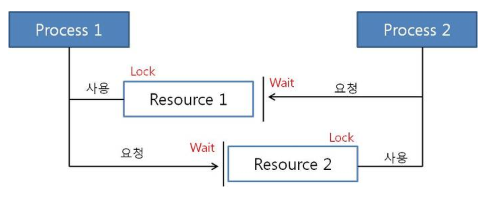
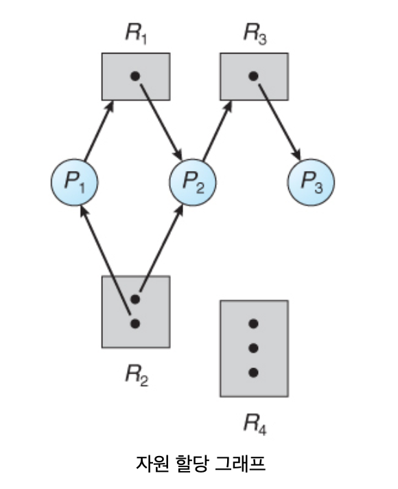
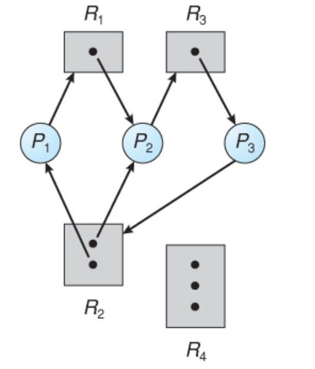
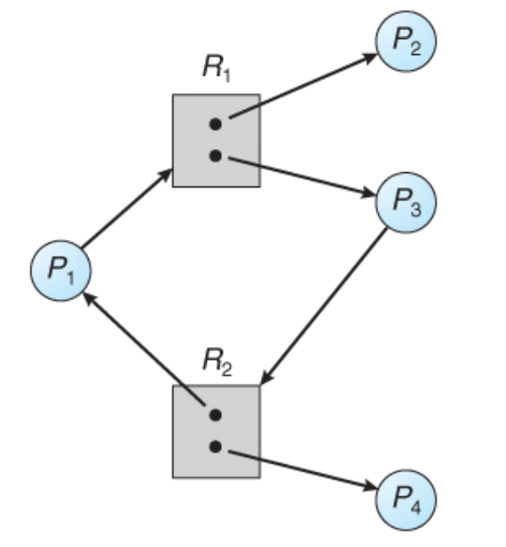

# Deadlocks (교착 상태)

## Deadlock 이란?
- `교착상태`라고도 하며 한정된 자원을 여러 곳에서 사용하려고 할 때 발생할 수 있다.
- 대부분의 현재 운영체제들은 교착 상태 방지 기능을 제공하지 않고 있다.

- 멀티 프로그래밍 환경에서 한정된 자원을 사용하려고 서로 경쟁하는 상황이 발생 할 수 있다.
- 어떤 프로세스가 자원을 요청 했을 때 그 시각에 그 자원을 사용할 수 없는 상황이 발생할 수 있고 그 때는 프로세스가 `대기 상태로` 들어 간다.
- `대기 상태`로 들어간 프로세스들이 실행 상태로 변경 될 수 없을 때 이러한 상황을 교착 상태라 한다.

## proecess가 자원을 요청하는 순서
1. 요청 (request): 프로세스는 자원을 요청한다. 요청이 즉시 허용되지 않으면 (ex. 다른 프로세스에 의해 사용 될 경우), 요청 프로세스는 자원을 얻을 때 까지 대기해야 한다.
2. 사용 (use): 프로세스는 자원에 대해 작업을 수행할 수 있다. 
3. 해제 (release) : 사용 후 자원을 해제함
- 자원의 요청과 해제는 `system call`이다.
- 프로세스나 스레드가 커널이 관리하는 자원을 사용할 때 마다 매번 os는 프로세스가 자원을 요청했는지와 그 자원을 할당 받았는지 확인한다
- 시스템 테이블이 각 자원이 자유 상태인지 또는 할당되었는지 기록하며, 각 할당된 자원에 대해서는 어느 프로세스에게 할당 되었는지도 기록 한다.
- 할당된 자원을 요청한 프로세스는 그 자원의 대기 큐에 입력된다.

## Deadlock 특징
Deadlock이 걸리면 프로세스들은 실행을 끝낼 수 없고, 시스템 자원이 묶여 있어 다른 작업을 시작하는 것도 불가능 하다.

네가지가 동시에 발생했을 때 Deadlock이 발생한다
1. 상호 배제 (Mutual exclusion) : 자원은 한 번에 한 프로세스만이 사용할 수 있어야 한다.
2. 점유 하며 대기 (Hold-and-wait) : 프로세스가 할당된 자원을 가진 상태에서 다른 자원을 기다린다.
3. 비선점 (No preemption) : 프로세스가 어떤 자원의 사용을 끝낼 때까지 그 자원을 뺏을 수 없다.
4. 순환 대기(Circle wait) : 각 프로세스는 순환적으로 다음 프로세스가 요구하는 자원을 가지고 있다.
    - 대기하고 있는 프로세스의 집합 {P0, P1, ...,PN}에서 P0sms P1이 점유한 자원을 대기하고, P1은 P2가 점유한 자원을 대기하고, P2,...,PN-1은 PN이 점유한 자원을 대기한다.

## 자원 할당 그래프
- Deadlock은 시스템 자원 할당 그래프라고 하는 방향그래프로 정확하게 기술 할 수 있다.
- V : 정점의 집합
- E : 간선의 집합
- P = {P1, P2, P3, ..., PN} : 시스템 내 모든 활성 프로세스 집합
- R = {R1,R2,R3, ...,RN} : 시스템 내 모든 자원의 집합
- 요청 간선 Pi -> Rj : 프로세스 Pi 가 자원 Rj 요청 (대기 상태)
- 할당 간선 Rj -> Pi : 자원 Rj가 프로세스 Pi에게 자원 할당된 상태

- 자원 할당 그래프가 사이클을 가지고 있지 않으면, 교착 상태가 아님
- 자원 할당 그래프가 사이클을 가지고 있으면, 교착 상태일 수도 아닐 수도 있음
    1. 각 자원 유형의 수가 하나인 경우 : 필요충분조건
    2. 각 자원 유형이 여러 개인 경우 : 필요 조건 O, 충분 조건 X
- 교착 상태의 자원 할당 그래프

    - 사이클 2개 존재
    - P1 -> R1 -> P2 -> R3 -> P3 -> R2 -> P1
    - P2 -> R3 -> P3 -> R2 -> P2
- 교착 상태가 아닌 자원 할당 그래프

    - 사이클 1개 존재, 교착 상태 아님
    - P4에 할당된 R2가 해제되어 P2에 할당될 수 있기 때문

## Deadlock 처리
1. 예방 및 회피 : 교착 상태가 되지 않도록 보장하기 위하여 교착 상태를 예방하거나 회피하는 프로토콜을 이용하는 방법
2. 교착 상태 탐지 및 회복 : 교착 상태가 되도록 허용한 다음에 회복시키는 방법
3. 교착 상태 무시 : 대부분의 시스템은 교착 상태가 잘 발생하지 않으며, 교착 상태 예방, 회피, 탐지, 복구하는 것은 비용이 많이 든다.

## Deadlock Prevention (예방)
교착 상태의 필요 조건 중 적어도 하나가 성립하지 않도록 자원 요청에 대해 제한을 두는 방법
- Mutual Exclusion (상호 배제) : 여러 개의 프로세스가 공유 자원을 사용할 수 있도록 한다
    - ex. read-only 파일 -> 동시접근 허용, 프로세스가 대기할 필요가 없어짐
    - 일반적으로 상호 배제 조건을 거부함으로써 데드락을 예방하는 것은 불가능
    - 어떤 자원들은 공유가 불가능 한 것들이 있음
        - ex. mutex락
- Hold and Wait (점유하며 대기) :  프로세스가 자원을 요청할 때는 언제나 다른 어느 자원도 점유하지 않도록 보장하면 교착상태가 발생하지 않음
    1. 각 프로세스가 수행 전에 필요한 모든 자원을 요청하여 할당받도록 하는 방법
    2. 각 프로세스가 자원을 하나도 갖고 있지 않을 때만 자원을 요구하도록 하는 방법
    - 프로세스 : 테이프 구동기 -> 디스크 파일 -> 프린터
        - 1의 경우 세 가지 자원이 프로세스의 시작 시에 요청되고, 종료 시에 해제됨
        - 2의 경우 단계별로 요청 및 해제함
    - 단점
        -  1의 경우 자원이 할당되어 오랫동안 사용되지 않으므로 자원의 이용도가 낮음
        -  2의 경우 필요한 자원중 최소한 하나가 다른 프로세스에 할당되어 있기 떄문에 무한정 대기하는 기아상태 발생 가능
- No Preemption (비선점)
    1. 자원을 보유하고 있는 어떤 프로세스가 현재 할당받을 수 없는 자원을 요청하면, 보유하고 있는 모든 자원이 해제되도록 하는 방법
    2. 다른 자원을 요청하여 대기중인 프로세스에 의해 점유중인 자원을 선점할 수 있도록 하는 방법

