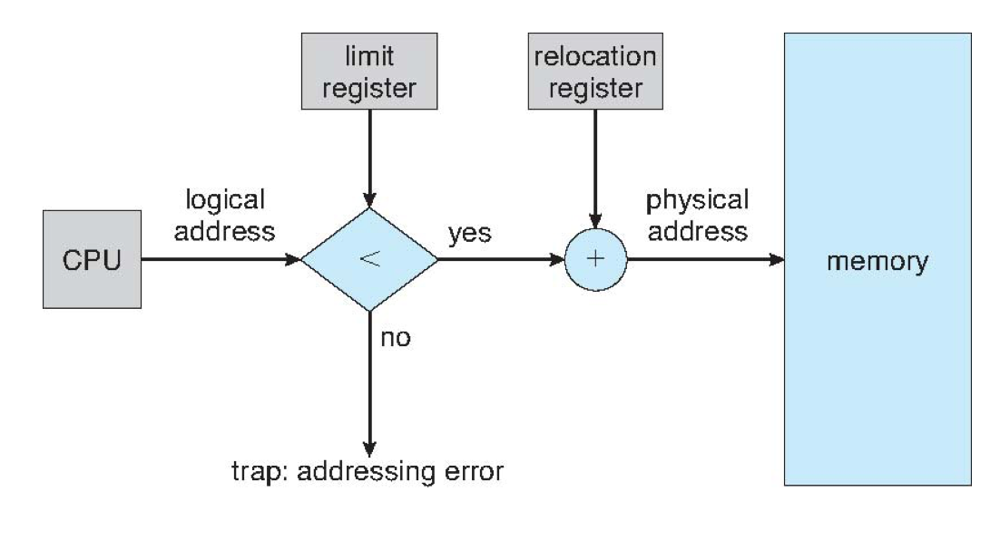

# Memory

## 프로그램 실행과 메인 메모리
- 메모리는 각각 주소가 할당된 일련의 워드 또는 바이트로 구성된다.
    - 1 Byte = 8 bit
    - 1 Word = 16 bit
- CPU는 PC가 지시하는 대로 메모리로부터 `다음 명령어`를 가져온다. 
    - 해당 명령어는 필요한 경우 추가적인 데이터를 가져올 수 있으며(load), 반대로 데이터를 메모리로 내보낼 수 있다.
- 전형적인 명령어 실행 절차
    - 메모리로부터 한 명령어를 가져온다.
    - 가져온 명령어를 해독하고, 메모리에서 피연산자(operand)를 가져와 명령어를 실행한다.
    - 실행 결과를 메모리에 다시 저장한다.

## 레지스터 - 캐시 - 메인 메모리
- 기계 명령어(어셈블러)는 `메모리 주소`만을 인수로 취하고, `디스크` 주소는 인수로 취하지 않는다
- 모든 명령어와 데이터들은 CPU가 직접 액세스할 수 있도록 메모리 혹은 레지스터에 있어야 함
- 명령어가 메모리에 없다면, 이를 처리하기 전에 디스크에서 메모리로 옮겨야 함.
- CPU의 명령어/데이터 접근
    - 레지스터들은 일반적을 CPU clock의 1 cycle(1 clock tick)로 접근이 가능.
    - 주 메모리는 많은 CPU clock tick을 필요
        - 이로 인해 데이터가 없어서 명령어를 실행하지 못하고 지연되는(stall) 현상이 발생 가능.
    - 해결 : 캐시

## 운영체제 영역 보호
- CPU 스케줄링의 결과로 다음 두 가지를 향상시킬 수 있다.
    - CPU 사용률
    - 사용자에 대한 컴퓨터의 반응 속도
- 성능 향상을 인식하기 위해서는
    - `메모리에 여러 개의 프로세스를 유지`해야 한다.
- 시스템이 올바르게 작동하기 위해서는 사용자 프로그램으로부터 `운영체제 영역을 보호` 해야 함.
    - 사용자 시스템인 경우 특정 사용자 프로그램이 접근하는 것도 막아야한다.
    - CPU와 메모리 간의 접근 중에 os가 개입하게되면 성능 저하 발생
    - 하드웨어가 지원!
- 프로그램은 실행을 위해 메모리로 옮겨져서 독립된 공간에 위치한다
    - 각 프로세스는 분리된 메모리 공간을 갖는다
    - 기준 레지스터(base register)와 상한 레지스터(limit register)는 물리 메모리 내의 프로세스 주소 공간을 결정하는 데 사용된다.
    - 프로세스가 접근할 수 있는 합법적(legal) 메모리 주소 영역을 설정한다.
    - 기준 레지스터(base register)는 가장 작은 물리 메모리 주소(시작점)를 가진다.
    - 상한 레지스터(limit register)는 프로세스 주소 공간의 크기를 저장한다.

- 왼쪽 메모리 맵에서 두 번째 프로세스
- 기준 레지스터: 300040
- 상한 레지스터: 120900
- 이 프로세스가 접근할 수 있는 물리 메모리 범위는 300040부터 420940까지 이다

- 메모리 공간 보호는 CPU가 `사용자 모드에서 생성되는 매 주소를 레지스터(기준 및 상한)와 비교`함으로써 이루어진다.
    - 모든 불법적인 메모리 접근은 운영체제에게 `트랩(trap)`을 통해서 알린다.
        - **트랩 : 소프트웨어 인터럽트 
- 범위를 벗어나는 메모리 접근 시도는 치명적 `에러`로 취급한다.
- 이 기법은 os가 다른 사용자 프로그램이의 코드나 데이터 구조를 수정하는 것을 막는다.
- base register와 limit register는 `kernel mode`에서만 로드된다.
    - os만 레지스터 값 변경 가능!
- 커널 모드에서 동작하는 운영체제는 모든 메모리 영역(운영체제, 사용자 영역)의 접근에 어떠한 제약도 받지 않는다.
    - 그래야 context switching 가능!

## 입력 큐 (Ready queue)
- 입력큐 : 디스크 상의 프로세스 집합으로, 실행되기 위해 메모리로 옮겨지기를 기다리고 있다.
- 필요 이유
    - 프로그램은 디스크에 이진 실행 파일(binary executable file)로 저장된다.
    - 실행되기 위해, 프로그램은 메모리로 옮겨져 “프로세스”가 되어야 한다.
    - `메모리 관리 전략`에 따라, 프로세스는 실행되는 동안 디스크와 메모리 사이를 왔다 갔다 할 수 있다.
    - 디스크에서 메모리로 들어오기를 기다리고 있는 프로세스들의 집합은 이른바 입력 큐를 형성한다.

## 사용자 프로그램 처리 과정
- 사용자 프로그램들은 수행되기 전에 여러 단계를 거친다.
- 각각의 단계에서 `다른 방법`으로 주소가 표현될 수 있다.
    - 명령어(instructions)
    - 자료(data)
- 주소의 표현/변환
    - 소스 프로그램의 주소는 일반적으로 기호로 나타낸다. (int A)
    - `컴파일러`는 기호 주소를 재배치 주소(relocation address)로 바인드할 것이다. (첫 번째 바이트로부터 14번째 바이트 주소)
    - `연결 편집기(linkage editor)`나 `적재기(loader)`는 재배치 주소를 절대 주소로 바인드할 것이다. (74014)

## 주소공간
- Logical Memory : 프로세스가 인지하는 정의 공간, 프로그래머가 프로그래밍에 사용하는 공간 
- Physical Memory : 하드웨어의 실제 공간, RAM, byte사용
- Logical Address : CPU가 생성하는 주소
- Physical Address : 메모리가 취급하는 주소
    - MAR (Memory Adress Register)에 주어지는 주소
- Virtual Adress : 컴파일시 바인딩과 적재시의 바인딩 기법 경우에는 논리 == 물리 이지만, 실행시간 바인딩 기법에는 논리 !=물리 이다. 이러한 경우 논리주소를 가상주소라한다.
- Logical Address Space : 프로그램에 생성된 모든 논리 주소 집합
- Physical Address Space : 모든 물리 주소 집합
- MMU (Memory Management Unit) : 가상 주소를 물리주소로 바꾸어야 한다
- base register == relocaion register
- 사용자 프로그램은 실제적인 물리공간을 결코 알수 없다
    - 바인딩에 의해서 물리적 주소 결정
    - 그 전까지는 논리 주소 일뿐 물리적 주소를 알 수 없음

## Address Binding
- Logical Address를 Physical address로 변환하는 과정
- 메인 메모리의 고정된 부분에 적재 시키는 것
- 컴파일 시간(compile time): 주소 변환이 `컴파일 시`에 이루어 지는 방법
    - 물리적인 메모리가 많이 비어있어도 이미 주소가 결정되어서 변경 할 수 없는 비효율적인 방법
    - 변경해야하는 경우에는 컴파일을 다시 해줘야 한다.
    - 변경할 수가 없으므로 컴파일 된 코드를 absolute code라고한다.
    - 컴파일 시간 및 적재 시간 주소 바인딩에서는 논리와 물리 주소가 같다.
    - 일단, 메모리에 적재된 이후에는 CPU가 사용하는 주소가 절대 물리 주소가 되는 것이다
- 적재 시간(load time) : 프로그램이 `실행되었을 때`, 바인딩이 이루어지는 방법
    - 컴파일러가 재배치 가능한 코드라고 해서 relocatable code라고 한다.
- 실행 시간(execution time) : 현재 컴퓨터들이 지원하고 있는 바인딩 방법
    - 프로그램이 실행 된 후에도 주소를 변경할 수 있다.
    - CPU가 주소를 참조할 때마다 새로운 binding 상태를 점검해야한다.
    - 실행 시간 주소 바인딩에서는 논리와 물리 주소가 다르다.
    - CPU는 논리 주소를 사용하며, 이 주소는 적절한 변환을 거쳐 물리 주소에 매핑된다
    - 사용자 프로그램(프로세스)의 모든 주소는 논리 주소를 취급한다. 
    - 사용자 프로그램은 실제적인 물리 주소를 결코 알지 못한다.
    - `MMU (Memory Management Unit)` : 이라는 하드웨어의 지원이 필요함!

## MMU (Memory Mangemnet Unit)
- logical address를 physical address로 매핑 해주는 하드웨어
- relocation register : 접근할수 있는 물리적 메모리 주소의 최솟값( 시작값)
    -relocation register 주소가 메모리로 보내질 때마다 사용자 프로세스에 의해 생성되는 모든 주소에 더해진다. 
    - limit register : 논리적 주소가 존재할 수 있는 범위 (for trap , 오류방지)

- 사용자 프로세스에 의해 생성되는 모든 주소(CPU가 사용하는 주소)에 재배치 레지스터의 값이 더해진다.
- 사용자 프로그램은 논리 주소를 사용하고, 메모리 매핑 하드웨어는 논리 주소를 물리 주소로 바꾼다.

## Dynamic loading
- 프로세스가 실행되기 위해서는 그 프로세스 전체가 미리 메모리에 올라와 있어야 한다?
    - 이 경우, 프로세스 크기는 메모리 크기보다 커서는 안 된다.
    - 또한 메모리 공간의 효율성이 크게 떨어진다.
    - 동적 적재/동적 연결을 활용한다.
- 동적 적재에서 각 루틴은 실제 호출 전까지는 메모리에 올라오지 않는다.
    - 예를 들어, main 루틴이 먼저 적재되고, main이 호출하는 다음 루틴이 적재된다.
    - 사용되지 않는 루틴들은 절대로 미리 적재되지 않는 장점이 있다.
    - (자주는 아니지만) 대규모 코드가 필요할 때도 유용하다.
- 라이브러리 측면에서, 다음의 동적 연결(dynamic linking)과 대비하는 측면에서 정적 연결(static linking)이라 할 수 있다.
    - 즉, 프로그램에서 사용하는 라이브러리들은 해당 프로그램 내에 포함되어야 한다
- `정적 연결(static linking)`: 라이브러리가 프로그램 이미지에 결합된다.
    - 프로그램 크기가 커지고, 동일한 라이브러리 코드가 메모리에 중복될 수 있다. 
- `동적 연결`: 라이브러리 연결이 실행(호출) 시기까지 연기된다.
    - printf()를 사용하는 프로세스가 10개라 해도 printf() 코드는 한 곳에만 존재한다.
- 동적 연결에서는 라이브러리를 부르는 곳마다 `스텁(stub)`이 생긴다.
    - 스텁은 (작은 코드 조각으로) 메모리에 존재하는 라이브러리를 찾는 방법이나,메모리에 없을 경우 해당 라이브러리를 적재하는 방법을 알려준다.
    - 위 방법으로 스텁은 라이브러리 루틴의 주소를 알아내게 되고, 자신을 그 루틴의 주소로 대체한 후 해당 루틴을 수행한다.
- 동적 연결은 라이브러리를 변경할 때도 유용하다.
    - 라이브러리는 어느 때나 새로운 버전으로 교체가 가능하다.
    - 정적 연결이라면, 해당 라이브러리를 포함하는 모든 프로그램이 새로 링크되어야 한다.

## Swaping
- 프로세스는 임시적으로 보조 메모리(디스크)로 교체되어 나갔다 다시 메모리로 돌아올 수 있다. 
    - 다중 프로그래밍 환경에서, CPU 할당이 끝난 프로세스는 메모리 관리자(memory manager)에 의해 보조 메모리로 보내고 다른 프로세스가 메모리로 올라올 수 있다.
    - 스왑 인(swap in) vs 스왑 아웃(swap out)
        - 메모리에서 디스크로 잠시 나가는 상태 - 스왑 아웃
        - 디스크에서 메모리로 다시 들여오는 상태 - 스왑 인
- 이상적인 메모리 관리자는 다음에 실행될(CPU 스케줄링될) 프로세스를 가능한 빠르게 메모리에 준비시켜야 한다.
- 스왑 아웃되었던 프로세스가 스왑 인될 때의 `주소 바인딩`
    - 컴파일 시간 및 적재 시간 바인딩에서는 `스왑 아웃되기 전의 주소`로 올라와야 한다.
    - 실행 시간 바인딩의 경우 메모리 내 빈 공간 어디라도 들어올 수 있다.
- 스와핑 시간의 대부분은 전송 시간이다.
    - 스와핑이 발생한다면 문맥 전환 시간이 매우 길어질 수 있다.
    - 전체 전송 시간은 스왑되는 총 메모리 양에 직접적으로 비례한다
    - 스와핑 시간을 줄이기 위해서는 실제로 사용하는 부분만을 스왑한다.
- `백킹 스토어(backing store)`: 스와핑을 위한 보조 메모리 장치(영역)

- 메모리 공간이 충분하지 않을 때,  디스패처가 프로세스를 백킹 스토어에 있는 입력 큐로 스왑 아웃한다.
- 디스패처는 프로세스를 배킹 스토어로부터 준비완료 큐로 스왑 인한다

## 연속 메모리 확장 (Contiguous Memory Allocation)
- 메인 메모리는 보통 두 부분으로 나뉜다.
    - `운영체제`: 보통 인터럽트 벡터와 함께 하위 메모리에 위치한다.
    - `사용자 프로세스`: 보통 상위 메모리에 위치한다.
- 연속적인 할당(contiguous allocation)
    - 각 프로세스는 메모리의 `연속적인 부분`에 할당된다.
    - `재배치 레지스터` 방법: 사용자 프로세스들 서로 보호하는데, 또한 운영체제 데이터와 코드를 바꾸지 못하도록 보호하는데 사용된다.
        - `재배치 레지스터`(기준 레지스터)는 가장 작은 물리 주소 값을 포함한다.
        - `상한 레지스터`(limit register) 는 논리 주소 범위(각 논리 주소는 상한 레지스터보다 작아야 한다)를 포함한다.

- 메모리에 여러 사용자 프로세스들이 동시에 놓인다.
- 각 프로세스는 하나의 연속 메모리 부분에 놓인다.

- 기준 및 상한 레지스터로 보호
- 각 `논리 주소`들은 상한 레지스터보다 작아야 한다.
- MMU는 재배치 레지스터의 값을 더함으로써 논리 주소를 동적으로 매핑하여 메모리에 보낸다.

## 연속 메모리 할당 기법
- 고정 분할 기법
    - 메모리를 동일한 크기의 파티션으로 분할한다.
    - 하나의 프로세스는 하나의 파티션에 할당한다.
    - 구현/관리는 쉬우나 제약이 너무 많다. -> 요즘은 사용되지 않는다.
- 가변 분할 기법
    - 운영체제는 어느 부분이 사용되는지 어느 부분이 자유 공간인지를 `테이블`로 관리한다.
    - 운영체제는 `자유 공간에 프로세스를 할당`한다.
    - 이를 위해 운영체제는 항시 `가용(자유) 공간의 크기와 입력 큐를 유지`하여야 한다.
- 다중 파티션 할당(multiple partition allocation)
- 공간(hole):유효한 메모리 블록, 메모리에 산재된 다양한 크기의 공간들이 존재
- 운영체제는 아래 정보를 유지한다.
    - (a) 할당된 파티션(allocated partitions) 
    - (b) 자유 파티션(free partitions) -> 공간(hole)
- 프로세스가 도착하면, 수용할 수 있는 충분히 큰 공간에 할당된다.

## 동적 메모리 할당
- 동적 메모리 할당 문제(dynamic storage allocation problem)
자유 공간 리스트에서 크기 n-바이트 블록을 어떻게 만족시킬 것인가?
- 최초 적합(first-fit): 프로세스를 담을 수 있는 충분히 큰 첫 번째 공간에 할당한다.
- 최적 적합(best-fit): 충분히 큰 공간 중에서 가장 작은 공간에 할당한다. 
    - 크기 순서대로 정렬되어 있지 않다면 전체 리스트를 검색해야 한다.
    - 남은 공간이 너무 작아지는 문제가 있다.
- 최악 적합(worst-fit): 가장 큰 공간에 할당한다. 
    - 이 방법 또한 전체 리스트를 모두 검색해야 한다.
- 최초 적합과 최적 적합이 메모리 이용 효율 측면에서 최악 적합보다 좋다는 것이 입증되었다.

## 단편화 (Fragmentation)
// 이거 예제 찾기
- 외부 단편화(external fragmentation)
    - 단편(fragment)는 공간 중 일부가 사용하지 못하게 되는 부분을 일컫는다.
    - 프로세스가 메모리에 적재/제거되는 일이 반복되면 자유 공간들이 단편화 된다.
    - 자유 공간 전체를 합하면 프로세스 적재가 충분히 가능하나, 이들이 연속적이지 않아 실제로는 적재할 수 없는 상황을 외부 단편화라 한다.
    - 50% 규칙: 프로세스에 N개 블록이 할당되었다면, 통상 0.5N개는 단편화로 사용치 못한다. 결국, 메모리의 1/3이 쓸 수 없게 된다는 이야기이다.
- 내부 단편화(internal fragmentation)
    - 자유 공간으로 배정된 메모리가 요청한 메모리보다 약간 더 큰 경우에 생긴다. 
    - 내부 단편화 예제
    - 자유 공간이 18,464B인데, 18,462B 프로세스가 할당되면, 2B 자유공간이 남는다.
    - 2B 공간을 추적/관리하는 오버헤드가 크므로 그냥 18,464B를 할당한다. 
    - 이렇게 되면 2B는 사용치 못하게 되는데 이를 내부 단편화라 한다.
- 단편화 해결 방법
    - 압축(compaction)을 통해 외부 조각을 줄인다.
    - 자유 공간들을 모아 큰 하나의 블록으로 만들기 위해 메모리 내용을 재배치 한다.
    - 압축은 오직 재배치가 동적일 때만 가능하다. 또한 재배치가 실행 시간에 이루어지는 경우에만 가능하다.
    - 프로세스가 필요한 메모리를 연속이 아닌 비연속 공간으로 나누어 배치한다.-> 페이징(paging)과 세그먼테이션(segmentation) 기법

## Paging (페이징)
- 프로세스를 일정 크기인 페이지로 잘라서 메모리에 적재하는 방식
- 페이징은 다음을 가능하게 한다.
    - 프로세스의 물리 주소 공간은 `연속적이지 않아도` 된다.
    - 프로세스는 메모리가 유효할 때는 언제든지 물리 메모리에 할당된다.
    - 메모리 공간을 할당할 때 코드에서 명명한 메모리 주소 위치와 다르게 임의로 프로세스를 메모리에 적재하였다. 이렇게 할 수 있었던 이유는 바로 `MMU의 재배치 레지스터의 값을 바꾸어 CPU를 속일 수 있었기 때문`이다.
    - 프로세스를 나눈 페이지마다 재배치 레지스터를 만들어 놓으면 CPU는 마치 프로세스가 연속된 메모리 공간에서 동작하고 있다고 생각
- 물리 메모리는 `프레임(frame)`이라 불리는 일정 크기 블록으로 나뉜다.
    - 프레임의 크기는 2의 지수, 대개 512(=29)~16,384(=214) 바이트이다.
    - 모든 자유 프레임들은 기록되고 관리된다.
- 논리 주소는 `페이지`라고 불리는 `같은 크기의 블록`으로 나뉜다.
    - 크기가 n 페이지인 프로그램을 실행하기 위해, n개의 자유 프레임을 찾아서 프로그램을 로드 할 필요가 있다.
    - 논리 주소를 물리주소로 변환하는 `페이지 테이블`을 설정한다.
- 이 경우에 `외부 단편화는 발생하지 않으나 내부 단편화`가 발생한다.

## 페이징 주소 변환
- CPU에 의해 생성되는 논리 주소는 아래와 같이 구성된다.
    - `페이지 번호`(page number p): 물리 메모리 내 각 페이지의 기본 주소를 포함하는 페이지 테이블의 인덱스로 사용된다.
    - `페이지 오프셋`(page offset d): 메모리 유닛에 보내지는 물리 메모리 주소를 정의하기 위해 기본 주소와 조합된다.
- 논리 주소 공간의 크기가 2m이고, 페이지 크기가 2n인 주소 유닛이라면,
    - 논리 주소의 `상위 m–n 비트`는 페이지 번호를 결정한다.
    - `하위 n 비트`는 페이지 오프셋을 결정한다.

## 페이징 주소 변환 구조

- `페이지 테이블`은 물리 메모리에 각 페이지의 기본 주소를 포함한다.
- 페이지 테이블은 각 프로세스 별로 생성된다

## 페이징 예제

- 페이지 (프레임) 크기: 4 bytes
- 물리 메모리: 32 bytes
    -  8 프레임
    - 물리 주소를 위한 5 bits
    - 페이지 프레임을 위한 3 bits (8 프레임)
- 논리 주소 공간: 16 bytes 
    - 4 페이지
    - 논리 주소를 위한 4 bits
- 논리 주소 4 bits
    - 상위 2bits: 페이지 번호
    - 하위 2bits: 페이지 오프셋
- 논리 주소 0(0000)은
    - 페이지 0, 오프셋 0 → 5 x 4 + 0 = 20
- 논리 주소11 (1011)은 
    - 페이지 2, 오프셋 3 → 1 x 4 + 3 = 7

## 자유 프레임

- 4 페이지 주소 공간이 필요한 새로운 프로세스가 생성되면
- 운영체제는 자유 공간에 4 프레임이 유효한지 검사한다.
- 새로운 페이지 테이블이 생성된다.
    - page 0 → frame 14
    - page 1 → frame 13
    - page 2 → frame 18
    - page 3 → frame 20

## 페이지테이블 크기
- `페이지 테이블` 크기는 다음에 의존한다.
    - 프로세스의 논리 주소 공간 크기
    - 페이지 테이블 엔트리 크기
- `일반적으로` 각 페이지 테이블 엔트리는 `4 바이트`이다.
    - 4 바이트이면, 총` 232개의 물리 페이지 프레임을` 가리킬 수 있다.
    - 엔트리 크기는 4 바이트가 아닌 다른 값을 가질 수도 있다.
    - 페이지 프레임이 4KB라면, 가능한 물리 메모리 주소 공간은 `244 바이트(=16 TB)`이다.
- 최근 운영체제는 페이지 크기를 `2KB~8KB` 중에서 선택할 수 있도록 한다.
    - 너무 크면 단편화 문제가 크게 작용한다.
    - 너무 작으면 페이지 테이블이 커져 이를 위한 오버헤드가 발생한다.

## Segmentation
- 프로그램을 메모리에 위치시키기 위한 `사용자 관점`
    - 프로그램은 `세그먼트들(segments)`의 집합이다
- 세그먼트는 다음과 같은 논리 단위이다.
    - 메인 프로그램(main program)
    - 프로시저(procedure), 함수(function), 메서드(method),
    - 객체(object), 지역 변수(local variables), 전역 변수(global variables),
    - 공통 블록(common block), 스택(stack), 심볼 테이블(symbol table), 배열(arrays) 등
- 세그먼테이션은 메모리의 사용자 관점을 지원하는 메모리 관리방법이다.
    - 사용자는 “함수 A”의 다섯 번째 라인, 심볼 테이블의 13번째 항목 등으로 이해한다

- 프로그램은 세그먼트의 집합이다.
    - 메인 프로그램(main program)
    - 서브루틴(subroutine)
    - 제곱근(sqrt) 
    - 스택(stack)
    - 심볼 테이블(symbol table)
- 세그먼트 내 요소들은 `세그먼트 시작점으로부터의 오프셋`으로 구별된다.
    - 제곱근(sqrt)의 1번째 문장
    - 스택 내의 5번째 요소
- 논리 주소 = <세그먼트 이름, 오프셋>
- 로더 -> <세그먼트 번호, 오프셋>

## 세그멘테이션 논리적 관점

- `논리 주소 공간은 세그먼트들의 집합`이다.
- 각 세그먼트는 `이름(번호)과 길이`를 갖는다.
- `<세그먼트 이름, 오프셋>`은 주소를 위해 사용된다.
- `세그먼테이션`은 각 세그먼트를 물리 메모리에 매핑한다. 

## 세그멘테이션 예제
- 일반적으로, 사용자 프로그램이 컴파일될 때, 컴파일러는 자동적으로 입력 프로그램을 반영하는 세그먼트를 구축한다.
- C 컴파일러는 다음을 위해 분리된 세그먼트를 생성할 수 있다.
    - 코드
    - 전역 변수
    - 메모리 할당을 위한 힙(heap)
    - 각각의 스레드를 위한 스택
    - 표준 C 라이브러리
- 라이브러리들은 분리된 서로 다른 세그먼트에 할당될 수 있다.
- 로더는 이 세그먼트들을 취해서 세그먼트 번호를 할당한다.

## 세그멘테이션 구조
- 각 세그먼트는 (이름 대신) 번호가 할당된다: 세그먼트 번호
- 따라서, 논리 주소는 <세그먼트 번호, 오프셋>으로 구성된다.
- `세그먼트 테이블(segment table)`
    - 사용자가 정의한 이차원 논리 주소를  일차원 물리 주소로 매핑한다.
    - 즉, <세그먼트 번호, 오프셋>을 물리 주소로 매핑한다.
- 세그먼트 테이블의 각 항목은 다음 값을 가진다.
    - `기준(base)`: 세그먼트가 메모리에 위치하는 시작 물리 주소를 포함한다.
    - `한계/상한(limit)`: 세그먼트 길이를 나타낸다

## 세그멘테이션 예제

- 5개 세그먼트
    - 0부터 4까지 번호가 붙는다.
- 세그먼트 테이블은 각 세그먼트를 위한 분리된 항목을 갖는다.
    - 기준(base)
    - 한계(limit)
- 논리 주소
    - 세그먼트 2의 53
- 물리 주소
    - 4300 + 53 = 4353

# 더 알아두기

## trap
- 트랩 : 소프트웨어적 흐름의 변화
    - 스프트웨어 인터럽트라고도 하며, 프로그램 내부에서 일어나는 에러
    - 프로그램의 일정한 지점이기 때문에 동기적이다.
    - 고정 영역에서 일어난다.
- 인터럽트 : 하드웨어적 흐름의 변화
    - 프로그램 외부(I/O 장치, 장치디스크 등)에서 발생하며, 발생 시점이 일정하지 않기 떄문에 비동기적이다.

## 인터럽트 종류
- 하드웨어 인터럽트 (Hardware Interrupt)
    - 인터럽트는 외부 인터럽트와 내부 인터럽트로 구분되는데, 외부인터럽트를 하드웨어 인터럽트라고 한다.
    - 내부 인터럽트는 소프트웨어 인터럽트와 같은 개념
    - 프로그램 외부에서 일어나는 인터럽트
    - 기계 검사 인터럽트, 입출력 인터럽트, 전원 이상 인터럽트 등이 있다.
- 소프트웨어 인터럽트 (SWI, Software Interrupt)
    - 트랩 (Trap)이라고도하며, 프로그램 내부에서 일어나는 인터럽트, 예외와 시스템 콜 존재
    - 예외 : 메모리 참조오류, 0으로 나누기, Overflow, Underflow등의 경우에서 발생
    - 시스템 콜 : 사용자가 의도적으로 일으킨 인터럽트

## 스터디 후
- TLB
