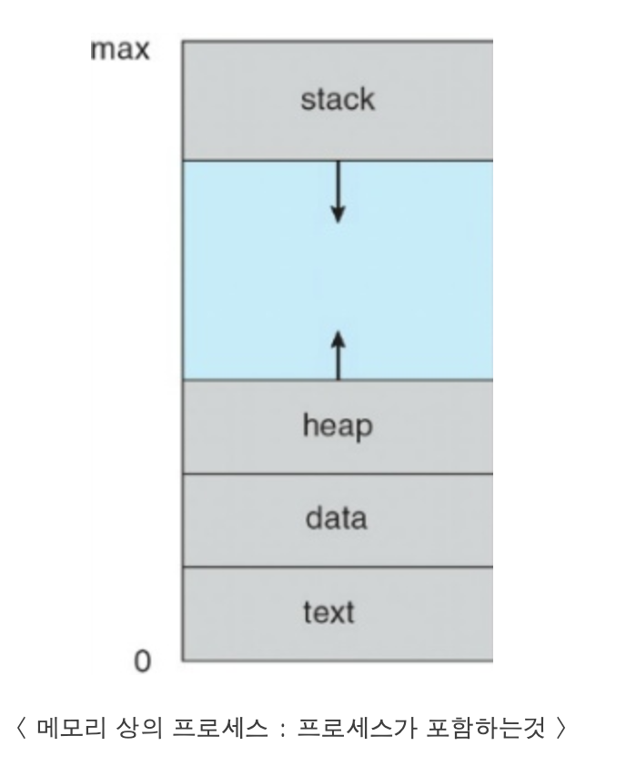
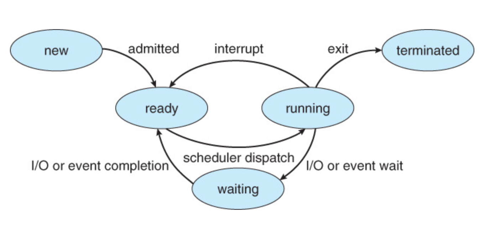

# Process

## 먼저 알아야 할 것

## process 개념
- 실행중인 프로글매
- 프로세스는 컴퓨터에서 연속적으로 실행되고 있는 컴퓨터 프로그램이다. 프로세스는 현대의 시분할 시스템에서 작업의 단위이므로, 작업(task, job)이라는 용어와 거의 같은 의미로 쓰인다.

- text : 프로그램 코드
- data : 전역 변수들을 기록하는 메모리
- heap : 프로세스 실행 중에 동적으로 할당되는 메모리
- stack : 함수의 매개변수, 복귀주소와 로컬 변수와 같은 임시적인 자료를 가지는 메모리
- 프로그램 카운터 : 다음 실행될 명령어의 주소

## process!=program
- 프로그램 (program) : 명렁어 리스트를 내용으로 가진 디스크에 저장된 파일
    - 실행파일
    - 수동적인 존재
- 프로세스 (process) : 다음에 실행할 명령어를 지정하는 프로그램 카운터와 관련 자원의 집합을 가진 능동적인 존재
- 실행파일이 메모리에 적재 될 떄 프로세스가 된다.
    1. 아이콘 더블클릭
    2. 명령어 라인 상에서 prg.exe 또는 a.out과 같이 파일 이름을 입력

## Java process
- 프로세스 자체가 다른 개체를 위한 실행 환경으로 동작 할 수 있다
- Java 프로그램은 JVM 안에서 실행된다
- JVM은 적재된 java 코드를 해석하고 원 기계어를 이용하여 행동을 취하는 프로세스로서 프로그램을 실행한다.
- java 명령어는 JVM을 보통의 프로세스처럼 실행히키고, JVM은 java 프로그램 Program을 가상기계 안에서 실행한다.

## process 상태도

- new : 프로세스가 생성중
- running : 명령어들이 실행
- waiting : 프로세스가 어떤 사건이 일어나기를 기다린다
- ready : 프로세스가 처리기에 할당되기를 기다린다
- terminated : 프로세스의 실행이 종료되었다

## PCB(Process Control Block,프로세스 제어 블록)