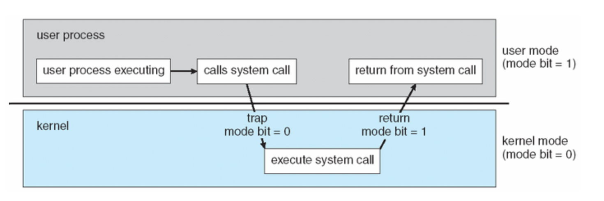

# System Call (시스템 호출)

## 먼저 알아야 할 것
- User Mode vs Kernel Mode

## Dual-Mode Operation (이중동작 모드)
- 나눈 이유 : 보안
- User Mode:
- Kernel Mode:
- OS는 사용자 모드(User Mode)와 커널모드 (Kernel Mode ==  Surpervisor Mode == Privileged Mode )로 나뉜다
- 하드웨어 모드 비트(Modie bit)가 있는데 0이면 커널모드, 1이면 유저 모드
- 최초 부팅시 하드웨어는 커널모드에서 시작한다. 운영체제가 올라오고, 거기서 부터 사용자 모드가 시작된다. 
- 인터럽트 또는 트랩이 발생할 때마다 하드웨어는 모드 비트를 0으로 바꾸고 커널모드로 전환한다.

## Dual-Mode Operation이 필요한 이유
- 시스템 및 사용자를 보호하기 위함
- System Call을 통해 커널 명령어를 사용하는 것은 사용자 뿐만아니라 시스템에게도 치명적인 영향을 미칠 수 있다.
- 유저 모드에서 특권 명령(시스템에 악 영향을 끼칠 수 있는 일부 명령)을 실행하면 운영체제는 이를 실행하지 않고 트랩을 건다.

## User모드에서 트랩이 걸리는 몇가지 경우
- 유저 모드에서 특권명령 실행 시도
- 프로그램이나 사용자 영역의 메모리 공간이 아닌 곳에 접근을 시도

## System Call이란
- 커널과 사용자 프로그램을 이어주는 인터페이스 역할
- 로우레벨 작업을 하는 코드
- 커널 영역의 기능을 유저 모드에서 사용 가능하게 하는 것
- 프로세스가 하드웨어에 직접 접근해 필요한 기능을 사용하게 하는 것
- 사용자 프로그램이 디스크에 있는 파일을 연다 == 시스템에 접근한다
- 시스템에 접근하기 위해서는 `커널모드`로 전환 되어야한다
- 이때 `시스템콜` 사용

## System Call 동작 

- 메모리의 특정 주소 범위에는 어떤 동작들이 할당되어 있다
- 이것을 시스템콜 테이블(System Call table) 또는 인터럽트 벡터(Interrupt vector)라고 부른다
    - fopen()함수를 호출하면 파일을 여는 함수를 찾기 위해 시스템콜 테이블을 참조한다.
- 시스템콜 테이블은 메모리 주소의 모음인데, 해당 메모리 주소는 인터럽스 서비스 루틴(Interrupt Service Routine)을 가리키고 있다
    - Interrupt Service Routine : C로 짜여진 코드이며, 시스템 콜 테이블이 가르키는 특정 메무리 주소가 구체적으로 어떤 동작을 할지 정의해 놓은 것
- 처리방식
    - 유저 프로세스가 시스템콜을 요청하면 제어가 커널로 넘어온다 (유저모드 -> 커널모드)
    - 커널은 내부적으로 각각의 시스템 콜을 구분하기 위해 기능별로 고유 번호를 할당하고 그 번호에 해당하는 제어루틴을 커널 내부에 정의
    - 커널은 요청받은 시스템 콜에 대응하는 기능 번호를 확인
    - 커널은 그 번호에 맞는 서비스 루틴을 호출
    - 서비스 루틴을 모두 처리하고 나면 커널 모드에서 유저 모드로 다시 전환

사용자 프로세스 -> 시스템콜 -> libc.a -> 0x80 인터럽트 발생 -> 커널에서 처리
1. 사용자가 fork() 시스템콜 호출
2. c 라이브러리에서 fork시스템 콜의 고유번호 '2'를 레지스터에 저장하고 0x80인터럽트를 발생시킨
3. 인터럽트가 발생하면 유저 모드 -> 커널모드로 전환
4. 커널은 IDT(Interrupt Descriptor Table)에서 0x80 주소에 있는 system_call()을 찾음
5. system_call()함수에서는 호출된 시스템콜 번호와 레지스터들을 스택에 저장하고 올바른 시스템 콜 번호인지 검사 후 sys_call_table에서 시스템 콜 번호에 해당하는 함수 호출
6. 이 함수가 종료되면 ret_from_sys_call()에 의해서 사용자 프로세스로 리턴

## IDT

- 시스템 콜을 호출하면 최종적으로 트램을 발생시키는데 이것은 소프트웨어 인터럽트 라고 이해하면 된다.
- IDT를 통해 모든 인터럽트가 관리되는테 시스템 콜은 0x80의 인터럽트를 사용한다
- 각 인터럽트를 처리하기 위한 서비스 루틴을 함수로 구현해 두고, 각 함수의 시작점 주소(핸들러 함수)를 등록
- 메모리에 위치한다.
- IDT의 위치를 가르키는 레지스터를 IDTR이라고한다
- 256개의 엔트리를 가진다
    - 각 엔트리는 8 byte크기의 디스크립터로 구성되어있다
    - 256*8 = 2048 byte 필요

## System Call 예시
- `fork(), exit(), read(), worte()`와 같은 함수 들이 있다
- 개발자가 이걸 직접 조작하는 것은 불편하고 위험한 일
- 그래서 표준 라이브러리(Standard Library)를 사용한다.
    - ex) stdio.h

## 사용자 프로그램이 운영체제에게 매개변수를 넘기는 방법
1. Call by value : 매개 변수의 값 자체를 복사하여 CPU 레지스터에 전달
2. Call by reference : 값의 메모리 주소를 전달한다. 많은 값을 전달 할 때는 이렇게 전달하는 것이 효율적
3. 프로그램을 통해 스택(Stack)에 매개변수를 추가하고, 운영체제를 통해 값을 뺀다.
2번이나 3번의 경우 매개변수의 개수나 길이에 제한이 없어 몇몇 운영체제에서 선호되는 방식이다.

## System call 종류
시스템 call은 총 6가지로 분류할 수 있다.
- 프로세스 제어 : end, abort, load, execute
- 파일 관리 : create, delete, open, close, read, write
- 장치 관리 : read, write, request, release
- 정보 유지 : get/set time or date
- 통신 : send/receive message, transfer status
    - 일반적인 통신 모델에는 `메시지 전달`과 `공유 메모리` 두가지가 있다
    - 두 프로세스의 통신에 정보 교환을 위한 메세지를 주고 받는다.
    - 공유 메모리에서는 다른 프로세스가 소유한 메모리에 접근을 위해 특정 시스템 콜을 호출한다
- 보호

## 커널코드 수정 순서 (Linux)
1. 시스템 콜 번호 할당
2. 시스템 콜 테이블 등록
3. 새로운 시스템 콜 작성
4. 커널 재 컴파일 & 업로드
5. 추가된 시스템 콜 사용 응용 프로그램 작성

참고 블로그
- https://parksb.github.io/article/6.html
- https://luckyyowu.tistory.com/133

